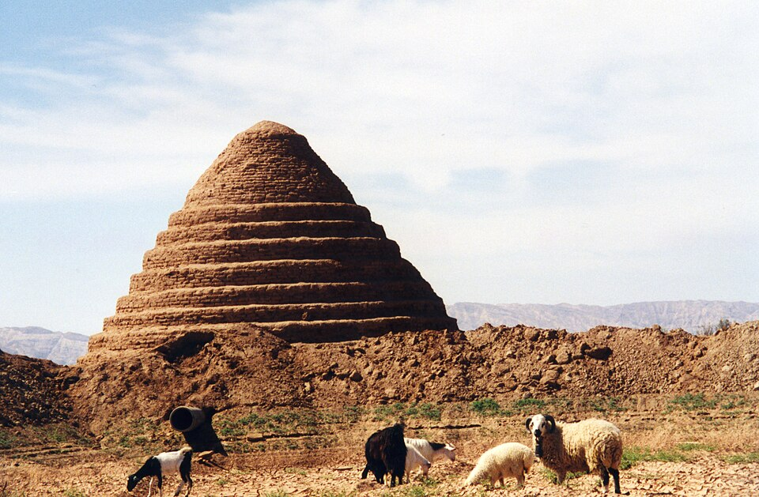

<figure>

<figcaption>Most portrayals of the <i>Temperance</i> card involve a figure
pouring liquid from one cup to another, representing the dilution of
wine.</figcaption>
</figure>

I want to write about this because of complaints that Singapore is hot
(it is), our offices and universities are too cold;
I see a lot of portable fans being used around me and I can't stand it;
I like to sit in darkness, I have fucking night vision;
I like to sleep with the fan on, and I like to dilute
the drinks I buy from stores with water.

This post is me, an old man (26 as of this post), screaming at clouds
because I feel we've upset the balance of nature and lost our ways.

## The Sun

Here in Singapore, we have eternally sunny and humid weather, with the occasional
tropical monsoon. It gets hot, people get sweaty.

Lee Kuan Yew, the founding father of modern Singapore, was known to have pushed
heavily for the installation of air conditioning (AC) throughout the country.

> Air conditioning was a most important invention for us, 
> perhaps one of the signal inventions of history. 
> It changed the nature of civilization by making development possible in the tropics.

It's true. I simply don't think I can focus as well if I'm sweating, thighs sticking
to pleather seat, arms leaving stains on the table. Been there.

I worked best in university in my climate-controlled enclosure (study rooms),
which were freezing cold and I always wondered just how much impact it had on the weather.

I think it's great that AC, and refrigeration in general has become
so commonplace. Not too long ago, the lack of such technologies heavily
shaped human culture.

The laws of physics used to be actual laws, where we had to find ways to abide by them,
like figuring out fermentation, canning, pickling, etc. to keep food from spoiling.

<figure>

<figcaption>

A yakhchāl, an ancient icehouse, meant to keep ice.
Photo by [Jeanne Menj](https://www.flickr.com/photos/jmenj/9261276542/) off Wikimedia Commons.

</figcaption>
</figure>

Point is, civilisation used to work alongside nature. I don't think it's anything
new to say that humans have disrupted this balance.

I do, however, think that a lot of us have been coddled by technology to the point 
of no return; we don't know how to live in tandem with nature anymore. 
At least, that's my view in the context of Singapore.

### Those damn Jisulife fans 

I first started noticing portable fans heavily being used in South Korea during the summer.
Likewise, back in Singapore. It's hard not to notice when they emit a high-pitched
hissing when they operate.

Have we lost the plot? Please excuse my doomerism, but I don't think the solution
to increasing ambient temperatures is supplementing additional measures.

In fact, I think we've gone too long as an AC-loving people, and as a result,
have lost the natural acclimatising effects of staying in a tropical climate.

We're like fish out of water in our own country. How's that?

### Do we use too much AC?

I recently went to read a bit of Cherian George's [Air Conditioned Nation](https://www.airconditionednation.com/).
A lot of the things I could be saying here are better said by him, so I don't claim
to be making any profound statements, mostly focusing on the physical aspects of temperature.

### Definitions

If you continue reading, I'd like to make a note on the title of this article.
Tempering isn't really the closest word to some of what I describe, but it stuck.

What I really mean is acclimatising, but in choosing the word "Tempering", I'm
making a nod at many concepts.

Firstly, there is an etymological relationship to temperature, specifically heat.
Materials are typically tempered with heat to increase their strength.
I'd like to apply this concept to the heat of Singapore and what it does for our
collective approach to temperature.

Secondly, I enjoy the mysticism of tarot cards, and would like to allude to
the 14th card of the major arcana, Temperance, which is a virtue that 
simply means moderation or restraint. Again, very relevant concepts in this writing.

### CROSS VENTILATION

Some architect friend told me about this.

[Check out this article I found.](https://www.archdaily.com/1008994/balancing-function-and-aesthetics-incorporating-natural-light-and-ventilation-in-facades)

Architecture that integrates ventilation will often also integrate natural sunlight,
which gets another thumbs-up in my book, because I think we overuse LEDs,
and I'll to that in the next section.

## The Moon

Excuse me for the tarot reference again.

A few times I've sailed around Indonesian waters. Out in the sea, darkness permeates
everything at night. It's scary just how little you can see.

Singapore, however, is quite visible from afar. It's how we know we're on the right track,
which is increasingly difficult because (forget that GPS exists for a second)
lights everywhere have blotted out most of the celestial figures sailors
use to fix their position.

I don't enjoy Singapore, or anywhere's obsession with lighting. 
Many new places now are bloody bright with LEDs, especially the newly-renovated
coffeeshops I frequent.

### Circadian rhythm

I'm going to make a bold statement here: You're constantly tired because you
aren't sleeping properly, and you aren't sleeping because you have your lights on 
all the time, you're getting too much blue light, it's messing with your body.

