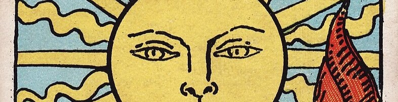
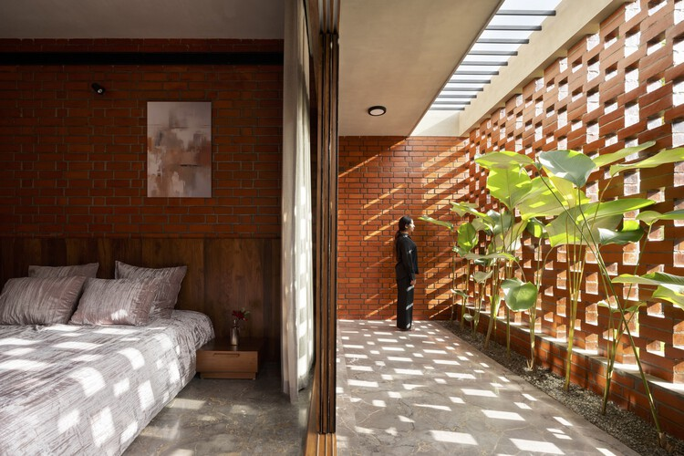
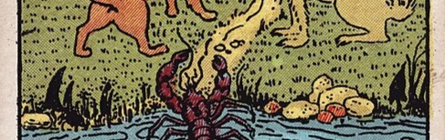
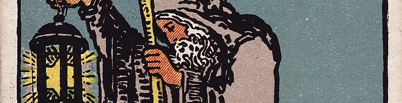

<figure>

<figcaption>Most portrayals of the <i>Temperance</i> card involve a figure
pouring liquid from one cup to another, representing the dilution of
wine.</figcaption>
</figure>

I want to write about this because Singapore is hot
(it is), and our offices and universities are too cold, and
I see a lot of portable fans being used around me and I can't stand it,
and I think we're really giving up the opportunity to temper ourselves
to the climate.

In general, technology solves some problems, but a lot of them
have already been solved by nature, and these two solutions find themselves at
odds with each other. Like if a community of blobfish[^blob]
decided that the deep sea environment was far too pressurised, and
depressurised their surroundings. They'd all be blobs!

## The Sun

Here in Singapore, we have eternally sunny and humid weather, with the occasional
tropical monsoon. It gets hot, people get sweaty.

Lee Kuan Yew, the founding father of modern Singapore, was known to have pushed
heavily for the installation of air conditioning (AC) throughout the country.

> Air conditioning was a most important invention for us, 
> perhaps one of the signal inventions of history. 
> It changed the nature of civilization by making development possible in the tropics.

It's true. I simply don't think I can focus as well if I'm sweating, thighs sticking
to pleather seat, arms leaving stains on the table. Been there.

I worked best in university in my climate-controlled enclosure (study rooms),
which were freezing cold, but I wonder if that's just too much.
This was a sign that something was suboptimal, and my guess 
is this is a problem that spans institutions.

I think it's great that AC, and refrigeration in general has become
so commonplace. Not too long ago, the lack of such technologies heavily
shaped human culture.

What I want to hazard against is the proliferation of the idea that modern life
(in Singapore) is just moving from one air-conditioned place to another, trying 
to minimize time exposed to the outside world. As much as sun and heat are real threats,
there are benefits to getting some fresh air and sunlight.

If you spend like 20 hours of the day in an air conditioned environment,
I do believe this disrupts your body's natural heat acclimatisation.
Do this over the course of a lifetime and you're a fish out of water in your own country,
hypothalamusically speaking.

So the more we use AC, the more we might end up relying on AC. It's not the 
first time a convenient technology became a standard then a crutch,
and it won't be the last either. \*cough* AI \*cough*

<figure>

<figcaption>

A yakhchāl, an ancient icehouse, meant to keep ice.
Photo by [Jeanne Menj](https://www.flickr.com/photos/jmenj/9261276542/) off Wikimedia Commons.

</figcaption>
</figure>

The laws of physics were once stricter.
Humans, of course, adapted along these laws,
like figuring out fermentation, canning, pickling, etc. to keep food from spoiling.
In every bit of culture there is a reflection of the struggle and success.

We're living in a post-struggle world. 
The problems that pervaded the past were slowly eradicated,
and the children inherit the solutions without the context surrounding them.

Without the context, the solutions lose meaning. 
Some pickle recipes now require you to keep them in the fridge lest they spoil.
The object is there, but the connection to history has been severed.
That's one example, not that I object to having alternate, easier recipes for pickles.

So, what have we forgotten?

### Definitions

If you continue reading, I'd like to make a note on the title of this article.
Tempering isn't really the closest word to some of what I describe, but it stuck.

There is, I guess, an etymological relationship to temperature, specifically heat.
Materials are typically tempered with heat to increase their strength.
I'd like to apply this concept to the heat of Singapore and what it does for our
collective approach to surviving in nature. In other words, *tahan*-ing[^tahan].

What I really mean is acclimatising, but in choosing the word "Tempering", I'm
making a nod at concepts of virtue.

Anyway, I don't think I'm any more virtuous than you just because I
sleep with just the fan, but I do suspect my habits have made
me a little more resistant to the heat in Singapore.

### Ventilation 

One of my favourite things I've ever learned from a friend (studying architecture)
was the concept of cross ventilation.
I could never look at things the same way ever again, 
and I'm only mildly exaggerating.

I first started noticing portable fans heavily being used in South Korea during the summer.
Likewise, back in Singapore. It's hard not to notice when they emit a high-pitched
hissing when they operate which is just barely under my threshold of intolerability.

Fans are great, often more effective than air conditioning. Surely you've felt 
hot and stuffy before sleeping with the air-con but no airflow.

I don't think it's wrong to want a personal fan. You're valid for being hot!
I do think it's a waste of materials and will never truly solve a bigger problem.
([Related article](https://mashable.com/article/portable-hand-held-fans?test_uuid=04wb5avZVbBe1OWK6996faM&test_variant=a). I haven't seen any trendiness attached to the fans locally, thankfully). 

<figure>

<figcaption>

Brickwork that breathes.
[Check out this article for examples.](https://www.archdaily.com/1008994/balancing-function-and-aesthetics-incorporating-natural-light-and-ventilation-in-facades)
 I'll talk about natural lighting next.

</figcaption>
</figure>

I won't try to tackle climate change here. I think the proliferation of personal fans 
is a sign people crave for ventilation, which I suppose is one of those technologies
we've "lost" now that air-conditioning is the default.

Okay, not entirely lost. Some of the most beautifully designed buildings in Singapore
incorporate natural ventilation. The Hive, Geneo, to name a few, even Ng Teng Fong
General Hospital. It's such a delight to just *be* in those spaces!

I should mention at this point that I'm no civil engineer, and ventilation may be one
of those carefully designed things to the point of being invisible... but
to those at home: perhaps the solution isn't to close the windows and turn on the AC,
but to open them and cross-ventilate your space.

Also, airflow applies locally. I love wearing linen shirts, which 
let my skin breathe better.

Architecture that integrates ventilation will often also integrate natural sunlight,
which gets another thumbs-up in my book, because I think we overuse LEDs,
and I'll get to that soon. But first...

Ventilation works because it speeds up evaporation of sweat, which is how the 
body loses heat. That brings me to the next point.

### Evaporation

Every so often, Singaporeans online bring up the "showering in the morning" discourse,
which is one of those topics where seemingly neither side of the argument will ever 
see eye to eye.

I of course think you should shower in the morning, especially in this type of 
climate and if you have a long day ahead (say, if you're going to work).

Pragmatically, it helps you keep cool, because of the evaporation.
Maybe more Singaporeans would feel less heat
if they also showered in the morning. Granted, it won't keep you cool for too long,
but it's better than nothing.

### Temperance?

Going back to temperance as a virtue, I'm advocating for doing "less" to 
gain "more". Specifically, to reduce the exposure to air-conditioning in favour of
better acclimatising to the climate.

You're doing yourself a favour by making yourself more resilient.

It's a bit of a stretch, but this post has been in the drafts for too long
and I like that the tarot theme has stuck. 

I do still think it's somewhat applicable, and I'll continue to express my related 
thoughts now that I'm done with temperature. 

--- 

## The Moon

A few times I've sailed around Indonesian waters, around the Singapore strait.
Out in the sea, darkness permeates
everything at night. It's scary just how little you can see.

Singapore, however, is quite visible from afar. A brownish cloud of light lingers
above the island-nation from nautical miles away.

It's how we know we're on the right track,
which is increasingly difficult because (forget that GPS exists for a second)
lights everywhere have blotted out most of the celestial figures sailors
use to fix their position.

I don't enjoy the obsession with lighting. 
Many new places now are bloody bright with LEDs, especially the newly-renovated
coffeeshops I frequent. For drivers, headlights these days are just blinding.
Don't even get me started on flickering and colour temperature. God!

I think it takes a certain restraint to use minimal lighting, and to use it well,
to create an appropriate atmosphere. A coffeeshop doesn't need to be lit like 
an office (but seems to be the trend now).
A lot of it rests on clever manipulation of
natural sunlight, like the article I linked above.

I love floor-to-ceiling windows for that reason. It fills your room with light,
and it's often miles brighter and pleasant than sterile, barely-perceptibly flickering
white fluorescence.

We should be *natural-lightingmaxxing*. Stop turning on the lights in the morning 
and use your well-adjusted eyes. I genuinely believe we'd have better sleep quality 
if we stopped relying on artificial lighting after dusk, but in the name of productivity,
a compromise many make is in reducing screentime before sleeping, and reducing blue light
exposure throughout the day.

This reminds me of my high school days where I'd usually be the first in class, and
I'd sit in the dark until it gradually got light.

Moreover, your eyes *adapt*. A recurrent theme in this post is that humans adapt,
and technologies that help us have dulled our adaptability. We have *night vision*.
It's why, out at sea at night, or out hiking, no one uses torchlights unless they 
*really* have to. And even then, they use red light, and point it downwards.

Don't be *that* guy who blinds everyone on the early-morning hike.

### Circadian rhythm

The other side of the coin: If you are to sleep when it's dark, you should be 
waking when it's light. Our bodies are built to match the sun's rhythm.

Singapore's timezone is *wrong*. Our sun comes up too late in the morning (for most
other places, it's 6am. For us, 7am). If you have to get up early to get to work or school, which
most do, that's a whole hour of difference.

It'll be difficult to change the time zone, but the least we can do is reduce the 
amount of light we get at night. I've heard that it genuinely helps to just lie in
bed with the lights off even if you're not sleepy but should sleep; it'll do you 
a lot more good than using your phone.

---

## The Hermit

I think a sign of my ageing has been me literally watering down my sweet drinks,
quite literally doing as the figure in the temperance card does.
I believe it has increased my sensitivity to sweetness. Like many sensations,
they're dulled by overexposure.

Anyway, I have fully converted to sleeping with just the fan, and it's come to a 
point where most nights get so cold I even use my weighted blanket.

Watering down my sweet drinks has become an infinite money glitch, too.

At the end of this post, I'd like to say that I don't think the way I live is
superior, but it's worthwhile, I believe, to take full advantage of nature
while we still can, I suppose. Be it human nature or mother nature.

Oh, and use sunscreen.

[^blob]: They only look like that because they were photographed in a highly 
depressurized environment (relative to their natural one). 
It's like Brits suffering heatstrokes in 25°C weather, which is an ideal
air-conditioned/room temperature in Singapore.

[^tahan]: Malay word meaning to resist or endure.