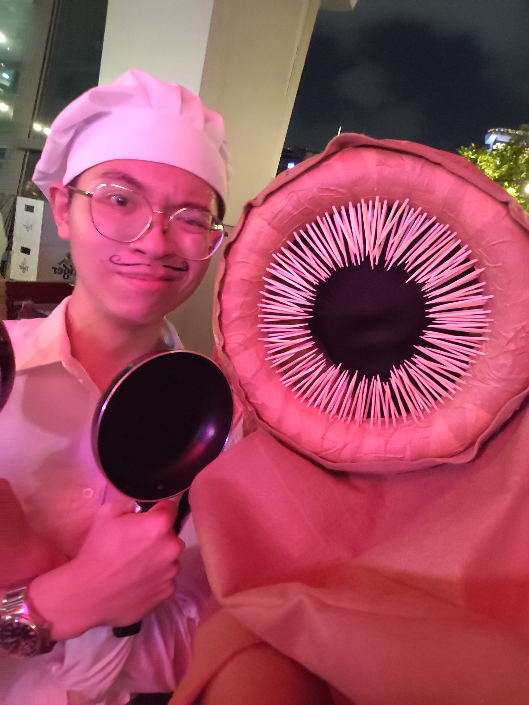
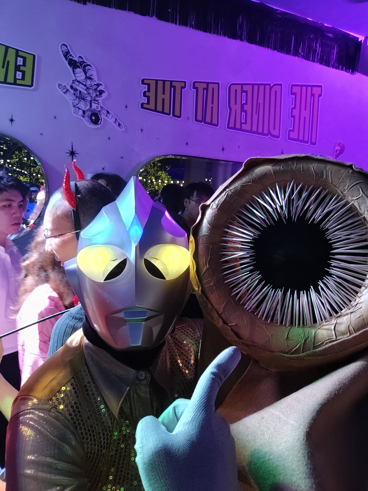
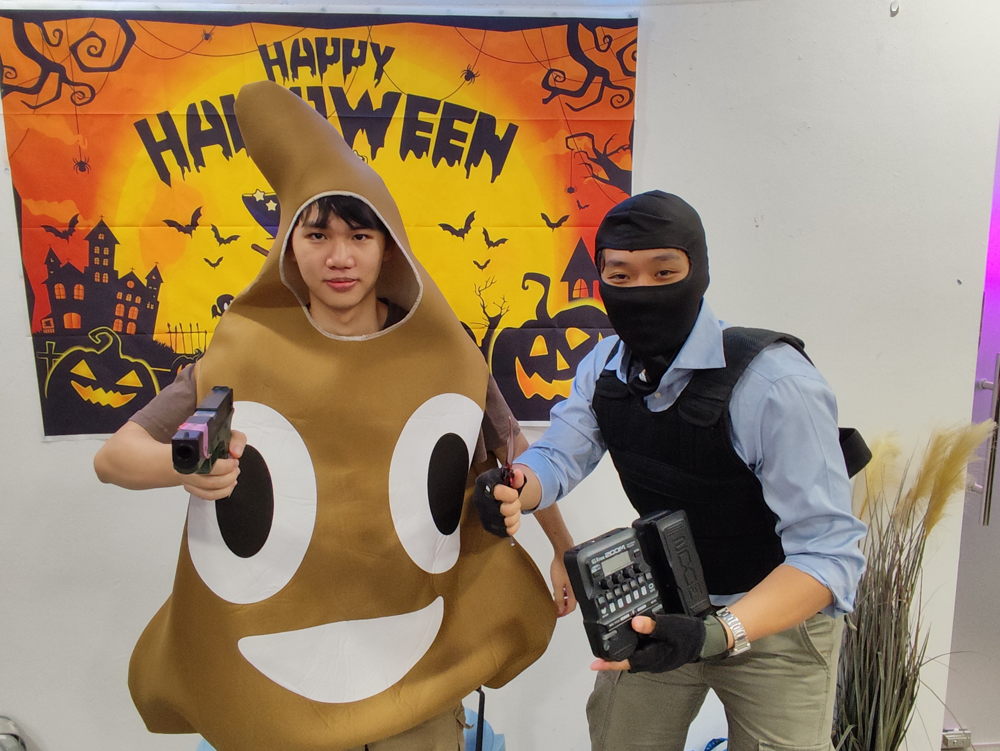
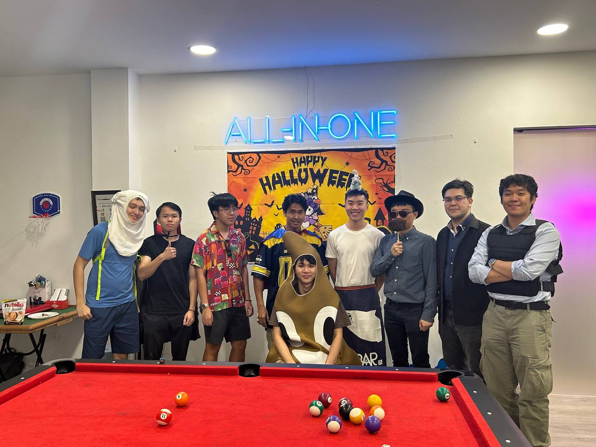

Halloween is always my favourite time of the year, because I get to see everyone's
creativity shine, and it's just plain fun.

This year, I went as Shai-hulud, the sandworm from *Dune*. My girlfriend and 
her friends went as the cast of *Challengers*, so we got Zendaya in common.

Turns out, making the costume didn't take long at all. I got a foam torus, 
some toothpicks (didn't need to use all of them, surprisingly), brown tape,
and a roll of felt. A hammer was used to nail the toothpicks in. It helped to blunt the tips too.
Altogether, the stuff was about $25.

<video muted controls>
  <source src="./build.webm" type="video/webm">
    Your browser does not support the video tag.
</video> 

I had intended to staple the felt onto the foam torus, but my staples just weren't
large enough. I instead used some toothpicks to nail the felt in place, and trimmed 
them off. To finish off, I taped around the torus to make sure no nails could 
fall apart. 

We went to a halloween party hosted at Overeasy by Eatmepoptart, one of my favourite organisations
because their DJs (especially Weelikeme) play music that suits MY tastes... and 
the crowd typically is older, so... you get the picture.

<row>

</row>

Everyone was so friendly, open to talk even if just to acknowledge each other's costume.
Of course, I took some photos, though I couldn't really see my phone screen!

I was in the midst of playing Hollow Knight, so I was happy to see a Hornet.

<row>

</row>

There was another worm, and together we won third place in the costume contest.
Our groups both shared a large bottle of Prosecco.
<figure>

<row> 

</row>

<figcaption>This other guy made his costume out of an IKEA play tube and
cloth. The teeth were broom bristles.
We were both sweating it out.

</figcaption>
</figure>

It was rather liberating being completely anonymous.
I had on a face cover which I pulled all the way up.
I basically couldn't see much through the semi-sheer cloth, but 
enough to make out shapes and figures, but not to identify costumes.

It was only after taking it off for the first time that I realised I was
basically waterboarding myself with how much sweat there was.

<video muted controls>
  <source src="./worm.webm" type="video/webm">
    Your browser does not support the video tag.
</video> 

I didn't do *the worm*.

## 2024 and before

I don't think I'll be making backdated posts, so here's an archive of the last few 
halloween costumes!

In 2024, I was a terrorist from COUNTER-STRIKE! Nothing offensive, I swear!
I had everything on hand, even a fake butterfly knife from AliExpress I got a few years back.
The hardest part was taking out each weight plate from my weighted vest.

### 2023

Went as Kuromi, on two occasions, one of which was again the Eatmepoptart x Overeasy party.
I believe this was my first time at a poptart party.

I met someone dressed as Patrick Bateman, from *American Psycho*.
I had to whip out my debit card, on which I had stuck Paul Allen's business card!

<row>

</row>

### 2022

Sisyphus, or a modern take on it? Like a salaryman of sorts.

<figure>

<figcaption>Having a SHIBUYAMELTDOWN moment.</figcaption>
</figure>

For some weeks I had a papier-mâché rock 
take up a corner in my university dorm room, on my laundry rack to dry, and 
each day I'd just tack on a few layers of newspaper and wait for it to dry.
One must imagine me happy.

<figure>

<figcaption>Rock on The Rock. Rock and roll, baby!</figcaption>
</figure>

I was, of course, committed to the bit.

<video muted controls>
  <source src="./rocks.webm" type="video/webm">
    Your browser does not support the video tag.
</video> 

That's all I got. Looking forward to the next one!