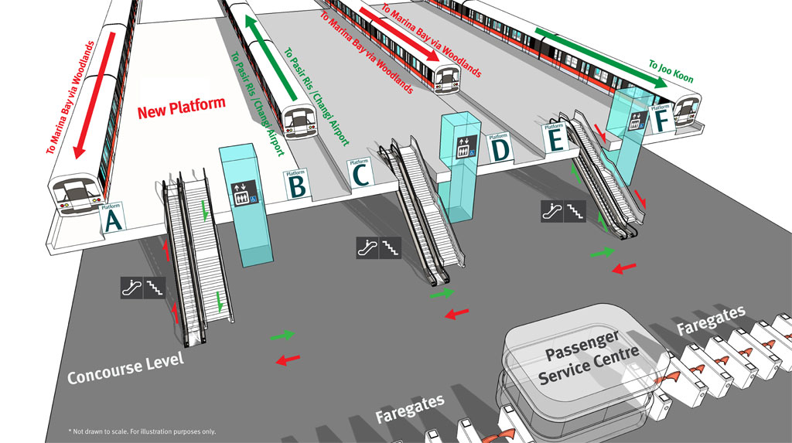

Being a west-sider in Singapore, I have visited Jurong East countless times. I grew up
with Jurong Entertainment Centre, then with JCube, which both have since been demolished
(is the lot cursed?) to make way for the J'den condo (a very cursed name).
I loved visiting IMM, Big Box had a special place in my heart,
and Westgate and JEM are reliable haunts.

As an adult, Jurong East is no less relevant as one train station I must pass by 
on my way to work. The increased frequency of my commuting has 
given me more observations of people coming and going, and I have come to the conclusion that,
by design or by human nature, the way people go about changing trains at this terminal
is suboptimal and, in my experience, has resulted in conflict between people.

I'm writing this to express my thoughts on how the design of the local MRT system 
can be better. I'm currently aware of plans for two new lines, and each time one 
is erected, it feels like a rushed job, not to mention all the environmentalist concerns.

## The Layout

<figure>

<figcaption>

Image provided by SMRT [via Facebook](https://www.facebook.com/share/18XGGMLVFR/).
Platform A was opened in 2011.

</figcaption>
</figure>

Jurong East (JE for short), as a terminal *and* and interchange, connects people 
from the end of the North-South line (NSL) to the middle of the East-West line (EWL),
two of the oldest train lines in Singapore.

The NSL trains come and go via platform D/E.
During peak hours, the NSL trains alternate between platforms A and D/E.
The EWL train at platform B/C is eastbound, and the one at platform F is westbound.

JE quite nicely segments the westernmost part of Singapore, mainly the industrial hub,
from the rest of the EWL, which includes the central business district and airport.

As you can tell, there will be two groups of people commuting at Jurong East in the morning,
both headed to work in different directions.

### The Problem

Most commuters coming from NSL going to the east would have no issue with the station's layout. 
They come in via any of the NSL trains, and can easily get to the eastbound EWL train at platform B/C.

With those heading west, however, there is a complication. The NS train that arrives
in platform A is far from platform F. For them to make the transfer, they would have to 
go down to the concourse level and walk over.

What most of them do is stay at the train platform and walk through 
the trains to cut through to platform F. They'd have to go through the EW train (eastbound)
and then the NS train at platform DE to get to platform F, in that order. 

This, I feel, is suboptimal, which is a point I'll elaborate on, 
but understandably it's a locally optimal solution if one is to minimise stair climbing.

Still, it's disruptive. There was once, when the train was full, someone tried 
to shove through to get to the other side. This resulted in a bit of argument between passengers. 

Another time, a passenger tried to cut through, but the train doors closed before he could 
get to the other platform. I observed him as he waited 'til the EWL (eastbound) train got 
to Clementi before he alighted and waited for the opposite train to reverse direction
(and the JE -> Clementi distance is nothing to scoff at!).

## Logically Speaking

> If your solution to some problem relies on "If everyone would just…" then you do not have a solution.
> Everyone is not going to just. At no time in the history of the universe has everyone just,
> and they’re not going to start now.
> <cite>Tumblr User squareallworthy</cite>

Obviously, the intended solution is to go down to the concourse. But this is a very 
*Singaporean* approach to solving problems: it requires co-operation, is inelegant,
and frankly speaking I'm surprised there wasn't a barricade put up to
coerce this behaviour.

Let me digress a little to show you that our infrastructure *can* be improved to accommodate 
the traveler, and their needs usually manifest in the form of [desire paths](https://en.wikipedia.org/wiki/Desire_path).
It wasn't too long ago that [barricades were removed](https://www.straitstimes.com/singapore/transport/section-of-barrier-outside-marina-bay-mrt-station-removed-as-more-workers-return-to-offices-lta)
at Marina Bay MRT. 

The next solution is probably also intended but never done in practice. Simply 
take the NSL train that's bound for platform D/E. Those hopping on board the train
on the NSL are told which platform it'll stop at once it reaches JE.