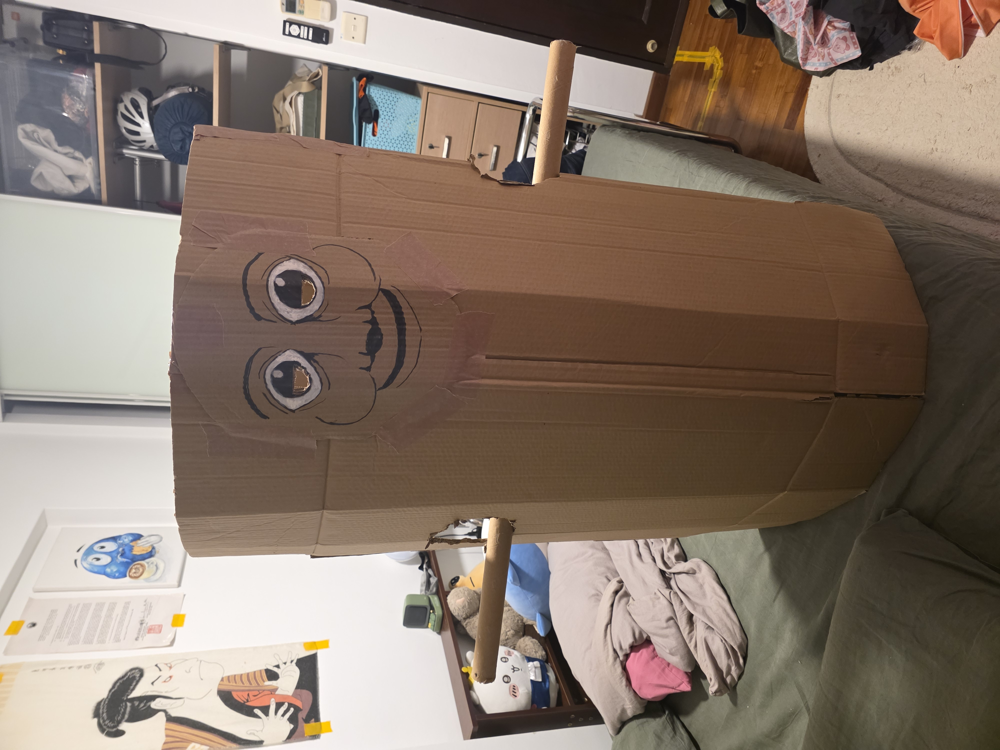

I had a vision this Halloween, and I was surprised at how simple it was to execute.
I don't mean to brag, but it's times like these that I can consider myself a true 
engineer. There were some constraints I worked with: I had to ensure I could 
get in and out of the costume, that I could see, and that it wouldn't get loose 
while wearing it.

Having an arm hole as the "locking" mechanism solved two of those problems, rather 
elegantly I must say. I happened to get the arm hole and eye socket placements 
right the first time as well. I just wish I could've made the face larger, but 
I'm very happy with the end product, which in truth took no more than an hour in total.

I'm attending a few Halloween events this year.
