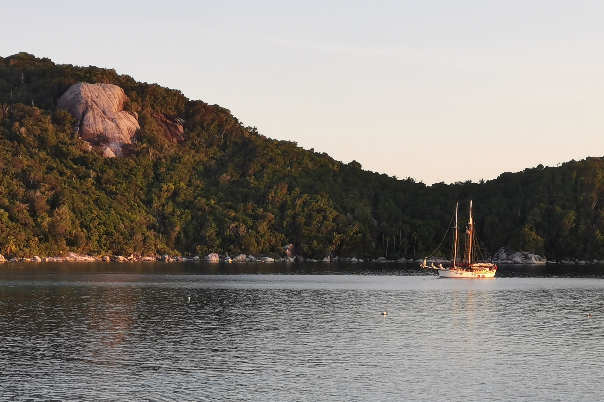

<figure>

<figcaption>The iconinc "Moon Rock" on the left, the Four Friends in view on the right. Actual name is Pulau Sagudampar.</figcaption>
</figure>

In the summer of 2023, after the completion of another semester of university,
I happened to see an advertisement for a school-subsidised trip to sail
on a wooden schooner off to the Anambas Regency, a cluster of islands in Indonesian territory.

I claim to love the sea, but had never sailed in this manner before.
This was the chance to earn my sea legs.

It turned out to be one of the more significant experiences of my life!
Have a look at some of the photos of beautiful nature and the open sea.

### Turtles Mating
Our first night, we 

## At Moon Rock Lagoon

We spent a few nights at Moon Rock lagoon, named so because of a giant rock 
jutting out of the largest island of this lagoon, Pulau Sagudampar.

Naturally, one activity consisted of climbing up to said moon rock.

<figure>

<figcaption>My inexperience is measured by the degrees of arching of my back.</figcaption>
</figure>

### Casualties

I received one (1) major injury this trip,
and it was the loss of the entire big toenail on my right foot.

It was one night I decided to walk around on deck without lights,
as one should, and had missed one step on a staircase going up.

I drove my foot right into the wood, thinking there wouldn't be anything there.
My big toe took the brunt of the hit, and bled under the nail.

I didn't notice until the next morning that I was bleeding, but thankfully
we had some attentive first-aid trained students on board.

A short while after disembarking, the entire toenail grew loose and fell clean off,
perhaps from a loss of circulation. I'm all right now.

Some images courtesy of Nikki, a friend I made on this voyage with whom
I've continued to maintain a close friendship.