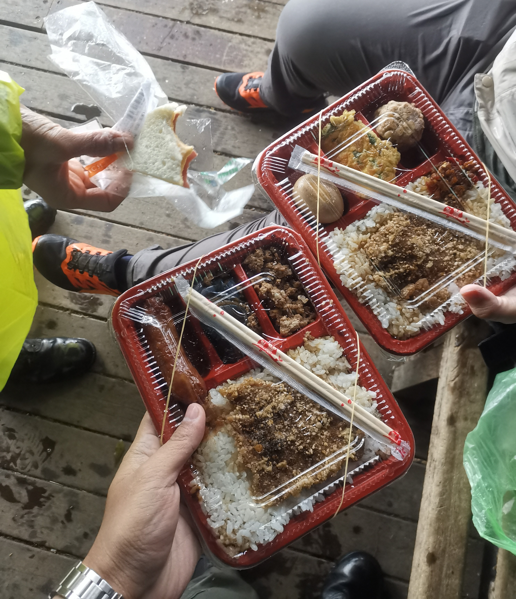
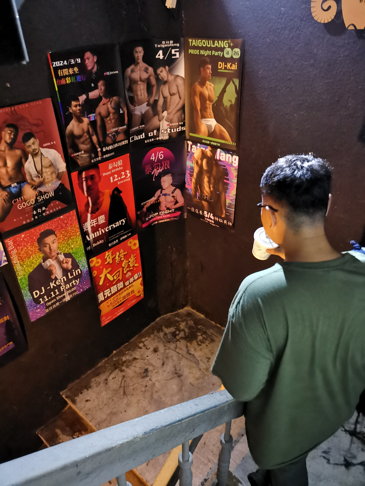

In June 2024, I went to Taiwan with two friends with the main objective of climbing Yushan,
or Jade Mountain, the highest peak in Taiwan at just a bit under 4000 meters of elevation.

We made it, but the climb was not gentle on us. The moisture and cold made us
appreciate the ground-level temperature after the hike.

The rest of the trip was spent lollygagging around most of Taiwan,
and while I didn't fully circumnavigate the entire island (missed out the southeast coast),
I can say that I'd seen enough of what Taiwan had to offer.

## Summiting Jade Mountain

<figure>

<figcaption>Left to right: Aung, with a penchant for aura farming.
JQ, who planned it all, and me, whose boots would not end up surviving the way down.
</figcaption>
</figure>

We set off full of gusto, (unbeknownst to us) underdressed, and inadequately waterproofed.

The trail itself was straightforward with minimal tricky bits; older folks were seen
quite often.

We went in the middle of summer, so there wasn't any snow. Outside of winter,
the rainy season covers quite a few months. Pick your poison.

Either way, expect to be cold and wet. I'm no geographer, but I hear it's
because Taiwan is surrounded by sea, and winds carry up lots of moisture.

I learned one thing this trip: my windbreaker is NOT waterproof, not that it ever claimed to be.

A spell of rain in the middle of our hike with no good shelter taught us this valuable lesson.
My jacket was soaked, although it put up some resistance. My passport, which I had failed to keep safely,
had to be replaced after this trip.

There were several stops along the way up where you could rest and seek shelter.
Eventually, we stopped somewhere to devour the food we had bought that morning.

<figure>

<figcaption>It is said that Aung can walk a million miles on the energy bestowed
by a single sandwich.</figcaption>
</figure>

Eventually, the mountain lodge slowly made itself apparent. Due to our slow pace
and late starting time, we were the last to reach the lodge for the day.

### At the lodge

Our stop for the first day was at Paiyun Lodge, some 3400m of elevation above sea level.

This was our rest stop before we all departed for the summit around 2-3am the next day.
I was so happy to finally have something warm in my hands: generous servings of Taiwan's braised pork rice.

<figure>

<figcaption>The lobby, and generous servings of food to help yourself to.</figcaption>
</figure>

There were drying areas at the lobby, but they were pretty much all occupied. 
We went to the cabins to rest and dry up.

#### The cabin situation

Since we were soaked, we changed and spread all the clothes out to hang.
Even my sleeping bag was wet, but I found enough dry spots to lie on, hoping it'd 
dry up if I were to spread it out on the bed mat.

The genius that I am, I strung up some rope for us to dry our clothes and maximise
surface area. I'd say we were successful enough; we were dry enough to finish the climb,
and then the way down.

There were some electrical sockets for us to charge our devices.

### Day 2

The mountain shack is a place to rest before heading out
again for the summit.

By the time we got there, we were soaked.
There are places to hang our equipment to dry, though
the humidity and temperature made it difficult to
get fully dry. We still managed to an acceptable level, though!

You could help yourself to heaping portions of soup and 
braised meat rice, which warmed us up.

### The summit

<figure>
tba video
<figcaption>Near the peak. Views obscured by clouds, but still breathtaking.</figcaption>
</figure>

### Getting there

Prior to the trip, please make sure to apply to enter and hike the trail.
**You must apply in advance to enter the trail! This also ensures you have a spot in the lodge.**

Checking out from our accommodations in Shuili (水里), we bought some food and took 
the public bus up towards Yushan National Park.

<figure>

<figcaption>A fat dog we saw while buying food.</figcaption>
</figure>

Everyone else on the bus is likely to be headed the same way the closer you get to
[Paiyun Mountaineering Centre](https://maps.app.goo.gl/PxBaDftmCt3m5dWJA),
where we registered. The lady at the office was kind to let us stow our luggage there too.

There's quite a bit of walking, which serves as a nice warm-up for what's to come.
From the office, it's a ways up to the trail start. There are buggy services, but
you may as well just walk — it's what you came for.

<figure>

<figcaption>A monkey spotted at one of the bus's rest stops.</figcaption>
</figure>

**Very important lessons:**
- You should arrange for transport to leave the national park. There's hardly any way down,
and you have very little chance of flagging a taxi on the spot.

In fact, you should probably rent a car, because it's very likely you might miss your bus.
Thankfully, we managed to call a driver. It's a long way down to the nearest town,
and the fatigue from a long hike up and down did not help.

---

After the arduous climb, we were free to enjoy the rest of Taiwan like normal tourists.

## Tainan

After Chiayi, our next stop was Tainan.

At night, JQ wanted to bring us to a cool spot, and that spot turned out 
to be a gay bar. Or rather, it was taken over by one.

We didn't enter.

We ended up down Hai'an road, where the nightlife was concentrated in Tainan.
We had our fair share of beer, including Taiwan beer.

This was also a nice place to visit in the day; I looked around the quaint stores
the next morning before we departed north for Taipei.

## Taipei

I'm not gonna lie, it was quite boring to me.
I did enjoy the food, gashapon machines, and the nightly Taiwan Beer inbibing,
but apart from that, there wasn't anything special to me.

I really enjoyed the architecture style of the country
parts of Taiwan. Very old school, and full of soul.
Taiwan Beer hits the spot for me, and the street food
were perfect accompaniments.

## Yilan

