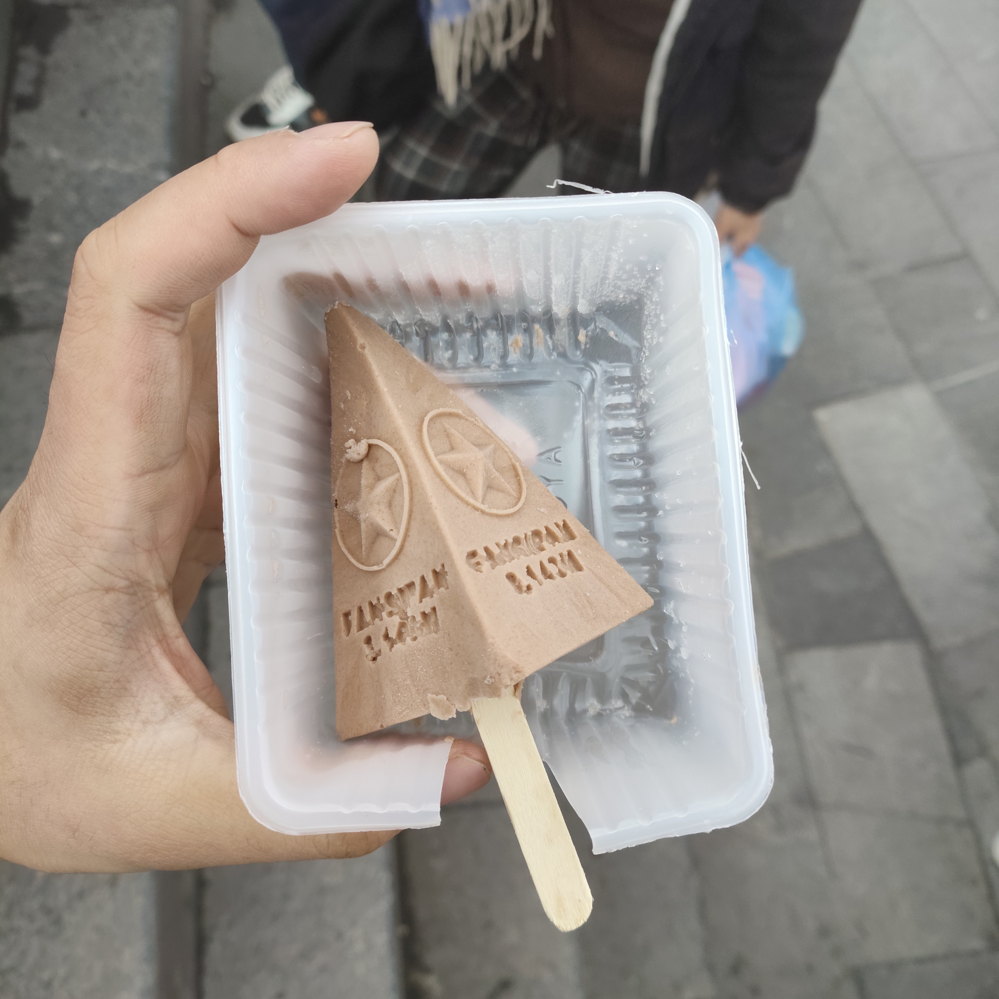
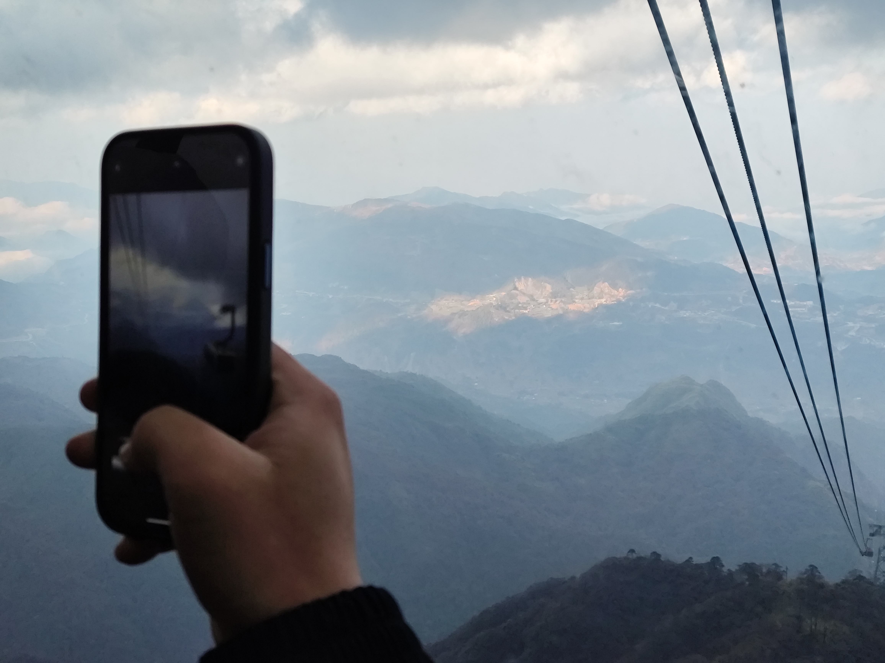
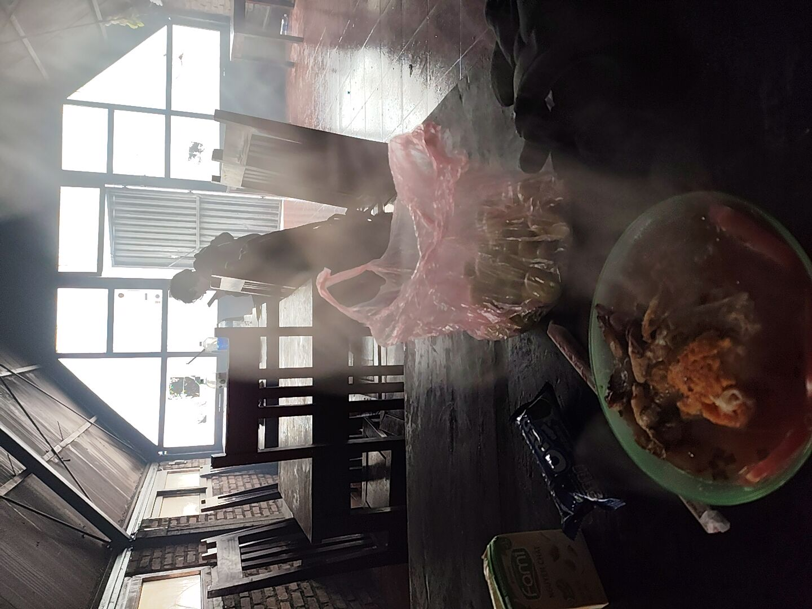
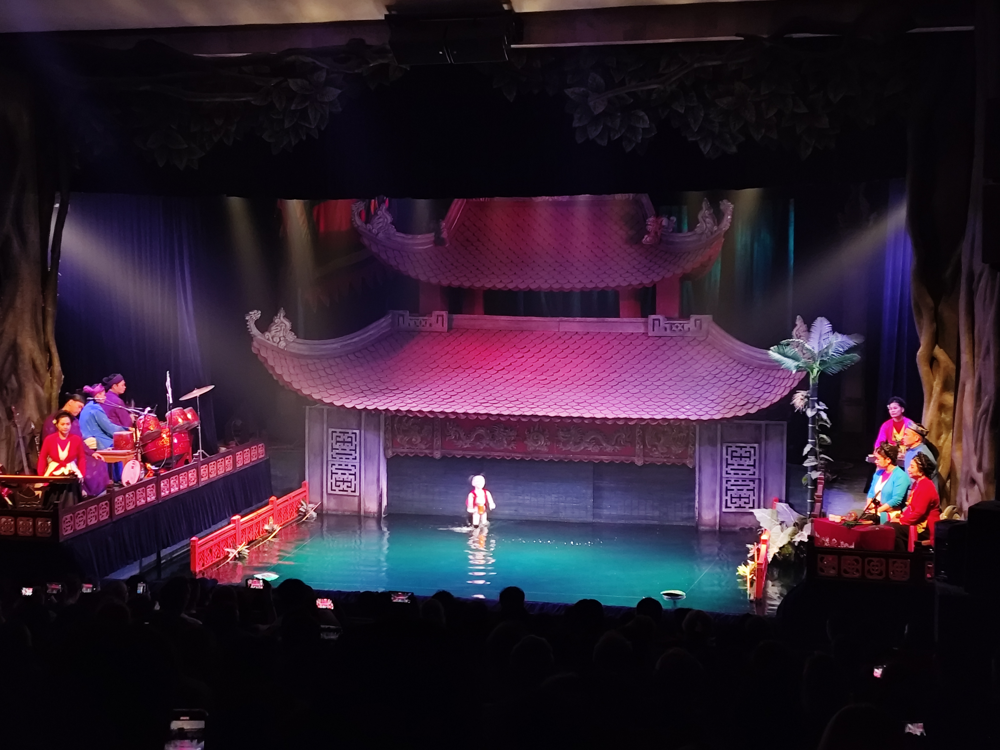
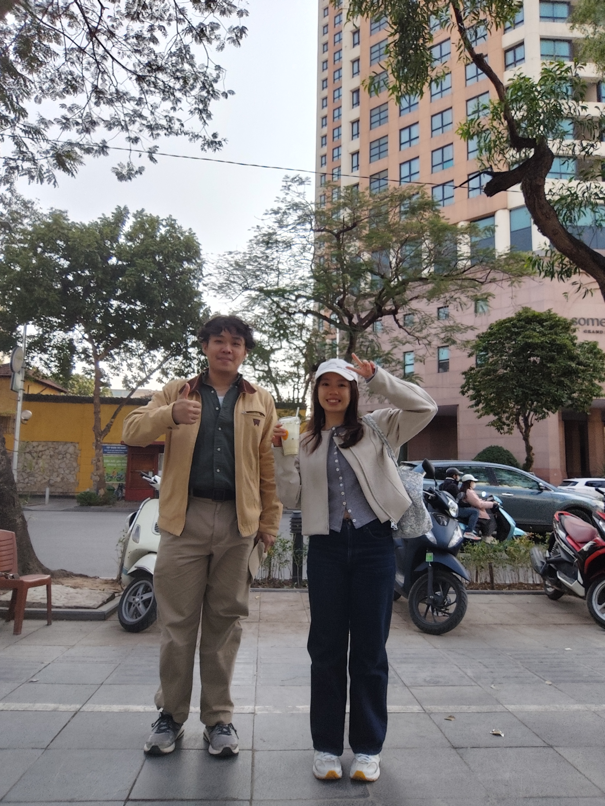

Over the lunar new year holidays in 2025, I went to Vietnam for a week; with my family for the first 4
 days, and solo the last 3 days. 
 I'd like to take some time to reflect on the trip, and hope this serves as useful information.
 
 
 
 ## Itinerary
 
I planned loosely around the main thing I wanted to do: Conquer mount Fansipan in Sa Pa. 
Everything else, I just made sure I was hitting certain locations like the old quarters, 
but no specific spots for food and shopping.

### With family
- Day 1: Exploring Hanoi Old Quarters, night train to Sa Pa
- Day 2: Exploring Sa Pa Centre
- Day 3: Go up Fansipan, night train to Hanoi
- Day 4: Exploring Hanoi West Lake and Old Quarters
### Solo 
- Day 5: Exploring Ba Dinh area, Old Quarters
- Day 6: Day trip to Ninh Binh
- Day 7: Lunch with Hanoi friend before flight

Itinerary-wise, this was rather tight. A night train meant we had a whole day to explore the area,
which was plenty of time, all the while saving on a night's worth of hotel fees. 
However, it also meant we had no hotel room to rest or refresh ourselves. 
In particular, having to wait for the train to depart at night, and having hotel check-ins in the afternoon meant no proper showers for a long period. 
 
I made a mistake planning a train back to Hanoi the night of my Fansipan hike, 
which meant I went a day without showering after my hike. 
Thankfully, the weather was frigid with strong winds, especially at the summit.
I didn't stink and didn't sweat.

Since we arrived during the lunar new year, or Tết, many shops were closed on the first few days.
It was a completely different Hanoi when we first touched down versus the last few days
(Tết celebrations ended on Monday, 3 Feb, and most businesses resumed then).

I expected we would see a unique side of Vietnam with Tết celebrations, 
but we didn't encounter much. What we did see were loads of families dressed to the nines
crowding the busy streets, and that was a sight to behold. Everybody looked so good.
Perhaps I could have planned better to seek out festivities, 
but I wouldn't say it's worth going during this specific period as shops are closed. 
 
 ---
 
## Climbing Fansipan
 
On to the main event! I climbed Fansipan in a day, which means I started early in the morning (around 7?) and reached the summit at noon.

Despite its relatively low elevation of ~3k meters, it's quite steep.
There are no tricky parts, just high steps, and each step took the wind out of me.
For my Hmong guide, it was a regular weekday, and I got *Hmogged* by him.

<figure>
 

<figcaption>At the start of the trail. What the hell was up with my hair?</figcaption>
</figure>

> We do this not because it is easy, but because we thought it would be easy.

It was only later when I told my friends about the trip that I realised how much of a feat it was to climb it in one day, let alone by noon. Most climbs up Fansipan take 2D1N. 

There are two rest stops along the trail, where you have lunch on the first and sleep in the second, resuming the climb the next day. 
For me, I skipped the first rest stop and had lunch at the second. This took about 3-4 hours, and the after lunch another 2-3 hours.

Once you reach the top (but not the summit), you'll be at the base of a very large temple, where the people come exiting out of the cable cars. There are steep stone stairs up to the summit, which took another half an hour. I was buffeted by strong, icy winds at the top, and it was too cloudy for a nice photograph. Oh well, I made it, and tasted victory, which tasted like... Chocolate, actually. 

### Getting There

Information online is conflicting. Climbing Fansipan is no joke, and you need to have a guide. The route was rather straightforward, but the guide will help sort out your permit and rest stops along the way. 

Also, because of the cable cars, you hardly see anyone on the trail. I ran into only a handful of people along the way. It's no good to be alone on a mountain. 

I was recommended [Sapa Trekking Hiking Tours](https://sapatrekkinghiking.com/) by my Vietnamese friend and they delivered. Fast to respond, English speaking, and they settle everything you need, also including taxi before and after the hike, and cable car/funicular tickets if needed. 

I requested for them for my family to join me at the peak, and I wasn't going to climb down on foot, so I also got myself the tickets.

Altogether, I paid about $230 USD, which would have been cheaper (per pax) if I had gone with a group. $90 for 1 pax hike, $35 x 3 for cable car, $7.50 x 3 for the funicular, and $5 x 2 for the transportation.

**On that note,** if you're just taking the cable car up, you will get there via the funicular
from Sun Plaza at Sapa town centre.

### Supplies

Hanoi has several winterwear shops of questionable authenticity. Fortunate for me, because I desperately needed more coverage than had I packed. Even Hanoi was unbearably cold for my ever-loving tropical sunshine self, so Fansipan would have killed me. I wore three layers — of which two were purchased from Hanoi — during the hike and it still wasn't enough to stave off the cold completely, which was intensified by the dampness.

I did have a hearty breakfast before departing, but I should have brought more snacks for energy. I was very much winded up until we reached the 2nd rest stop at 10am, where the guide prepared instant noodles with egg, and gave me fruits, Oreas, and soy milk as well. Having warm food when I was already half freezing to death kept me going for the last leg of the climb. 

<figure> 

<figcaption>
    The guides cooked over an open flame in the back.
    I needed to eat and rest here, oh, sweet salvation.
</figcaption>
</figure>

---
 
## Experiences and Recommendations
 
Here are the more generic experiences aside from the mountain.
 
### Hanoi

I did enjoy the shopping at Hanoi (primarily the old quarters). Sue me for buying counterfeit, but a part of me believes the goods touted are actually genuine, from the same factories, but somehow bootlegged out into the stores... Surely, someone along the way must have thought to smuggle some goods out of the factory line right? Nonetheless, they are quite convincing fakes. I'm not a good haggler, never will be, but I was fortunate to have my brother present to do the talking for me. 

After a while spent in Hanoi, things in the Old Quarters got repetitive. I had wanted to buy some nice-looking propaganda posters but the nice shops were closed and the not-so-nice prints I didn't bother.

I did spend some time out in the West Lake area, but didn't really explore that much. I will have to say the bookstores are nice and there are always nice cafes for you to visit. My Vietnamese friend informed me that it was a place where expats congregated.

#### Water Puppets
If there is one thing you must do, please go watch a water puppet show. PLEASE! It was the highlight of my trip, despite costing so little and being so short in duration. It truly was so creative, unique, and funny. I felt connected to the culture through the theatrical experience, I was almost brought to tears. 

I opted for the translation device, which has a little earpiece that doesn't directly translate the dialogue at all, but rather gives you background knowledge on what is being shown. I went to [Thang Long Theatre](https://maps.app.goo.gl/UYxepk42EQ4ZBFxa8). 
 

#### Ba Dinh
Also, do go check out Ho Chi Minh's Mausoleum while you're in town. It's a fairly orderly site where you follow a line and get to see Uncle Ho. It should go without saying, but dress respectfully, no hats, and no photographs either. 

He's very well respected by his country. Within the compounds, you also get to see his old house. It's actually quite nice. I didn't pay for anything, but also didn't enter the museum.

#### Hotels
I stayed at [Hanoi Marvelous Hotel](https://www.hanoimarvelloushotel.com/) and Spa while in Hanoi, and it served my needs well, being rather near to the old quarters and Ho Hoan Kiem. The breakfast was rather limited; you could have two servings of pho, pancakes, french toast, or eggs... Every morning, I had pho (different meat each time), and eggs/toast. There was also a small buffet section where I helped myself to sausages, cheese, bread, and the occasional vegetable or Vietnamese food (I don't recall the food being something to write home about). The hotel service was overall great.

The first night, my mom and brother stayed at [The Oriental Jade Hotel](https://theorientaljadehotel.com/), also near the old quarters. I took a later flight so I didn't stay with them, but it seemed nice when I went in to take a shower minutes before checkout. They gave us some Vietnamese coffee and the accompanying drip filter (Phin), which I put to use back in SG! 

#### Food

Here are some nice food places I personally tried.

- [Bún Chả Que Tre](https://maps.app.goo.gl/XWTbqdphoxWTXVm39) - Really good Bun Cha.
- [Pizza 4P's Bao Khanh](https://maps.app.goo.gl/Puq3Suaz3yHK5xo7A) - Every Vietnamese friend told me to try Pizza 4P's so I did. You also have to get a reservation. The pizza was delicious of course.
- [GoodTime Burger Bát Đàn](https://maps.app.goo.gl/AezMm6TfpKiBjMFaA) - The burgers were nice, and you have to try the Dream fries. I seriously need to reverse-engineer the spice mix.
- [Banh Mi 17](https://maps.app.goo.gl/VoqsWv7TwueN9cfDA) - On my very last night in Hanoi, I had Banh Mi, a Burger, fries, and a beer. It was the best way to close off the trip.
- [Banh Mi Paté Cô Hà 1](https://maps.app.goo.gl/49bLTvi286BRDvcVA) - Fast service and all-around good Banh Mi.
- [Take Taco II](https://maps.app.goo.gl/g63vLPiAmc7jWBBx6A) - Tacos were great, but I really LOVED their spring rolls.

---

### Sapa Town

I was enthralled by the town. It has a little old-timey vibe and gets really beautiful at night. However, I was put off by the Hmong people who peddled their wares. I know they are an underprivileged group in Vietnam, but it pained me to see them trying to earn money in whatever ways they could, even having the children dance on the streets. It just felt so demeaning (also, is child entertainment worth as much as child labour if they wanted to have their children work for money? Food for thought).

In any case, I bought a [Đàn môi](https://en.wikipedia.org/wiki/%C4%90%C3%A0n_m%C3%B4i) as a souvenir, and my mom got some pillowcases. 
Some of them will try to get you to follow them to their village, 
and if that's something you'd like to explore then go ahead. They aren't very pushy.

#### Night market

I don't have much in the way of recommendations, it's a rather small town.
The [Sapa night market](https://g.co/kgs/Cdu7opw) is a must-visit. Affordable and delicious food, primarily BBQ, and some dried meats. I bought some buffalo jerky and got to try horse and deer, among others

We wanted to visit [Banh Mi 911](https://g.co/kgs/1bv9DAL) but it was closed (or out of Banh Mi) the day we wanted to visit, and we were out of town the next. My personal 9/11. 

#### Hotel

I can't say much about the hotel, [Mong Village Resort and Spa](http://www.themongvillage.com/). I didn't stay there that long! However, the view is beautiful.
Oh, but there are only stairs...

Next time, I would just get a hotel near the town. It wasn't too difficult getting a taxi, but it was troublesome having to drive to-and-fro the town, where all the action is concentrated anyway, unless you wanted to be closer to the Hmong villages or quiet nature. 

<figure>

<figcaption>The view from our Sapa hotel, a ways off from the town centre.</figcaption>
</figure> 

--- 

### Ninh Binh

I had a bit of extra time in Hanoi, so I decided to book a day trip to either Ninh Binh or Ha Long Bay, both offered by the hotel.

I chose Ninh Binh, and on the morning of the trip I was picked up at my hotel by a tour bus,
joining a tour group. Given that I requested this on short notice, I was quite happy with the services, although I was a little bored with Ninh Binh.

Our first stop was Hoa Lu Ancient Capital. This was followed by some cycling around the area before we stopped for a buffet lunch at one of the hotels/homestays in the area. I quite enjoyed the cycling, for the weather was perfect and I liked the peaceful scenery, something different from Hanoi. 

The latter half of the day, we went to the river, and then the Lying Dragon Mountain.

The river trip was BORING. I spent 1.5h on the boat being ferried and after a while, I was getting cold... At the end of the trip, they ask you for tips.

At this point, I had genuinely ran out of cash on hand, so I sheepishly tipped the boater
barely enough for a meal, which was not well-received.

Lying Dragon mountain was a short hike, with nice views. At this point, I was ready to go back.

Anyway, for a day trip to Ninh Binh, it checked all the boxes for places people would want to visit, but I found it underwhelming. We were dropped off at our respective hotels around 8pm. I can't imagine how I'd have planned it differently anyway, so it was nice to just say I've been there, and move on. 

### Others

On my last day, I met my friend Chau who brought me around!

#### Trains

There are two options for night trains: King and Chapa Express. We took King from Hanoi to Lao Cai, and Chapa on the way back. Chapa is just better in my opinion. First of all, there are charging ports in the cabins. Chapa also had an on-train menu, and we got some beers and snacks from the trolley. You can even rest at the Chapa lounge at Lao Cai station. They were both clean and comfortable. As I've mentioned, these sleeper trains save you a night of hotel's stay, but you will be out of a place to freshen up unless you have early check-in, so do take note.

#### Clothing
I don't know if it was because of Tết or if uncles just have that much drip, but just about every uncle I saw was slaying the house down in their suits. Vietnam is known for some of its tailors, whose services are pretty fast and affordable. I hadn't planned to tailor a suit, but I feel I should have. All those uncles must have gotten their suits locally, and they were walking advertisements to the quality of suits in Hanoi to me.

#### This weird guy
I also met this weird guy at my hotel. He approached me at breakfast and spoke in an unsure, muffled manner, but I could tell he was from China and so I tried to speak Mandarin to him. Even then, he didn't speak very clearly. All I could gather was that he was there for parties... Maybe a sex tourist? Hahah. I never really got a proper answer. He did weird out the restaurant staff who afterwards asked me what his deal was. 
 
Hanoi's great. As a Banh Mi lover, I was disappointed, but apparently they're more known for their Bun Cha, with HCMC being the place to go if I want to explore good Banh Mi. I suppose it's a great stop for clothes and food. As my first foray into Vietnamese culture, it was a pleasant one. 

**P.S.** With the Vietnamese language having Chinese influences, I thought about how the written language is basically permanently in Hanyu Pinyin. 