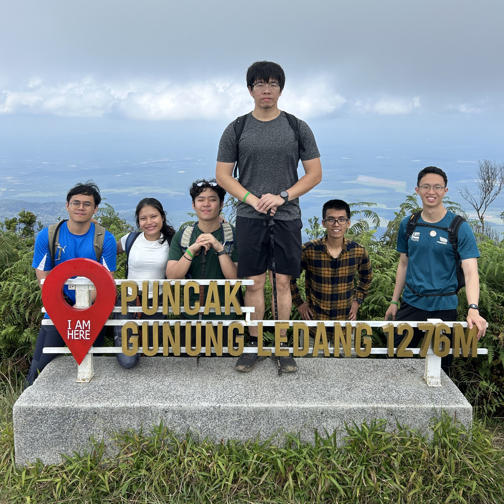
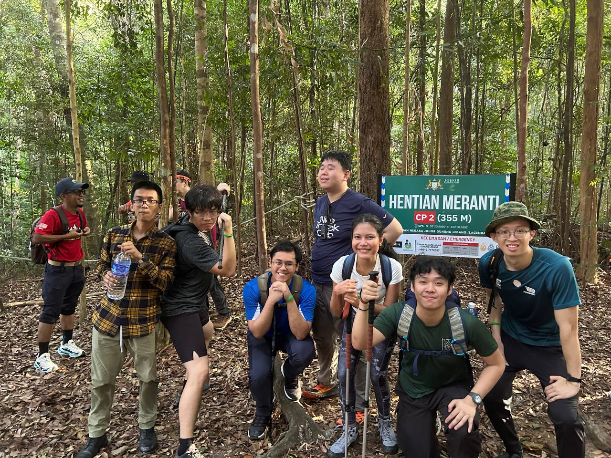
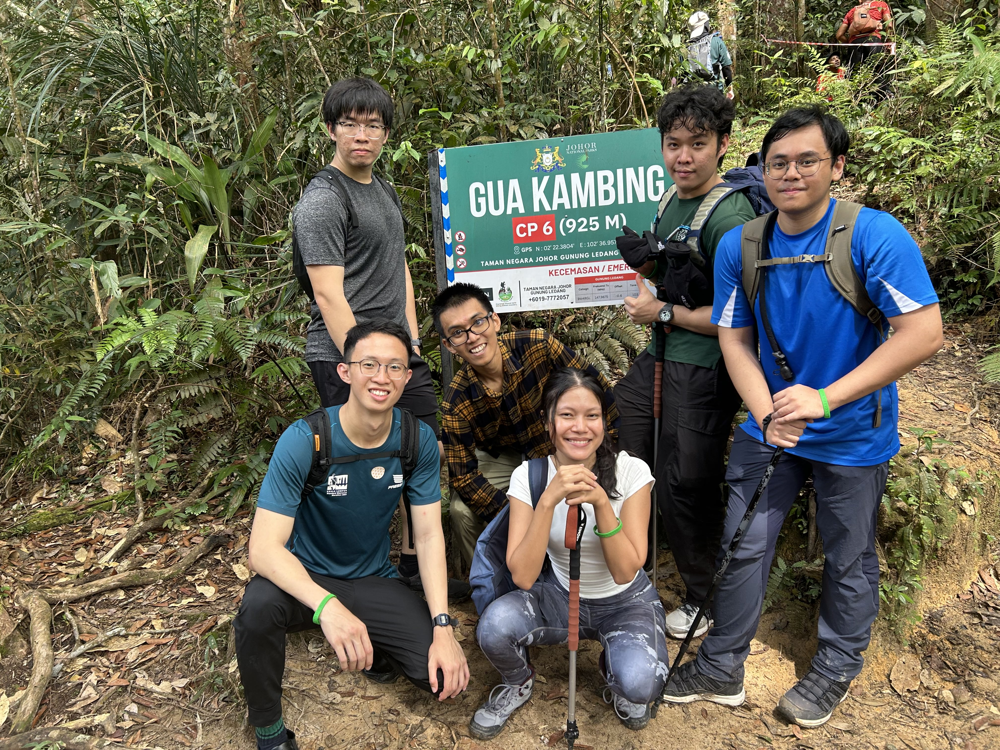
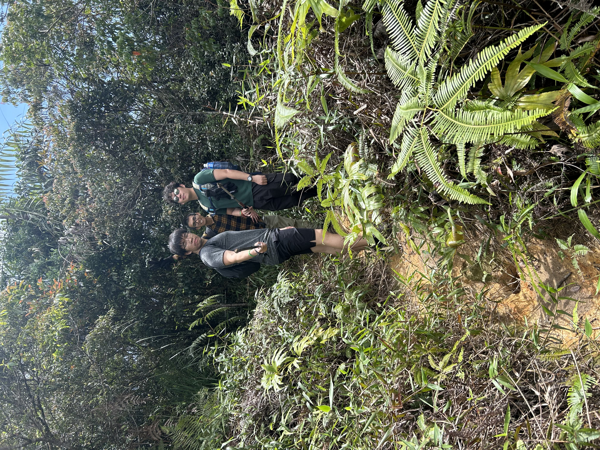
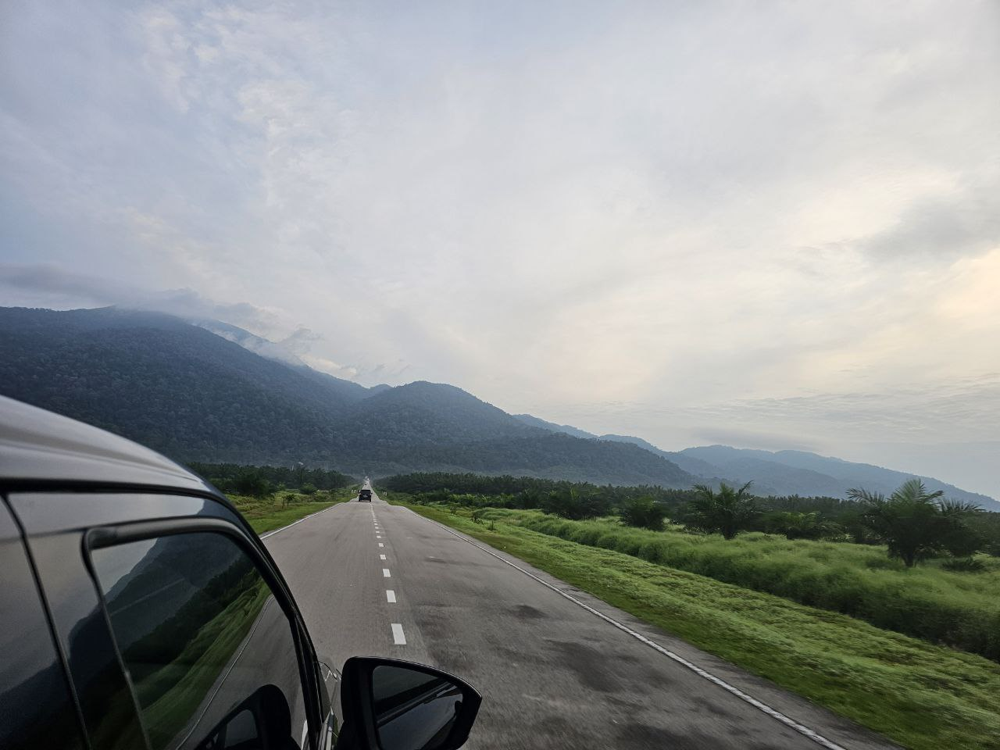
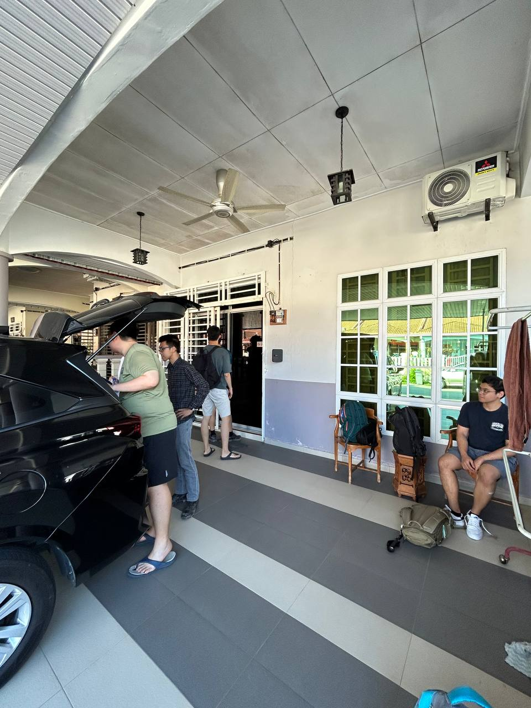
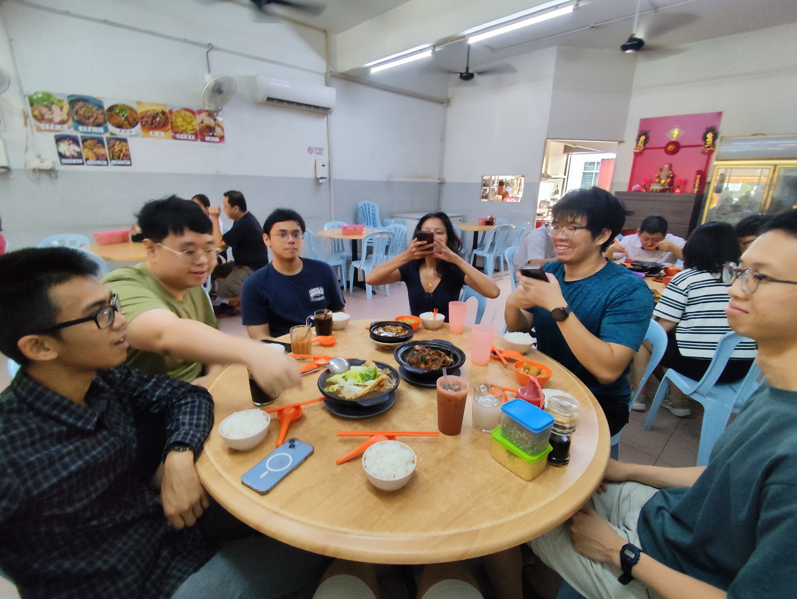
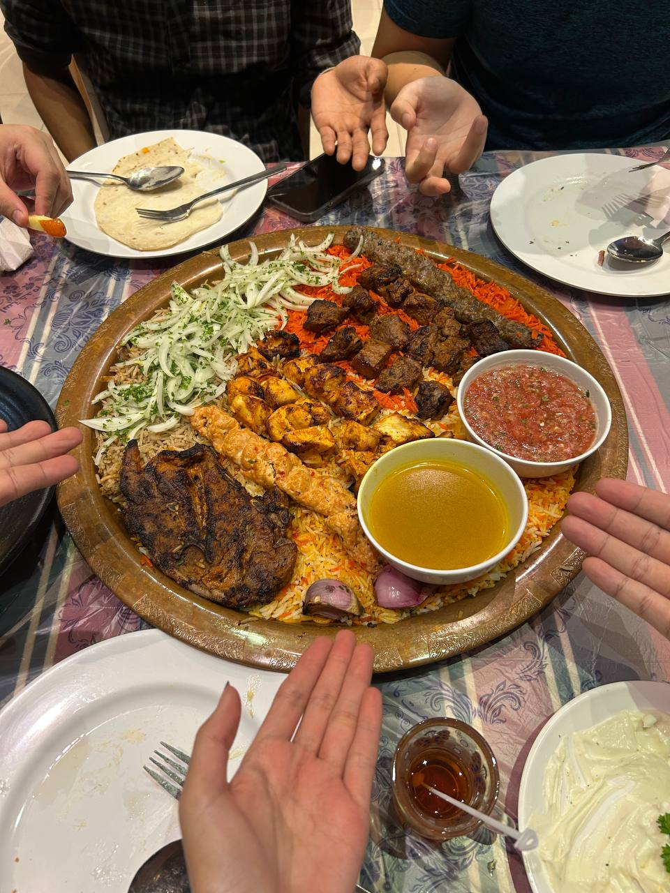
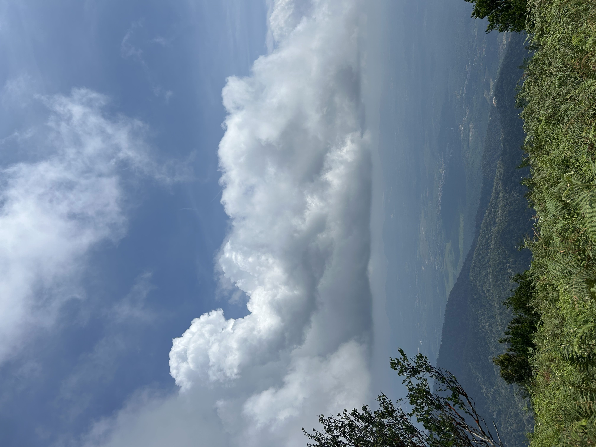

On 21 June 2025, my friends and I went to tackle Gunung Ledang,
also known as Mount Ophir, in Johor, Malaysia.
This was a fairly challenging climb, which we all totally underestimated
on account of its "measly" 1.2km elevation.

<figure>

<figcaption>At the peak! 6/7 made it.</figcaption>
</figure>

## Hiking the Mountain

The national park is a well-organised place. The guides all know each other and have radio comms.
Your own guide may not necessarily follow your group closely, but you'll find other guides
along the trail that will help you.

### The Trail 

We took the Lagenda trail, which appears to be the more conventional, well-maintained route.
I would recommend this to anyone going up for the first time. The paths were clear, clean,
and checkpoints were well-spaced.

The beginning of the trail was reasonably straightforward. For those doing a 1-day hike,
you'll skip a detour to CP4, where the campsites are, and go straight ahead.
After around CP5 was when things started picking up in terms of difficulty.

<figure>

<figcaption>Checkpoint 2 roughly 45 minutes in.</figcaption>
</figure>

#### The cut-off point

There are two ways up to the summit. The normal way, and the easier path. Usually,
you'd take the normal path and descend via the easier path, so you won't really meet anyone coming down.
However, if you don't reach the cut-off point by around 11am (just before CP5),
the guides will usher you to take the easy path up, and then back down.
This is because you **have** to summit by 2pm and start heading down by 2.30pm latest.

#### KFC and Ladders
Did I mention it gets harder after CP5?
Well, there were talks of a "KFC" after the checkpoint, and I was curious what it could mean.
Surely there wasn't a fried chicken outlet up there. Maybe it's just another checkpoint?

<figure>

<figcaption>The KFC we were promised near the peak was NOT finger licking good.
</figcaption>
</figure>

Near the end, the slope got steeper and instead of walkable paths,
there were tons of ladders and some ropes for you to climb up on a sloped boulder.
I took to this challenge with great enthusiasm, but for my friends who had had enough
at this point, there were alternative paths that the guides stationed around led them to.
The guides also helped a lot with those trying to get up via rope. 

<figure>

<figcaption>And then there were 6.</figcaption>
</figure>

We kind of had to leave one of our guys behind to take an alternate path, 
but he actually made it to CP7, the last one before the summit. However,
a giant boulder stood in-between after CP7, with some ladders to help you overcome it.

#### Water Points

There are two water points, one around CP5 and another on the way down.
When I say water point, I actually just mean a literal stream of freshwater.
It was actually really refreshing and I didn't experience any adverse effects.
There's also a toilet and prayer shack at the second water point.

### Duration
The estimated time for going up is 5-6 hours, and
coming down 4-5 hours. I took 5.5 hours to get up,
and about 3 hours coming down. Our group started at 8,
and reached the summit around 1.30pm. 

The latest you can stay up there is until 2.30pm. You have to reach the base
by 7pm, or be subject to overtime fees at RM50 per hour per group (essentially, per guide).

Our last guy only got down at 8.30pm after dark. Thankfully, he had a torchlight, and he was
accompanied by a patient member of our group and the guide, whom we tipped handsomely.

The ones who got down early settled their administrative forms (declaring no trash thrown)
and had time to drive back to the house for a shower before coming back for the stragglers.

### Experience
I consider myself fit enough, so this hike wasn't terrible, but it certainly was more work
than I had expected, along with my overpacking.
Nonetheless, I found the ropes and ladders more fun than anything.

---
## Itinerary

### Getting there

<figure>

<figcaption>Road leading up to the national park</figcaption>
</figure>

We chose to drive to the location in a rented 7-seater Perodua Alza.
Renting the car was a smooth process. No IDP needed as I had a Singapore driving license.
They gave us the car with 1 bar of fuel remaining, so the first stop was to refuel.

Driving from Johor Bahru to Tangkak took about 2-3 hours.
It may take up to 5 hours if there's a jam. 
I would suggest getting there while the sun is out. The roads are unlit
and everyone's driving really fast. Plus, it can get jammed on certain evenings,
including on the way back. Malaysian drivers are, however, very good compared
to other Asian countries I've been to.

We set off on Friday evening. Most of us took half a day off work.
We bought our supplies in JB, got the car at 5pm and set off.
We had dinner at Yong Peng along the way, and reached the house at 10pm.

### Tangkak

While the national park was nearer to Sagil, we decided to stay in Tangkak.
The food there was great, especially after the hike.

We wanted to try [beef noodles](https://maps.app.goo.gl/YkbVTK69zkdfzVMJ8) which was the local specialty,
but it was closed so we went next door for [Bak Kut Teh](https://maps.app.goo.gl/EkBwvs1vH6VCYDsw7).
In the same stretch of buildings, there's also a place to buy [traditional snacks](https://maps.app.goo.gl/kg3uYbk28mCtB63G8).

We didn't spend much time in town, as we wanted to get back to JB before the Sunday evening highway jam.

<figure>

<figcaption>Last pic was in JB.</figcaption>
</figure>

We reached JB by noon, so had the rest of the day to enjoy the city.

### Packing Notes

You are expected to account for all your belongings during the trail,
counting all your items on your person and making sure they tally at the end of the hike,
which means not leaving anything behind. It's a RM5 fine per item lost, deducted from a RM200/group
deposit at the start.

The weather was absolutely fine, apart from a bit of tropical heat.
I packed a jacket but that wasn't needed at all. In hindsight,
I should have packed less. I should have had a better way to stow away my sticks, which got in the way
at the ladders/ropes. My gloves were a godsend because on the way down, I was grabbing a lot of branches,
mud, and rocks.

### Costs

Prices listed in the currency paid. 
Prices per pax were divided over 7 people.

- Trail Guide: RM200 for Non-Malaysian, RM165 for Malaysian
- Accommodations: RM510 3D2N (~RM72 per pax)
- Car Rental: S$154 2D (~S$22 per pax)
    - Fuel: RM85, About ~RM2-3/L, roughly 40L for the whole ride
- Food: Depends, but we spent roughly RM100/pax altogether
- Some small fees for parking/tolls where applicable.

#### Total
At roughly 3.32 MYR to 1 SGD or 4.28 MYR to 1 USD,
per-pax costs were about 150 SGD or 116 USD as of current exchange rates.

This was a worthwhile trip. Let me know if you want any recommendations.

**Update:** a month later, we got informed by the rental company that we were caught speeding
down the expressway, doing 124km/h on a 110 road. 

I'd say it's totally normal in Malaysia to speed,
everyone's actually decent at driving... we just happened to get caught.

Anyway, that tacks on another RM300 or ~S$90 to the total costs.

Some of the pics in this post courtesy of the others.
