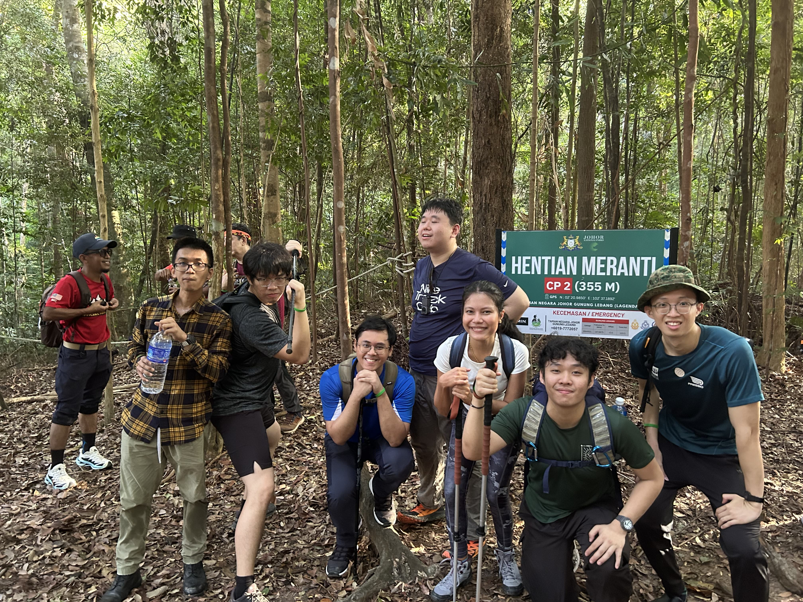

On 21 June 2025, my friends and I went to tackle Gunung Ledang,
also known as Mount Ophir, in Johor, Malaysia.
This was a fairly challenging climb, which we all totally underestimated
on account of its "measly" 1.2km elevation.

<figure>

<figcaption>At the peak! 6/7 made it.</figcaption>
</figure>

### The Trail 
We took the Lagenda trail, which appears to be the more conventional, well-maintained route.
I would recommend this to anyone going up for the first time. The paths were clear, clean,
and checkpoints were well-spaced.

The beginning of the trail was reasonably straightforward. For those doing a 1-day hike,
you'll skip CP4, where the campsites are, and go straight ahead.
After around CP5 was when things started picking up in terms of difficulty.

<figure>

<figcaption>Checkpoint 2 roughly 45 minutes in.</figcaption>
</figure>

#### The cut-off point

There are two ways up to the summit. The normal way, and the easier path. Usually,
you'd take the normal path and descend via the easier path. However, if you don't
reach the junction by around 11am, you'll automatically take the easy path up, and then back down.

#### KFC and Ladders

### Duration
The estimated time for going up is 5-6 hours, and
coming down 4-5 hours. I took 5.5 hours to get up,
and about 3 hours coming down. Our group started at 8,
and reached the summit around 1.30pm. 

The latest can stay up there is until 2.30pm. You have to reach the base
by 7pm, or be subject to overtime fees at RM50 per hour per group (essentially, per guide).

Our last guy only got down at 8.30pm after dark. Thankfully, he had a torchlight, and he was
accompanied by a patient member of our group and the guide, whom we tipped handsomely.

### Experience
I consider myself fit enough, so this hike wasn't terrible, but it certainly was more than I had expected.
Nonetheless, I found the ropes and ladders more fun than anything.

---
## Itinerary

### Getting there

We chose to drive to the location in a 7-seater Perodua Alza.

### Tangkak
While the national park was nearer to Sagil, we decided to stay in Tangkak.
The food there was great, especially after the hike.

We wanted to try [beef noodles](https://maps.app.goo.gl/YkbVTK69zkdfzVMJ8) which was the local specialty,
but it was closed so we went next door for [Bak Kut Teh](https://maps.app.goo.gl/EkBwvs1vH6VCYDsw7).
In the same stretch of buildings, there's also a place to buy [traditional snacks](https://maps.app.goo.gl/kg3uYbk28mCtB63G8).

We didn't spend much time in town, as we wanted to get back to JB before the Sunday evening highway jam.

---

## Costs

Prices listed in the currency paid. 
Prices per pax were divided over 7 people.

- Trail Guide: RM200 for Non-Malaysian, RM165 for Malaysian
- Accommodations: RM510 3D2N (~RM72 per pax)
- Car Rental: S$154 2D (~S$22 per pax)
    - Fuel: RM85, About ~RM2-3/L, roughly 40L for the whole ride
- Food: Depends, but we spent roughly RM100/pax
- Some small fees for parking/tolls where applicable.

### Total
At roughly 3.32 MYR to 1 SGD or 4.28 MYR to 1 USD,
per-pax costs were about 150 SGD or 116 USD as of this date.
