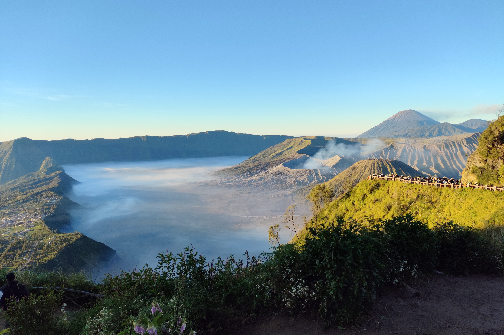

Over the weekend, I went to Surabaya on the Indonesian island of Java
to explore the famous volcano spots Ijen and Bromo.

We were so lucky to be blessed with two days of no rain, and clear skies!
While my photos are clear, you simply had to be there to take in everything
with your own two eyes. Trust me.

I went with some friends, but made plenty more by going with Sotravel.
All 19 of us became fast friends during the trip, which only spanned three days!

---

## Ijen Caldera

We first went up Ijen to view the sulfur and blue flames.

The trail had us going up to the rim of Ijen caldera, followed by a descent into
the crater where we could observe blue flames (sulfur gas ignition) within
the active volcano.

Oh, and to see the blue fires, we had to be there before sunrise, while it's
still dark. So, we began the hike around 2am. Check out what's in store for you
once you reach the bottom!

<video muted controls>
  <source src="./ijen-flames.webm" type="video/webm">
    Your browser does not support the video tag.
</video> 

### Trail

We left the hotel at Bondowoso at **11pm** and drove about 2 hours to 
[Paltuding](https://maps.app.goo.gl/CitaF1pMmTgx4DxS7), where there were campsites,
rest areas with warm food and toilets, where you can rent gas masks, jackets, and headlamps.

We took a short break to fuel up with some warm drinks and instant noodles.

The weather at this point is quite cold, as Paltuding is about 1.8km above
sea level, and you trek about 500m (elevation gain) to the crater rim.

It was a decent hike to the rim; consisting roughly 2 hours of continuously steep ascent.
Nothing technical, but just required you to keep moving. Quite like an incline walk on the treadmill.

#### Going Down 
Once at the rim, you start your descent into the crater. This one takes about 45 minutes
and is even steeper. You have to negotiate the rocks, narrow path, slopes, and crowd to get down. 

Usually, the crowd bottlenecks around here because inexperienced hikers descent slowly,
and there are miners/hikers going up as well.

<figure>

<figcaption>The crowd near the start of the descent, with a miner carrying sulfur going up.</figcaption>
</figure>

Once at the base, you get to see the blue flames. Expect to have to weave through crowds
to get a chance to pose up close...

A bunch of vendors also sell sculptures made out of sulfur. It's cheap and supports the economy,
I probably should have gotten one.

My girlfriend made it to the base faster than I did. She's a natural!

#### Back up

On the way up, the encroaching morning sun painted light across the landscape and we were 
able to see what was previously hidden in the dark: the gigantic acidic lake in the caldera,
and the neighbouring mountain ranges. 

Oh yeah, we also ran into some school friends in a different group!

<figure>

<figcaption>The way back up to the rim, with "taxis" lining the path offering to send you down.</figcaption>
</figure>

I would say it was breathtaking, if not for the smoke and sulfur.

After Ijen, we got back to the hotel, had a wash-up, and checked out of the hotel 
to head for lunch and then to Probolinggo.

---

## Bromo (Tengger Semeru National Park)

On the third day (at this point, with our nocturnal itinerary, night and day became a blur...),
we went up to Bromo, or more accurately [Bromo Tengger Semeru National Park](https://g.co/kgs/drzV9rt)
which encompasses the entire volcano/mountain complex.

### Mount Kingkong

Our first stop was Mount Kingkong, which overlooks the entire Bromo cluster.

We left the hotel at Probolinggo at 12 midnight, arriving at the 
[national park](https://maps.app.goo.gl/PKfCSRzNGkyXTpFr5) around 1-2am.

There's actually a bunch of homestays at the base, but we didn't stick around.
We switched to jeeps, and had a bendy and bumpy ride up Kingkong.

We chilled (literally.) around [Bromo Cafe](https://maps.app.goo.gl/9TFNDyj68E6KyejdA),
one of the many cafes that serve the tourists. Hot drinks, noodles, and souvenirs 
sold here.

<figure>

<figcaption>Nothing beats hot food and cool weather.</figcaption>
</figure>

We were there until sunrise, stargazing. At the crack of dawn, everyone gathered
outside to start taking photos as colour started filling into the distance.

<figure>

<figcaption>Stars were out in full force. I saw Orion and Aquarius, and many others
I couldn't identify.
Check out that <a href="https://en.wikipedia.org/wiki/Bintang_Beer">red star</a>, too!</figcaption>
</figure>

We were really lucky to get clear weather. As nice as it looks in my photos,
you really had to have been there to take it all in with your own eyes.

<figure>

<figcaption>The view from Kingkong. We witnessed an ash eruption of Semeru, the 
highest point in Java.</figcaption>
</figure>

I want you to pay attention to the last image, because that's where we went after having
taken in the sunrise view. Bromo is the little smoking volcano at the bottom left.
You may even see the temple and steps to take up to the rim.

### Sea of Sand

After Mt. Kingkong, we headed down by jeep to the Sea of Sand, to walk across and
climb up to the rim of Bromo crater.

Beyond the jeeps' parking spots, there's a vast expanse of sand and some vendors peddling
horse rides to get you across to Bromo crater.

We decided it'd be fun to run and try to outrun our friends on horses
(that didn't last long).

<video muted controls>
  <source src="./bromo-horserun.webm" type="video/webm">
    Your browser does not support the video tag.
</video> 

To get up to the rim, there's a long flight of stairs. If you're brave enough, you can bypass
the stairs (which can be slow with tourists clogging it up) and just climb your way up.
I only descended that way after realising it was allowed.

We didn't spend too much time here, on account of having to head back down to the hotel 
to check out. It's not a very long walk, much less so if you ride the horses.

<video muted controls>
  <source src="./bromo-jeep.webm" type="video/webm">
    Your browser does not support the video tag.
</video> 

The rest of the day was spent lollygagging until our flight home in the evening.

---

## Itinerary

### Nosleep

We had absolutely zero nights of proper sleep. Most days began early
in the wee morning in order to outrun dawn.

### Packing Notes

We were lucky not to have encountered any rain, but everyone who's gone
recommends **waterproof** raincoat/poncho/jackets.
Naturally, the weather will be cold (10-20°C) in both areas.

Bring shoes appropriate for trekking as you don't want to risk slipping
on Ijen on either descent (into crater, or back to base).

Bromo is easier, but there's lots of ash/sand on the ground.

### Costs

- Sotravel booking: $349
    - Includes hotel, transport, park entry, equipment rental, and guides.
- Flights: $231
- Food, purchases, tips: I spent roughly $70

**Total:** $650, give or take. Prices in SGD.

if you decide to pay for added services (quoted from the vendors):
- "Taxi" rides up/down Ijen: ~$100 USD up, ~$20 USD down.
- Pony rides across the Sea of Sand to Bromo: ~$20-30 USD.

It may be cheaper if you settle the itinerary yourself, 
probably saving up to $100.
I also feel like I could've gotten a better deal with the flights.
Nonetheless, it was well worth it for all the people I got to meet.

Some photos courtesy of friends.
