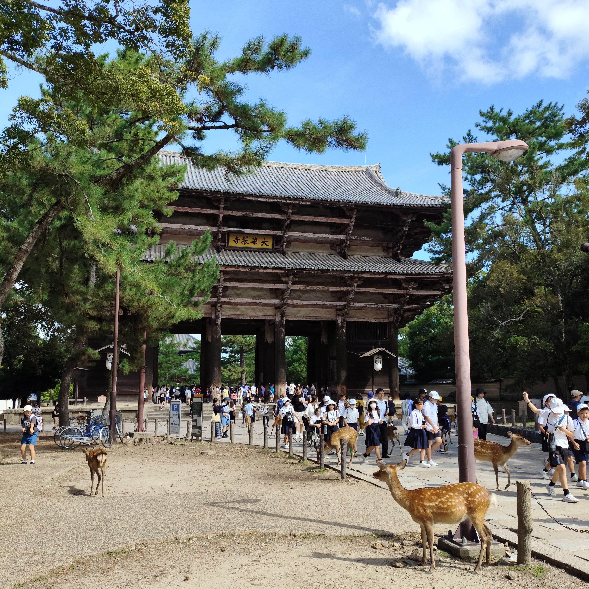
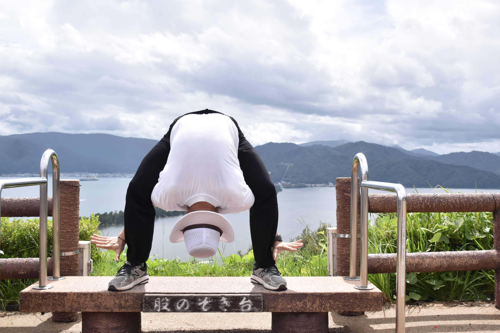
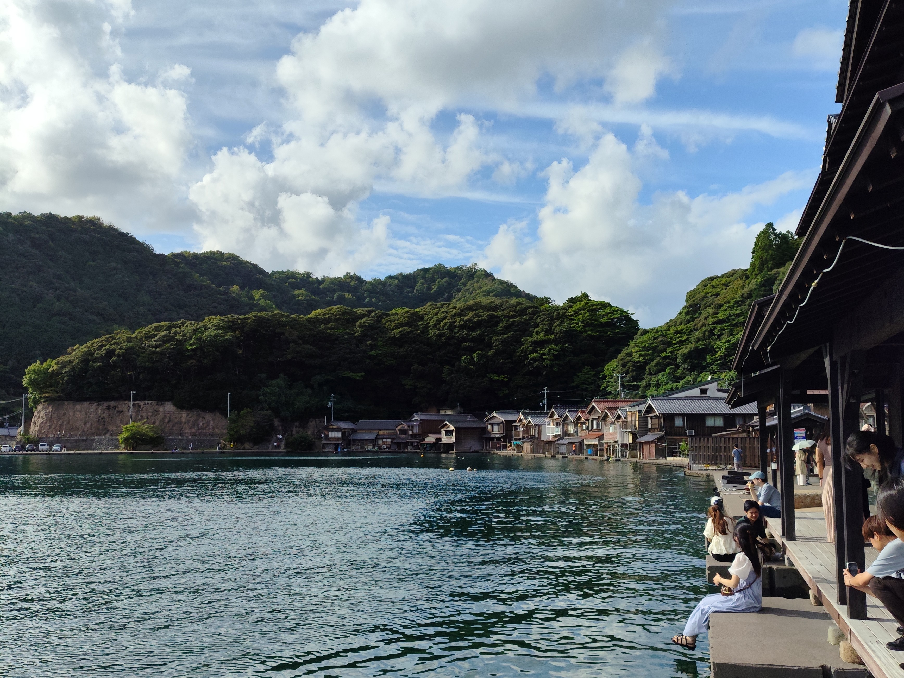
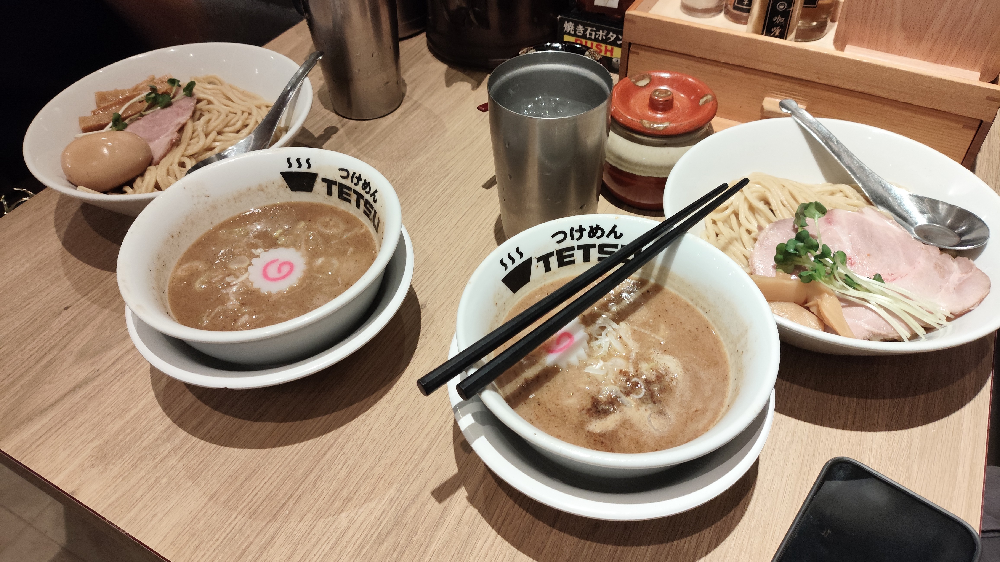
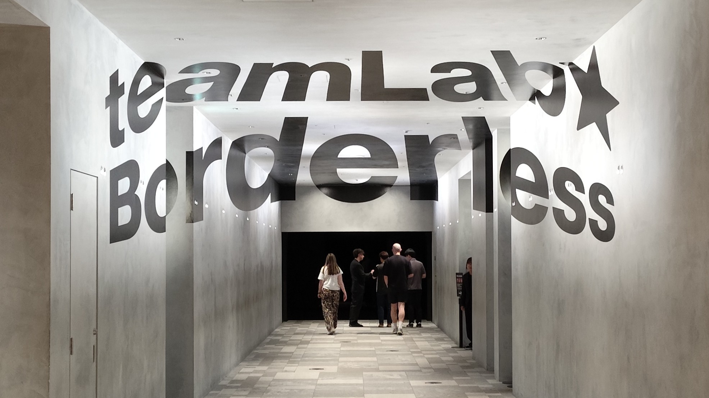
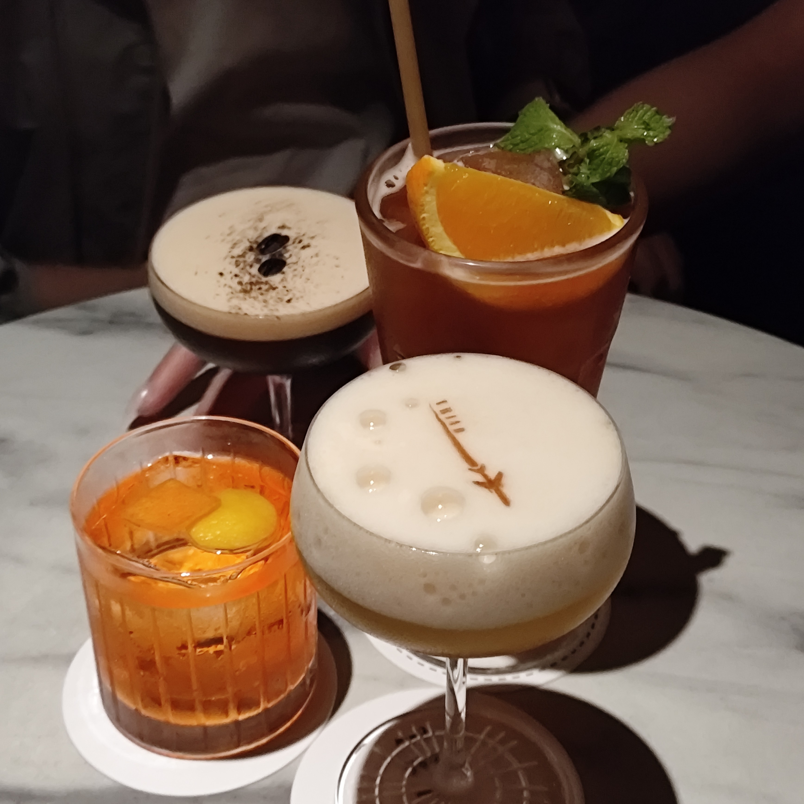
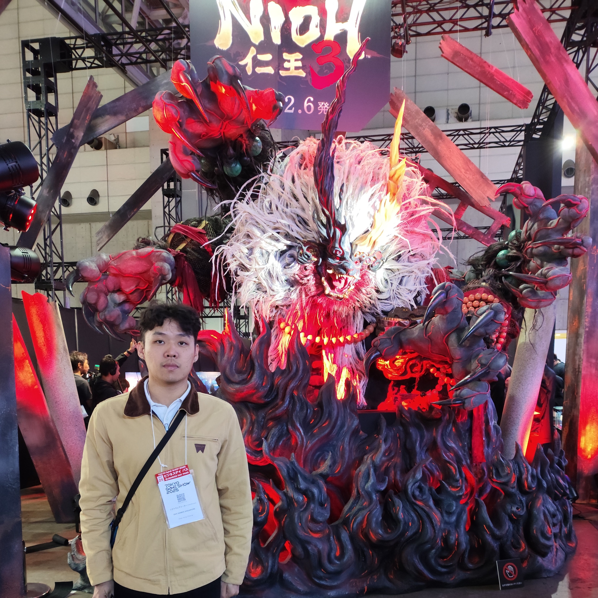
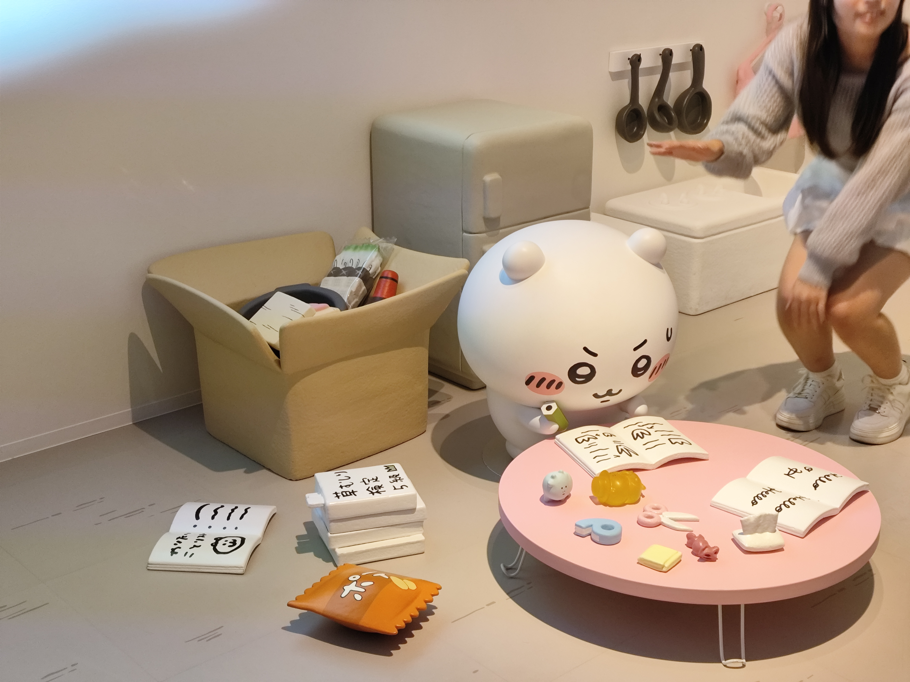

I went to Japan with my colleagues in September, primarily to attend 
Tokyo Game Show (TGS) on the 25–26th.
We also spent some extra days enjoying Osaka and Tokyo,
taking paid leave and financing the trip out of our own pockets.

The last time I visited Japan in 2020, I went solo, which was great for taking
long walks, but not so much for shared experiences, which I think I maximised on this trip.

Too much, in fact. Each day was packed to the brim, with little room for
impromptu arrangements. Thankfully, we were blessed with near-perfect weather.

Some lesser-known areas were visited, such as Amanohashidate,
and Oyama for a firework festival. 

<figure>

<figcaption>First meal together.</figcaption>
</figure>

## Osaka

The first half of our trip was spent in Osaka, and naturally parts in Kyoto.
We got a relatively cheap Airbnb, which was located in the middle of Haginochaya,
apparently a slum. Still, it was safe enough.

I liked the Airbnb. There was a TV at the common area, and we actually watched
the entirety of La Grande Maison Tokyo over the course of the stay. That's 
when I learned of Takuya Kimura, apparently Japan's (past) reigning heartthrob?

My first actual day was spent at USJ. I was surprised at our endurance;
we were in the entry queue early and stayed 'til near closing hours.
We went for the Halloween Horror Nights event, and I gotta say the haunted
houses are quite something. Won't go again, the thrills just aren't worth
the crowds and queues.

### Nara, Uji, Ogura (Nintendo Museum)

Would you believe I'd never been to Nara park? Anyway, I still haven't, but I
did pass by on the way to [Todaiji](https://en.wikipedia.org/wiki/T%C5%8Ddai-ji).
Aside from the big buddha, there's also a hole in a pillar that's said to bless you
if you can pass through it. Unfortunately, I was unable to negotiate the width of the hole;
my shoulders were just barely too wide. The long line of kids behind me also didn't give me
many attempts. I suppose my next life won't be so swell, but that's for the next
reincarnation to deal with.

<figure>

<row>

</row>

<figcaption>Sorry Sze Long for airing you out like this.
This hole was made for me!</figcaption>
</figure>

The temple + museum were breathtaking, especially in clear weather.
 I absolutely adore the architecture and 
craftsmanship of the statues AND the pillars.
I got a charm for my girlfriend's to achieve employment, and me for my safe travels.

Afterward, a short afternoon at Uji, known for tea. The highlight was certainly
[Nakamura Tokichi Honten](https://maps.app.goo.gl/ypSex6RsJqVFJi8r5), for which you
had to wait an hour, but the parfait I had was so worth it. Of course, we got to walk around
before our turn in the queue.

We finally went to Nintendo Museum at our ballotted timeslot, and it's built from 
one of Nintendo's first factories. You can't take any photos inside, but it's basically
got all their hardware, and some games, all from the beginning.
I especially appreciated seeing the prototypes 
of the Wii remote up til the final design.

<video controls muted>
  <source src="./nintendo.webm" type="video/webm">
    Your browser does not support the video tag.
</video> 

On a different floor, there was a play area with demos of their games. 
You had limited tokens to spend, so you had to choose which ones you wanted to play.
The stations ranged from a faithful NES setup
to their earlier physical toys to more arcade-style games.

### Amanohashidate 天橋立

<figure>

<figcaption>You're supposed to strike this pose 
to look at the sand spit upside-down
to see a bridge to heaven.</figcaption>
</figure>

I happened to have my International Driver's Permit, so we rented two cars with me
as one of the drivers, which was a great idea considering how far Amanohashidate was.
A little countryside drive was what we needed to make this trip stand out.

Thankfully, Japan's cars and roads were pretty much the same as Singapore's, so I had 
no trouble driving at all. At some points, the parts up north by the sea (at Ine)
had really narrow roads, but the problem was never the road, just congestion
with other cars.

Amanohashidate was pretty interesting. It's a linear path across the sand spit, and then
you can take a ski lift up to a viewing point.

I highly recommend doing a road trip around Japan at least once, for you
check out the countryside. One thing to be wary about,
the tolls are so expensive, but so are the long-haul train trips anyway...

We also went further up north to Ine before making the trip back, making the 
occasional pit stop.

<figure>

</figcaption>
<figcaption>Not pictured: the stress I caused myself because I entered
the wrong carpark.
</figure>

Other than that, I wanted to visit Mt. Kongo but got lazy what with the
hectic schedule and the weather forecast. We went to Minoh falls instead.

---

## Tokyo

Our (business) hotel for Tokyo was [Seiyoken](https://maps.app.goo.gl/ARGFUCbxkRhBa2kS6),
around Musashi-Kosugi which I suppose is more Yokohama/Kawasaki than Tokyo, and
certainly quite far from Makuhari Messe...

Some things were done in the city area. Firstly, a visit to [TeamLab borderless](https://www.teamlab.art/jp/e/tokyo/). Simply something you have to experience
with your own eyes.

We also went to DisneySEA. The rides were less thrilling than USJ, but it 
was nice immersing myself into the intricate sets. Disney isn't really my thing,
though, so that's the last I'll visit the place in the foreseeable future.

### Tokyo Office 

We visited the Osaka office while in Osaka,
and then the Tokyo office in Tokyo, which was the closer branch to us.

<figure>

<figcaption>
Top photo was from Osaka office (HQ).
Below two were with Tokyo office folks.
I'm a big fan of Shinkiro's artwork.
</figcaption>
</figure>

The night ended with delicious Yakiniku and drinks. Okay, it didn't end there.
Some had DDR (Drink Drink Ramen), some went to the arcade, and I went to a bar
afterwards.

### Tochigi/Oyama

We went up north, about 2 hours by train one-way, for hanabi (花火),
a fireworks show! There were stalls all around, and we got seats (ahead of time)
at a grandstand by the river where the fireworks were released.
Everyone was in kimonos and yukatas, it was a sight to behold.

<video controls muted>
  <source src="./hanabi.webm" type="video/webm">
    Your browser does not support the video tag.
</video> 

Despite the crowds, it was well-managed on-site and I don't think I'd have been able
to arrange something like this for myself, as a foreigner.
The fireworks were incredible and went on for like 1-2 hours. I think I did get 
a little sleepy near the end.

### Tokyo Game Show

The thing we came for! This was my second game convention after Gamescom Singapore,
and I still wish I had more hours in a day to experience everything.

<figure>

<figcaption>
There was a challenge to beat a boss (umm.. right behind me isn't he?)
within a certain time limit to get a T-shirt.
We couldn't do it!
Tried like three times. I was playing Nioh 1 at the time, so I thought my 
muscle memory could come in handy, but the mechanics were just so different.
</figcaption>
</figure>

I don't actually have much to say about this. Two days were spent trying to 
maximise the number of demos played. Lots of cool merch and cosplayers.

### Other stuff

I visited Chiikawa Park! It was... alright. I had a lot of self-control seeing 
all the Chiikawa merch being sold and... didn't buy much! Only a popcorn holder.

I also went to a sumo show which was also *meh*, but I guess I shouldn't have
expected much. It was one of those foreigner-oriented shows, 
so no actual serious sumo-ing.

<video controls muted>
  <source src="./sumo.webm" type="video/webm">
    Your browser does not support the video tag.
</video> 

---

## Itinerary

### Costs

Most of our costs were shared within the large group, so I can't say these prices
will be representative of most trips, least of all the 12-man AirBnB.

- $308 SIN -> KIX via Peach MM774 + 1 checked luggage
- $257 NRT -> SIN via Air Japan NQ3 (which got CANCELLED on the morning of...)
- $434 NRT -> SIN via Zipair ZG53 (Insurance covered me)
- $639 Total accommodations (average $60 a night)
- ~$300-500 on transport including train, shinkansen, and rental car + tolls (amortised)
- $350 on a Seiko SBSC001 (Japan exclusive! no regrets)
- ... other costs which widely vary based on the traveler...

Total was about $3k+, which I came to learn was "not that bad", but it still stung
to me, because I hadn't been on a longer trip lately.

--- 

If you made it this far, this is me singing *Majulah Singapura* because someone 
queued it at the karaoke and no one stepped up to sing it.

<video controls>
  <source src="./majulah.webm" type="video/webm">
    Your browser does not support the video tag.
</video> 