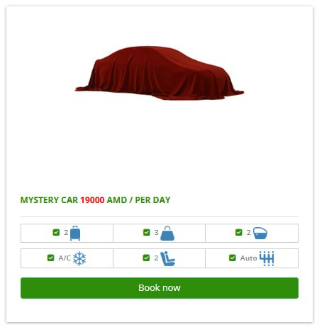

Caucasus! This was part of a multi-country trip I had. See also: [Georgia](../2025-10-georgia/).
I went with a friend and two others, four of us boys sharing one car.
To explore the sparse mountainous countries in the Caucasus region, a car
was definitely needed.

This was my first time outside of Asia/Oceania, and this region being my first 
foray into Europe seems a little unorthodox. I don't think it's a popular 
tourist spot, and I mostly saw Chinese and Korean tourists if I even saw them at all.
As usual, I'm going to share my experience!

Some things you might enjoy in Armenia, and by extension, Georgia (but I'll save the 
specifics for its own post), include nature and history. These areas are very mountainous
and have beautiful sceneries. Just about everyone seemed to grow their own grapes
and apples. 

As you might know, Armenia is the first Christian country in the world,
followed by Georgia, in adopting the state religion. 
I'm no Christian myself, but I'm grateful to be able to first enjoy the shrines of Japan
followed by some of the oldest monasteries and churches in the world.

Anyway, Armenia is safe! Everyone's really nice and chill. It wasn't uncommon to find kids who'd
want to take photos with us. Maybe they don't get to see Asians often.

The entire time we were there, it was cloudless,
bare blue skies, except in Yerevan. The sun shines really bright, despite the colder
atmosphere, so sun protection was important.

## Zvartnots

We spent our first night in Zvartnots technically, touching down at the airport
just past midnight and spending the first night at hotel [Altunyan](https://maps.app.goo.gl/Ejznis2UYUK9P7ie8).

We were unaccustomed to the driving and missed a turn, and were thus rerouted through
the [Alley of Glory](https://maps.app.goo.gl/rTnTqdx4ynGeSGVk7), which was quite a trial to drive through.
Bumpy and narrow roads, darkness in some parts, with an apt name to boot,
just the type of drive we needed at 1am after a series of flights.

Our hotel window faced south, so we had a nice view of Mount Ararat, which remained visible as we
drove down to Khor Virap, en route to Areni, to kick off our trip proper.

### Khor Virap

## Areni 

Our check-in date was on the 4th of October, which just so happened to be the day of the biggest wine 
festival in Armenia, located in Areni. The traffic was crazy.
Because we booked a shack on top of Noravank Gorge, [Sareni](https://www.ecolur.org/en/news/biodiversity/15945/),
the only way up was through a mountain road which was closed off on this very day

<figure>

<figcaption>

First Armenian meal of the trip: [Arpi Hacatun](https://maps.app.goo.gl/Mzz4BsgSQBJ9Rzp76)

</figcaption>
</figure>

We contacted the folks and the manager, Vardges, led us to his restaurant, where we parked our car
and took his jeep up another off-road way up to Sareni, which our rental car wasn't built for.

[Sareni](https://www.ecolur.org/en/news/biodiversity/15945/) is one of two huts sitting atop the gorge,
surrounded by nothing but nature. Aside from the spotty water heater, it was bliss.

Later on in the day, we went to get our car again. By this time, the festival had cleared,
leaving drunk people just walking along the roads. I say this without any negative undertones.
They were drunk off wine from the festival, and they looked very jolly.

We also got dinner from [Vardges' restaurant](https://maps.app.goo.gl/FCfvpekNV2T8hYxN7),
portioned "for two"... staples including
bread, fish, (goat?) cheese, [gata](https://en.wikipedia.org/wiki/Gata_(food)), vegetables.
By the way, their restaurant has NO electricity whatsoever!

### Arpa Protected Landscape

I can't be sure where we walked around, as the Google Maps data isn't substantial,
but I'll just say we were in the vicinity of the [Arpa Protected Landscape](https://maps.app.goo.gl/mxKD7JpKHWLyLsn29).

Lord, it was beautiful. We could just leave the hut and trek around, which we did.
The views were amazing, nature all around us, and it was all for us to enjoy since we 
were the only ones staying up there (another couple later checked into the other hut
later that night). Didn't see any bezoar goats this entire trip, which was a bummer.

The first of many scenic pisses.

### Noravank Gorge and Monastery

## Lake Sevan

From Areni, our next stay was at Garni. We decided to drive up north and pass by
Lake Sevan, seeing as the major roads looped around the terrain. It's the biggest lake 
in caucasus, all the more significant for a landlocked country. 

We had some nice food (seafood included!) here, I believe it was [Tarsus Sevan](https://maps.app.goo.gl/2oJCRp6dRXmq8v477)
and visited the monastery atop Sevan island, now a peninsula.

## Garni, Geghard

We stayed for a night at Garni, in a "hidden garden". 

We told the owner we were headed for Geghard monastery, and he gave us a chef's kiss
and made the sign of the cross, so you know UNESCO got something good in store for you.
Anyway, we grew weary of the monasteries after a while, and arrived too early 
(or maybe it was closed), so we enjoyed the entrance and left.

## Yerevan

Finally, after a loop around parts of the country, our last stop was Yerevan.

Before heading for the airport, we had a few hours to kill, and frankly
cut it too close, making it to check-in in the last minute.

In fact, too much time was lost trying to park. I learned my lesson the hard way:
never try to drive or park in the city, least of all in a historical European city where
the infrastructure was never meant for such density.

At one point, we got stuck in a narrow two-way alley, and a local got in our
car to help us navigate the gridlock. Talk about hospitality! 

--- 

## Itinerary

We basically went to Areni, did a loop up to Lake Sevan without staying a night there,
and stayed again in Garni before returning to Yerevan. It's highly recommended you 
rent a car. Driving is no issue in the country as cars are sparse, except in the city.

It's quite funny that there's 
<figure>

<figcaption>As funny as it was, we decided not to gamble on a shitbox.</figcaption>
</figure>

I would not drive in Yerevan. Even if you *do* find
a parking lot, everyone else's parking is so bad, it's not uncommon to see double- or
even triple-parked cars.

We tried to visit as many historical sites as possible, but that sort of boiled down
to like a hundred monasteries. I find it a shame we didn't manage to fit in any 
cave visits into our schedule (at Areni).

### Costs

Armenia is slightly cheaper than Georgia, but also slightly less developed.
Food-wise, we ate a lot, which was typically SGD 10-20 per meal. Not much 
in the way of variety, but the food is good nonetheless.

#### Totals 

Flights cost 1.6k for a multi-city trip.
Singapore to Armenia with one stop in Doha cost about 600,
and Georgia to Singapore with a stop in Doha cost 1000.

According to my friend who planned the trip, he snagged the tickets
when the prices dropped to 1180 **total** (likely during the Israel-Iran exchanges).
My fault for booking later than them, but oh well.

Rounded up to 2-3 significant figures, prices in SGD

- Flights: $1750
- Accomodations: $300
- Transport: $320
- Food: $275
- Attractions: $88
- Miscellaneous: $39

... For the rest of the trip, check out the post on [Georgia](../2025-10-georgia/)!