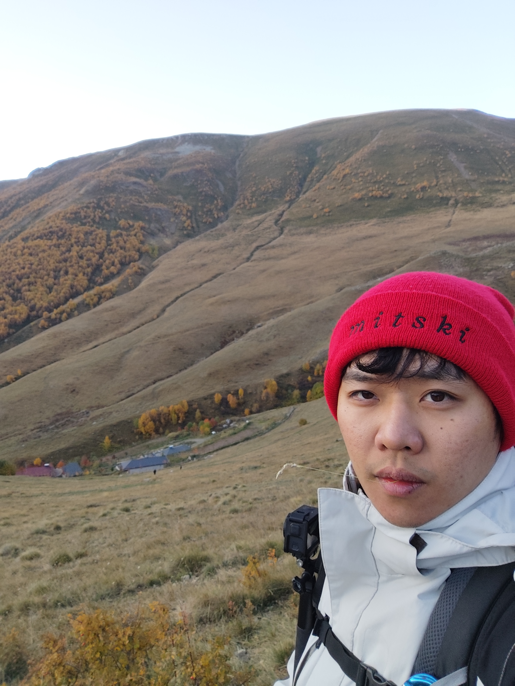
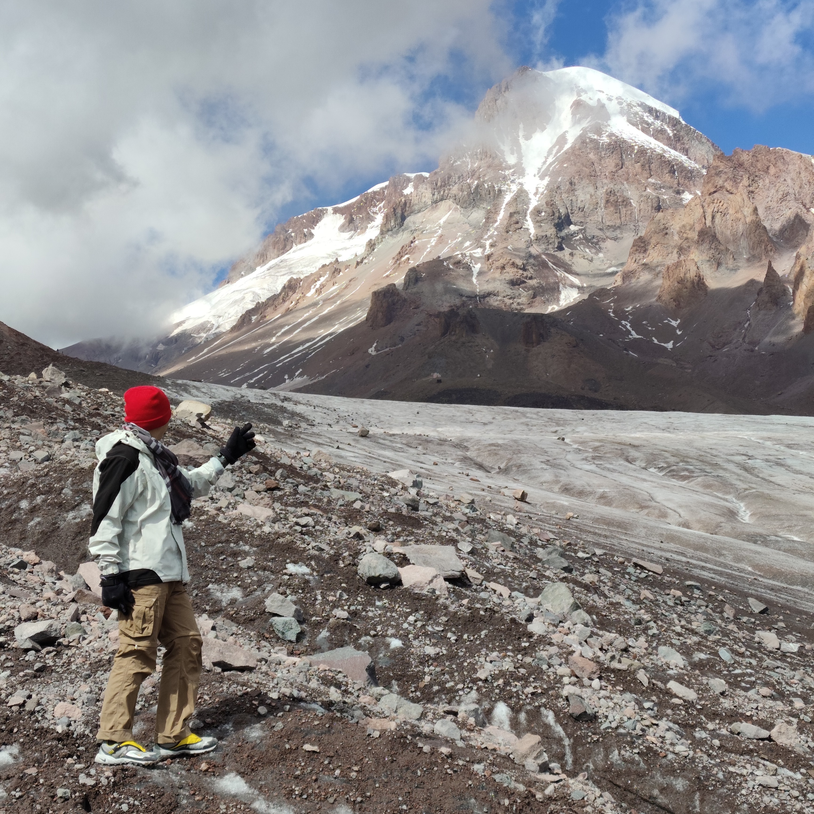

This is part of a multi-country trip I had. 
We first visited [Armenia](../2025-10-armenia/) for a few days before 
spending the majority of the trip in Georgia, north of Armenia and 
just next door.

Coming from Armenia, I noticed the country was noticeably more developed,
and was caught off-guard by the existence of McDonald's, H&M, and basically
other global brands.

It's very similar to Armenia in many ways, being the second country to adopt
Christianity after Armenia, and of course as members of the Soviet Union.
The region is mountainous, offering beautiful landscapes and cool weather.

We spent a majority of our trip in northern Georgia, which borders Russia,
and is where the glaciers are. Read on to see what went on!

--- 

## Stepantsminda (aka Kazbegi)

On our first day, we drove up north to Stepantsminda, which is a small mountain
town near the Russian border. This was something that I had been looking forward to,
because of the glacier hike we had planned at Gergeti.

### Military Road

The path we took is known as the 
[military road](https://en.wikipedia.org/wiki/Georgian_Military_Road), which 
was used to connect Georgia and Russia, starting from Tbilisi on the Georgian end.
Along the way north, there were many sights that you could stop at to appreciate.

Because this road is heavily frequented by tourists, typically on tour buses,
there's quite a few stores and paid parking. We didn't stick around too long 
for those, and we parked by the road for free.

Near the end of this road, we noticed the increase in altitude as the roads started
getting more winding (to snake around the mountains). The views were incredible.
Quite a number of homestays are lined along the road, and we saw some paragliders as well.

We didn't stop for much here, and continued on to finally reach Stepantsminda. Eventually,
Mt. Kazbek (towering over everything else in the area) peeked out from beyond the mountain 
range and came into view, signalling our imminent arrival into the town.

### Stepantsminda Town

The town itself had the highest concentration of tourists seen thus far, mostly 
Chinese and Korean. We found ourselves in a nice little homestay, a short walk from 
the town center.

The view from the homestay was incredible, and it was probably the best accommodation
we had this trip. 

Most of all the restaurants were full, and required a day's booking in advance, 
so we did that. On our first night, we simply cooked some shitty homemade food which 
would fuel our hike the next day.

### Gergeti Trinity Church

I know by now we'd seen enough Christian landmarks, but it was still nice to visit
the church that sat near the trailhead of the Gergeti Glacier hike. 
This will be the starting point of the trail, which is after a winding drive up from
Stepantsminda town. It's hard to miss the car park by the trailhead.

<figure>

<figcaption>This was the view on the way back down the trail. You can see the church 
in the distance, and the car park, surrounded by mountains.</figcaption>
</figure>

## Gergeti Glacier

We began the trail early on the second morning. There were barely any cars at the carpark,
let alone hikers. It's a relatively simple trail with no need for guides.

Do note: The trail begins at the sign, immediately up the hill, not down the road.
My compatriots refused to go up the hill, thinking that I was picking the more difficult hike
(well, I thought that too).

In the end, they ended up at a dead end further at the base of the hill, and had to 
scale the hill to get to me. 

At some point, Kenneth and I split up with Zane and Derek, who went at a slower pace.
The glacier is located somewhere in the mid-2000's to 3000m+ elevation above sea level,
so understandably one should take caution as to not fall to altitude sickness.

#### Cafe 360°

For the longest time, there weren't any landmarks until we reached 
[Cafe 360°](https://maps.app.goo.gl/j5nomgPZRsX8yWBJ8).

As one might expect, it carries pricey food for starving trekkers. We weren't 
in the market for food, so we carried on after a short break. The cafe overlooks
a valley between the mountains, with a river (Chkheri) at the bottom.

It was at this point that a friendly mountain 
dog came and greeted us. So huge and fluffy!!

<figure>

<video controls muted>
  <source src="./gergeti_dog.webm" type="video/webm">
    Your browser does not support the video tag.
</video> 

<figcaption>The dog followed us for a good part of the remaining trek, before opting 
to follow another group later on.</figcaption>
</figure>

#### Altihut 3014

The "3014" in the name is in reference to its elevation, 3014m above sea level.
We didn't really visit this hut as we had no business there. It's a rest appropriate for 
those doing the full hike.

#### Glacier Tongue

<figure>

<figcaption>What I'm standing on is pure glacial ice, with a layer of dirt on top.</figcaption>
</figure>

We reached the tongue of the glacier at around noon, which would be about 5 hours
from the start of the trail. 

If you wish to summit Mt. Kazbek, the *real* trail begins from the tongue. Since it's
a glacier, it's full-on ice, so you'll need crampons and other proper gear if you want
to continue.

For the average hiker, this might not be a one-day hike. Mt. Kazbek sits above 5000m
of elevation, so acclimatisation is necessary. You may find it necessary
to stay at a hut along the trail and spread the hike over two days.

This was the first time I'd seen a glacier, so I was surprised to see that it really 
is just a huge block of ice!

---

## Tbilisi 

We spent some days in Tbilisi on the first night, and the last few days of our Georgia trip.
After Stepantsminda, two of our buddies headed home, so it was just me and Kenneth.

I'd recommend staying near to the old part of town (Old Tbilisi) if you can afford
the extra cost. You'll know by the cobblestone roads that you're there. 
Most of the sights to see are concentrated there, and it's relatively walkable. 

### Chronicles of Georgia

We went out of our way to visit the Chronicles of Georgia, which are a massive
group of sculptures atop a small mountain. It's really impressive and has a great
view of the reservoir. 

You can and probably should take a taxi up. In a bid to save some money, and to 
get some steps in, I opted to hike up, but we were met with muddy paths which we 
pushed through on, for some reason... because we didn't realise there were roads 
on the other side of the mountain.

#### Metro 

The Tbilisi metro was affordable and and decently reliable. It's best to buy a metro
pass; it's inexpensive and prices are capped per day anyway.

#### Hotel ZP Palace

I'd like to shout out our hotel, ZP Palace (The ZP stands for Zaza Pachulia, a
Georgian basketballer). It had one of the best gyms I'd ever been to in a hotel,
let alone amongst gyms in general.

The breakfast was decent and the location, being somewhere in Tbilisi, and a short 
walk from the metro, made this a value-for-money booking.

--- 

At the tail end of the trip, two of us had more days in Georgia. We opted for 
day trips, one day to the eastern sites of Georgia, another for the west.

For the most part, these day trips run by tour operators are typically watered down 
and funnel you to the same few spots that have their prices jacked up for tourists.
While I still appreciate that some of these spots were nice to visit, they're still 
better experienced at your own pace if you can rent a car instead.

## East Georgia 

### Sighnagi, Telavi

Sighnagi is known as the "city of love", I suppose many marriages happen here. It's 
a nice little town with cobblestone streets, with historical ties to winemaking,
but I thought it was just alright. Too touristy.

## West Georgia 

The western side of Georgia was the more interesting of the two, although 
we didn't fully explore the west (such as the regions by the Black Sea).

### Vardzia Cave Monastery

This was really interesting! It's basically a city carved into a mountain, and the 
network was quite expansive. Unfortunately, it looks nothing like it once did, due to
destruction by earthquakes and land wars. The monastery there is still active, and 
you can get a glimpse of how people might have once lived in the cave network together.

---

## Itinerary

At the end of this trip, I can conclude that the Caucasus region is absolutely
worth visiting if you like nature, and they are very welcoming people.
I'd certainly come back again, perhaps visit the other regions, maybe to summit 
Mt. Kazbek.

### Costs

I've aggregated the costs in the [Armenia](../2025-10-armenia/) post (do give it
a read too!), but anyway expect Georgia to be slightly more expensive. Nothing too 
outrageous, though. Taxis are still reasonable, even around Tbilisi (under 10 GEL).

The exchange rate was 2 Georgian Lari (GEL) to 1 SGD. For funzies
we called it the Georgian Ringgit and one of our mates actually believed it was
called that.

### Notes

In Georgia, the main convenience store is Spar. The country uses GEL, but I believe 
they're trying to phase in the Euro in a bid for membership with the EU.

The Tbilisi metro is reliable and cheap, I highly recommend using it to get around.
While we did get caught in a train crowd once, it wasn't too unpleasant.
Of course, taking a taxi is also not expensive (compared to Singapore).
