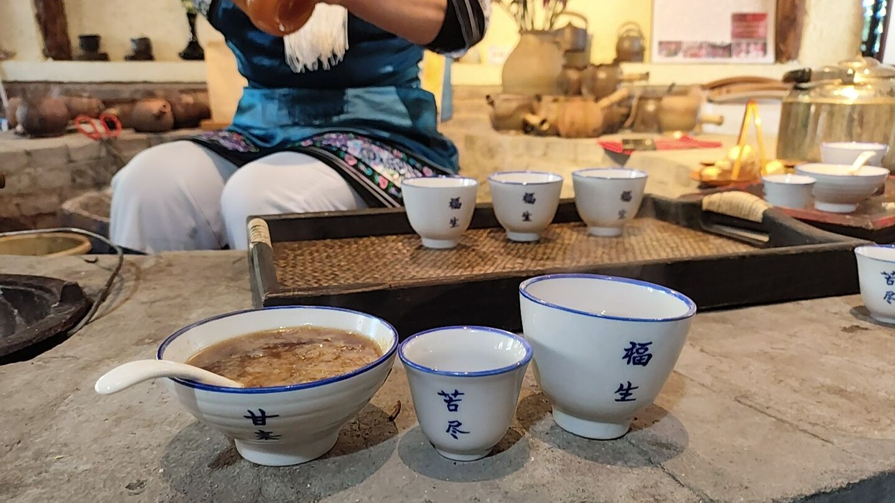
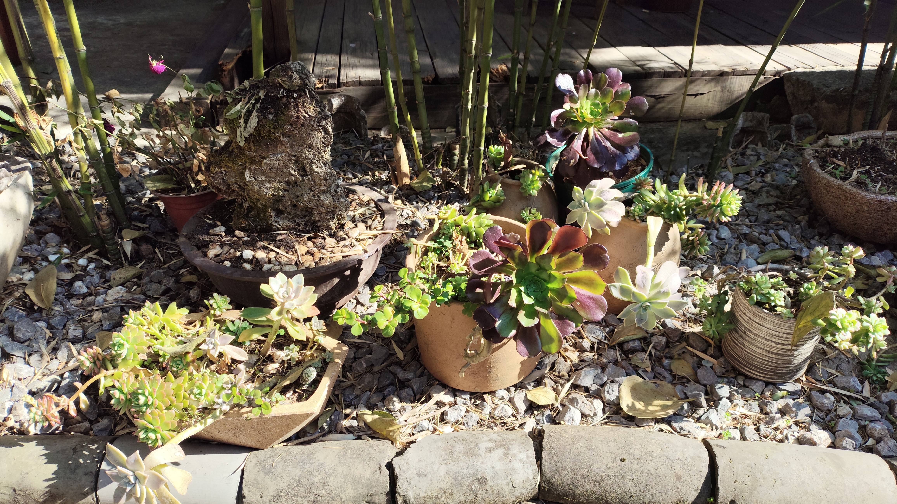
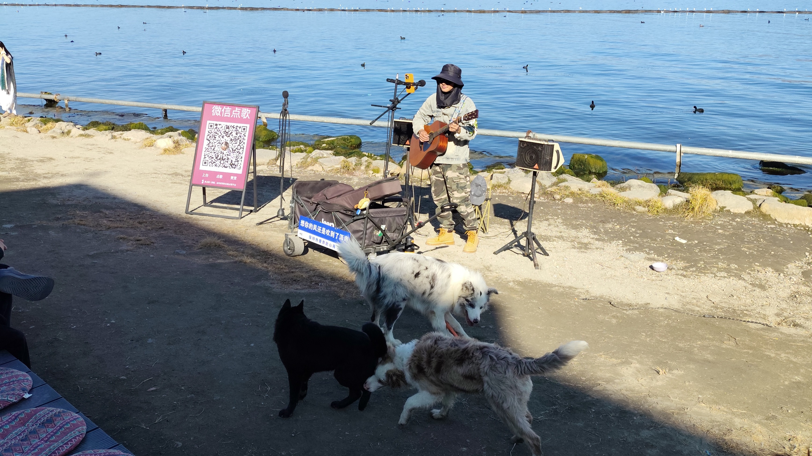
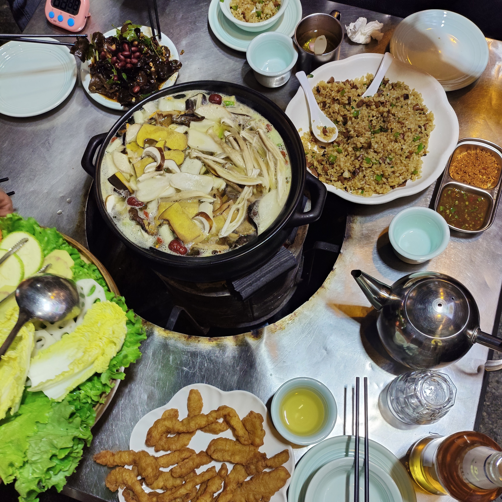
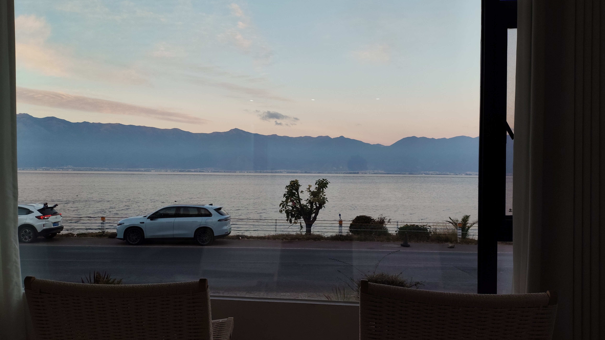
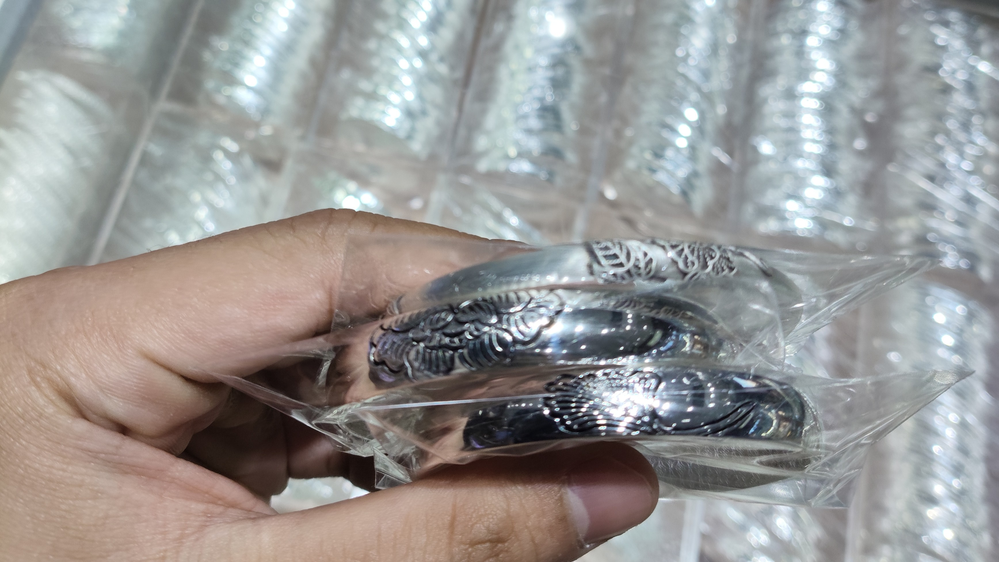

I visited Yunnan (<ruby>云<rt>yún</rt>南<rt>nán</rt></ruby>) with my family, and it
was pretty cold and pretty nice. This is practically my first time in China, and it was
pretty incredible. Great country.

Because I was with family, it wasn't a very adventurous trip, save for
me trying to get by with my poor mandarin skills, but the nature was quite breathtaking.
I'd sure like to revisit the other parts of China some other time. 

## Kunming 昆明

Our first and last days were spent in Kunming, where the airport is located.
We were received by my mom's friend, who brought us around generously.

Our first stop was a dinner with a show, and we all dressed up. I personally 
wouldn't have opted for the dressing, but they were insistent...

Afterwards, we had classic Northern China supper food and stayed a night. The next
day, we took a high-speed train to Dali.

## Dali 大理

Dali is a nice place to chill. There's a lot of activity on the western coast of
Erhai, which is a humongous lake and the activity center of Dali.

Our first activity was at a tea place, where we tried the traditional 
[three-course tea](https://en.wikipedia.org/wiki/Three-course_tea_(Bai_people))
 of the Bai ethnic people.
 

I absolutely loved the sweet tea, which had pieces of cheese inside.

<figure>

<figcaption>The three-course tea prepared by the Bai storekeeper. On the
cups the courses are labelled.</figcaption>
</figure>

One thing I noticed in these parts is that there are just huge and beautiful succulents
just growing everywhere. I assume they take well to these climates, but I'm so jealous!
I kill just about every succulent I get!

Afterwards, we went to walk by the west coast of Erhai. 
There are a bunch of shops, mostly cafes.

We also went to the old city. There are many like this throughout these parts of 
China, it seems, and much of our trip was spent walking around them.

For dinner, we ate mushroom hotpot. This part of China is known for its mushrooms.
Normally, I'm not a big fan of them, but I was able to put aside my reservations to
at least try them. Still not a convert, but they're nice.

Erhai is a huge-ass lake 
and even driving around it took forever. Welp. Our hotel was on the east side,
which was mostly empty save for homestays, but what a view!

The next morning, we went to another old street before heading off for a long drive up.
On our way to the next stop, we asked our driver to bring us to a place to buy silver.

Everyone, including the driver, wears silver jewellery in these parts of China because 
it's one of the local exports, probably there being lots of silver mines in the area.

We got one each, and this was before the peak of a silver boom in 2025, so you could
call me Warren Buffet.

---

## Lijiang 丽江

Lijiang is really cool! We visited a lot of nature spots in this leg of the trip.
Situated further up north, it's considerably colder, but nothing compared to Shangri-La.

At this point, there will be plenty of shops selling canned oxygen. I think it's not 
necessary, but because of how inexpensive it is, you may as well prepare yourself with
one or two, especially if you plan on going to higher altitudes.

Some say you get a "high" from inhaling that much oxygen at one go. I'm not so sure,
even after trying, if it's any different.

### Jade Dragon Snow Mountain 玉龙雪山

Our first morning in Lijiang, we set off early in the morning to get to Yulong (Jade Dragon)
snow mountain. It was about an hour's drive away and as we approached, the temperature grew
steadily colder. 

We took the cable car up. I would have loved to try and ascend it on foot, as an exercise.
Anyway, the views up there were spectacular. I'll let the photos speak for themselves.

The next area we visited was next door, some forest. And then a lake.
I should probably talk more about this.

### The Old Town

Once again, we went around the old town of Lijiang during our time there. It's huge,
and even though our hotel was situated right inside, I doubt we covered the full extent of it.

It's alright, though. After a while, the shops become repetitive. Some sell the same stuff
you'll find elsewhere. Even within the same old town, the stores tend to repeat.

### Tiger Leaping Gorge

We eventually continued driving further up north to Shangri-La. We made some stops 
along the river, a part of it being Tiger Leaping Gorge.

This river divides Lijiang and Tibet.

I neglected to mention, but we have been making stops for meals.
They're all very nice. I don't know what they're doing differently with their 
vegetables, but they're sauteed very well.

---

## Shangri-La 

At this point in time, I was absolutely freezing.
