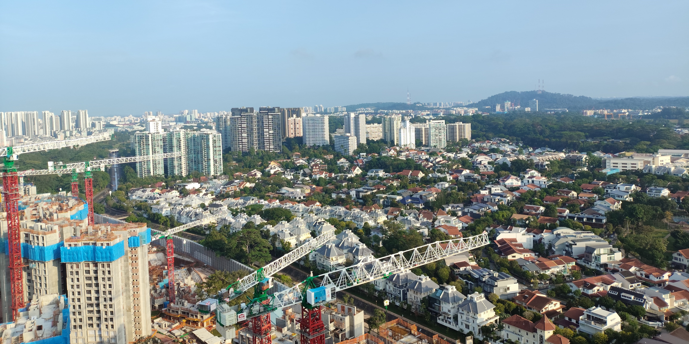

Here's something a little more local. I explored the Dover and Clementi forests
with a *chapalang*[^1] group comprising mostly retirees, but also young'uns like
my girlfriend and some others. We found the event on Peatix and decided to join.

I have memories of exploring forests in Singapore with my dad and uncle. There used to 
be one near my place where the newly developed town Tengah now stands, having had all 
the forest flattened.

All I remember was us foraging for durians, and one falling directly on my dad, leaving
a red mark on his back... I believe it's up there as one of the worst fruits you want 
falling on you from height.

Anyway, the same fate might soon happen to the remaining forests as much of them
may give way to further development of the country. 

Whatever I explored on this day were the remnants of a larger sprawl of forest that
had already partially given way to new housing. Dover more so than Clementi,
but both might soon go, only a matter of time.

Anyway, have a read! ...and let me know if you want me to lead you into the forest too :)

## Dover Forest

<figure>

<figcaption>View of Dover. The forest we visited is just behind the buildings on the left.
You can see Singapore's highest point at the back.</figcaption>
</figure>

We started at Buona Vista MRT and headed to Ulu Pandan Park Connector to enter the
Dover forest. Following along the canal, we headed into the forest on the left side of
the park connector, 

The main sign that you're "in" Dover forest, if not the fact that you're surrounded
by trees, is the "A" tree — so called because it's shaped like the letter A.

I honestly don't recall if it's the tree in the next photo or the one after. The 
first one had already fallen over.
Both kind of fit the bill. [Here's](https://www.singaporegeographic.com/park/dover-forest)
what it should look like, anyway.

There was another tree that we spent some time climbing around. Funny thing,
forests look denser from the outside, but there's actually quite a lot of
room once you're inside.

Those interested in nature might fare better at identifying the flora, fauna,
and funga within the forest. You'll have to make do with my highly detailed description
of the next photo:

<figure>

<figcaption>Snail and mushroom on fallen branch</figcaption>
</figure>

The next two photos are going to be even more egregious... so if you can
identify the one on the right, please contact me!

<figure>
<row>

</row>
<figcaption>Left: Pretty sure this is a <i>Phallus indusiatus</i> that's been circumcised. 
Right: Possibly the remains of a mop head or a <i>basal rosette</i> of some plant?
</figcaption>
</figure>

Afterwards, we exited the forest and went along the park connector to find another entry in.

### Entry 2

<figure>

<figcaption>Even outside the forest, there's still a number of sights if you look for them.</figcaption>
</figure>

A little ways down the park connector, we were led into another part of the forest where 
some people used to inhabit.

As far as I know, these areas used to be *kampungs*[^2] and farms. Most of them have 
been vacated and cleared for development, but some areas, like this forest, are the last 
of their kind, and still see visitors (or residents...?) to this day.

There is evidence of some human activity, as we found a Buddhist shrine with a fairly recently-smoked
cigarette. The person was nowhere to be seen.

We also found a *ang pao*[^3] with a horse symbol on the floor, and this year is 
the Chinese year of the horse, so it must have been placed there recently. 

There were some plants being grown within this part of the forest, just small ones 
like local chilis and whatnot.

After this, we exited again, the same way we came in, bringing us back to the park connector.

## Clementi Forest

After exiting Dover forest, we made our way to Clementi forest, accessible mainly
from opposite Ngee Ann Polytechnic. It was a short walk continuing along the 
Ulu Pandan park connector.

At this point, it was pretty sunny and we were both tired and feeling the heat.
Still, we pressed on... not wanting to miss anything.

We took a short walk to get to the bus stop opposite NP (although I always fancied
it being abbreviated as NAP instead) and went down to the tunnel right there.

This was a spot where we took shelter for a while and ate some food. The guy 
who led the hike wanted this to be a "Chinese New Year" hike, so we each brought
CNY food and shared it around. 

It wasn't quite the right food for me to get over my fatigue, despite the fats and 
sugars (and no matter how many I ate), but after that was done we continued 
into the forest.

The tunnel is part of an abandoned rail track, and much of the track was submerged 
in pretty still/muddy waters because it was built on lower ground than its 
surroundings. We went along the path on the side.

### Exiting into Rail Corridor

After a bit of walking past the "Avatar" trees, we exited into the Rail Corridor.
That wasn't the end of it!

[^1]: Local slang: mixed, hodgepodge
[^2]: Malay for village. The old establishments before Singapore's rapid development.
[^3]: Red packet/envelope, which contains money and is customarily given on Chinese New Year.
