<figure>

<figcaption>Photo by my room/tentmate this trip!</figcaption>
</figure>

This trip which I had booked on impulse in order to make use of the labour day long 
weekend turned out to be one of the nicest trips I've had.

Rinjani has always had its place in my bucket list as one of the mountains I'd like to 
conquer. I'd also been recommended to visit Lombok for its nature, which rivals Bali,
its next-door neighbour, but without the same amount of publicity.

Without thinking too much about the details, I decided to just go for it. What I got in 
return were beautiful sights, lots of ups and downs in the literal and metaphorical sense,
and a beautiful group of people with whom to experience all that.

This hike also happened to coincide with the Rinjani 100 mile ultramarathon. It's
crazy how they didn't close down the trails for the race, but thankfully most of the 
racers ran past us while we were asleep in our tents.

---

## Day 0: Senaru Villa

The day we arrived in Lombok, we took a long ride from the airport to 
[Villa Bambu](https://maps.app.goo.gl/4JpY6ua36CWE5yJf8)
at Senaru, where we'd stay for the first night and leave some of our items when we're on the hike.

I don't go to these places often, and living on a tiny island like Singapore, I tend 
to underestimate the sheer size of other islands. 

In any case, Lombok's roads are nice,
I believe they're newly paved, and certainly not as congested as Bali's.

We had a lot of time to chat and get to know each other in the van during the drive.

Aside from the roads though, Lombok itself isn't as tourist-friendly as Bali, for better 
or for worse. It's much quieter, and they don't sell alcohol just anywhere; I only 
found them in villas/hotels and certain restaurants.

Before dinner, they brought us on a short walk to a nearby waterfall (was meh), perhaps a good
taster for what's to come.

I wasn't a big fan of the villa; there weren't enough power sockets so we couldn't 
plug in our fan without not charging our devices, and the showers leave much to be 
desired. Naturally, there was no air conditioning too, but we managed to sleep
in the still, humid, mountainous air.

But... it's one of the few spots with beer so I had 
my last sips before going dry for the next few days.
Dinner itself was bomb. I'm always a sucker for Indonesian cuisine.

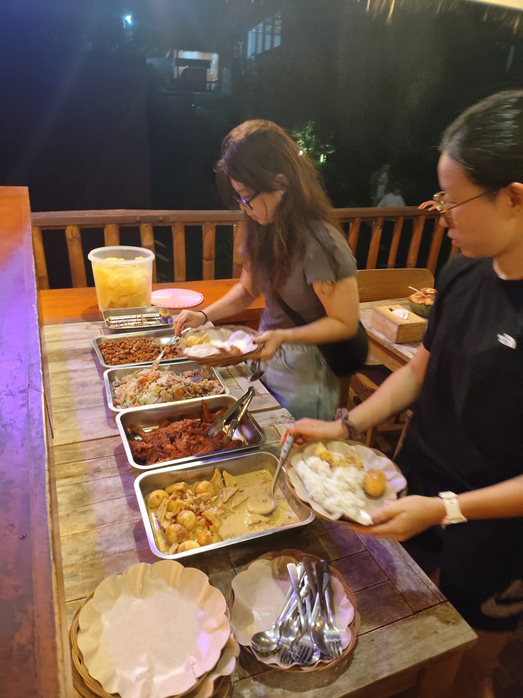
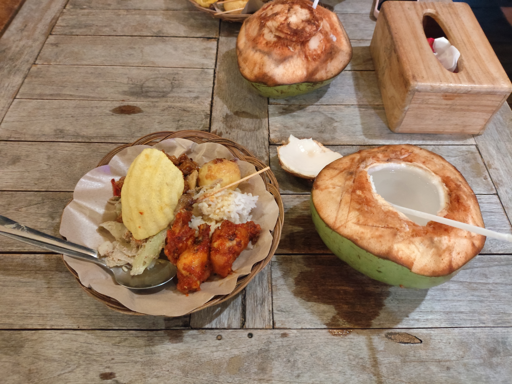

The night ended with a briefing by the guides about our plan for the next three days.
They've been up and down the mountain several times, which is no small feat.

## Day 1: Up from Sembalun to Crater Rim

Up and early the next day, we had breakfast (don't drink the coffee, it's more grounds
than liquid), and then headed to Sembalun from our villa to register and
begin the hike. This was a short ride on the back of a lorry.

<figure>

<figcaption>
They gave us all custom Sotravel t-shirts. Only I and the guides wore them...
I suppose as the trip leader, I had to.
</figcaption>
</figure>

After registration, we started the hike at 10am from the Sembalun gate, which is a little late.
The guide asked if we'd like to take a *Gojek*[^gojek] up to Pos 2 (our lunch checkpoint),
but we were sure we'd be able to make it up despite the delay.

Nothing much to say about the trail at this point. Lots of cow dung land mines.
We gained about 1.5km elevation during this fairly simple ascent. It got slightly
steeper near the rim, but the ascent to the rim (and later, descent) are the easier parts.

<figure>

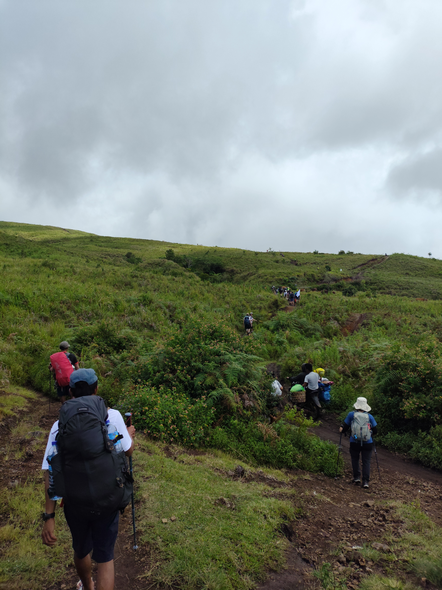
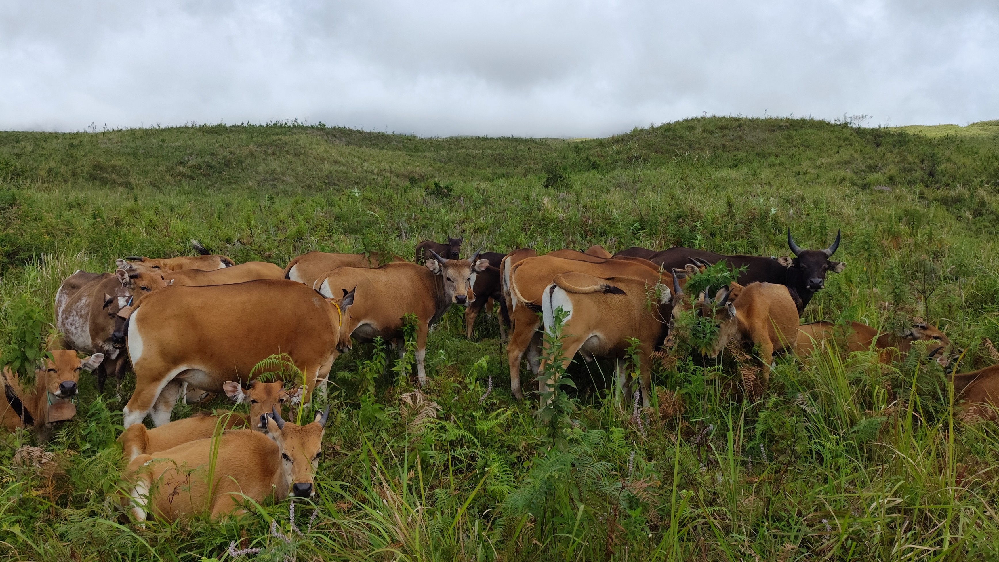

<figcaption>The culprits</figcaption>
</figure>

The weather was alright, we were on the tail end of the monsoon season so some 
moisture was expected.

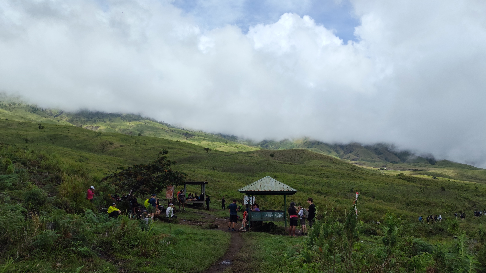

We stopped at Pos 2 for lunch. It was pretty good, though others complained that the 
meat was too tough, so they gave it to me. Yay! 

There was another huge group of Singaporeans whom we spoke to, but I never did get 
their names or contacts. It was nice seeing them along the trail, anyway.

It started raining for a short while during lunch and it continued
as we resumed the trail.

There were a few other Pos stops.
The crowd wasn't too bad on the trail.

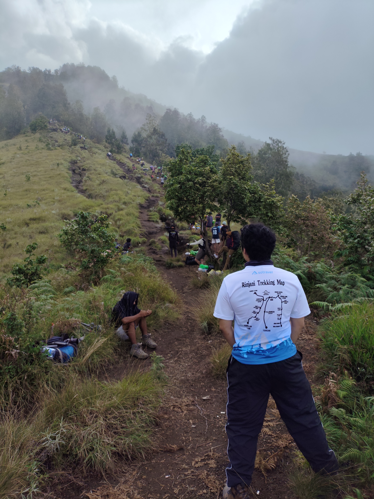

The final ascent was much steeper but nothing unnegotiable.
You'll never get lost with my shirt!

### Crater Rim

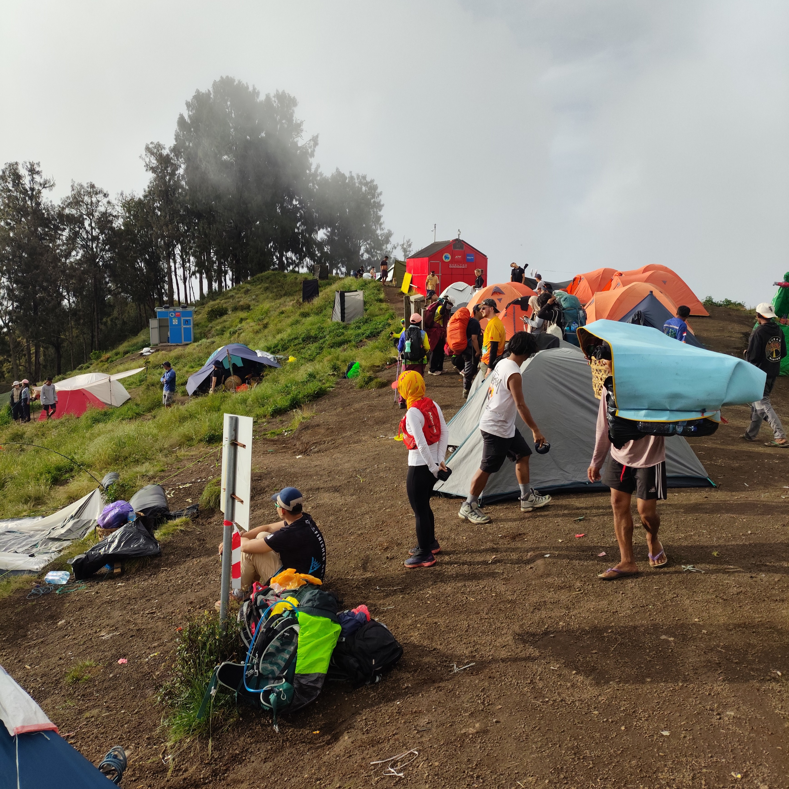

We finally reached the crater around 5pm on the dot. There are a lot of camping
spots on the rim, so we had to walk a little further in to find our tents.

<figure>

<figcaption>
I'm pointing in the general direction of the summit.
</figcaption>
</figure>

The crater rim would be our rest area for the first night, until 1am where we'd
set off for the summit. The porters reached before us, naturally, and had already
set everything up.

Temperatures were freezing the first night, especially with the wind and cloud cover.
We had a delicious dinner in the dark and rested early for the hike to come.

There are people who only opt to climb to the crater rim without summitting. 
I don't know how they are okay with themselves for half-assing it...

<figure>

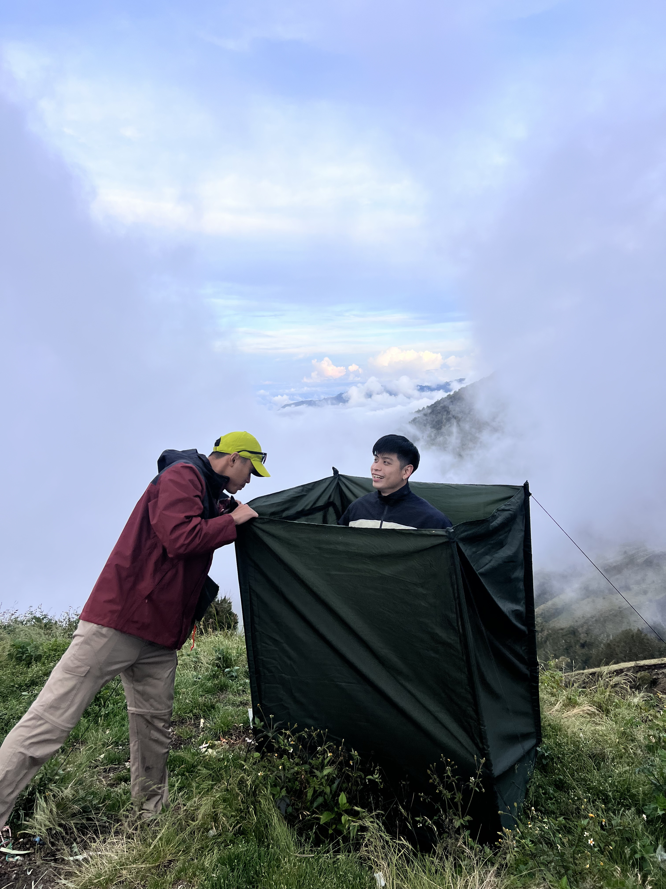

<figcaption>
The toilets are a hole in the dirt.
</figcaption>
</figure>

To some, the "toilets" may take a little getting used to, especially if you 
can't do a squat. For me, I had to be sure I was aiming correctly. Some 
decided to just hold their shit in for the entire duration.

<figure>

<figcaption>
The same angles but at night.
</figcaption>
</figure>

We didn't really do much aside from pack, but I managed to take some long exposures
of the beautiful starlit sky. It's just a shame that it was so cloudy *and* it was a
full moon! GAH!

<figure>

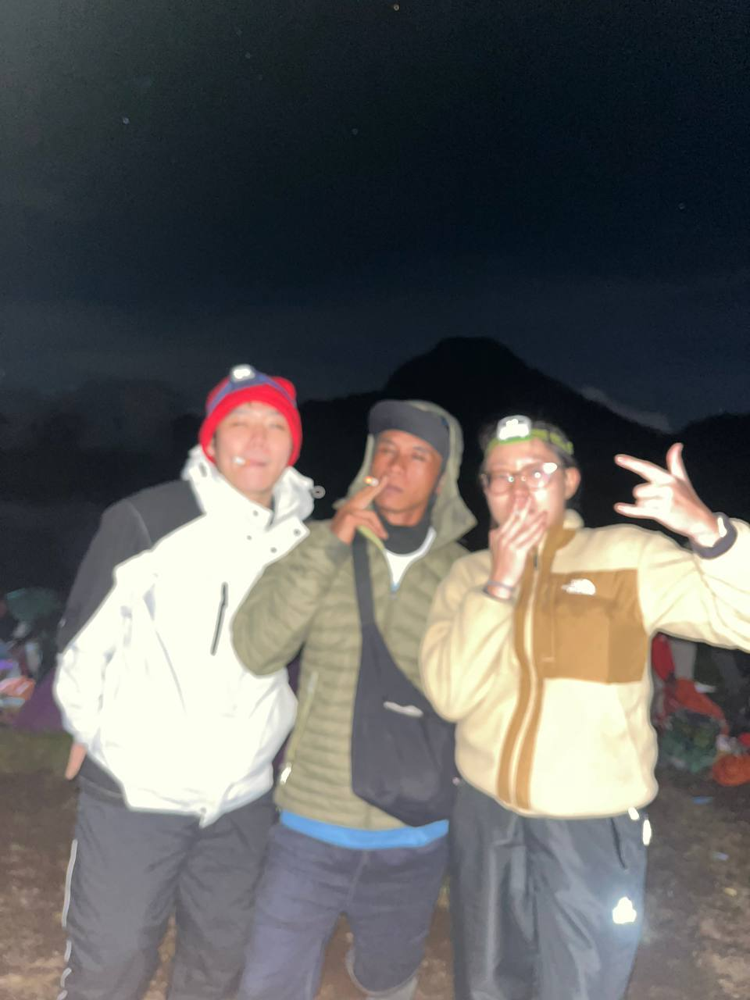

<figcaption>
I don't normally get the appeal of smoking, but somehow this cigarette
2800m above sea level felt amazing. Don't tell mom!
</figcamption>
</figure>

---

## Day 2: Summit Push and Down to Lake

This was the longest day, and considering how most people follow the same itinerary,
I wonder how the others manage this at all.

Basically, in a single day starting from 1am, we had to summit, go back to camp,
and then head down to the lake, which in itself was no simple task.

In the spirit of labour day, we had an immensely laborious day. At the end, there was even a
river crossing, which was basically the straw that broke the camel's back.

The group morale was pretty low at the end of ONLY the 2nd day, but that's something 
I'll get to later!

### Summit PUSH

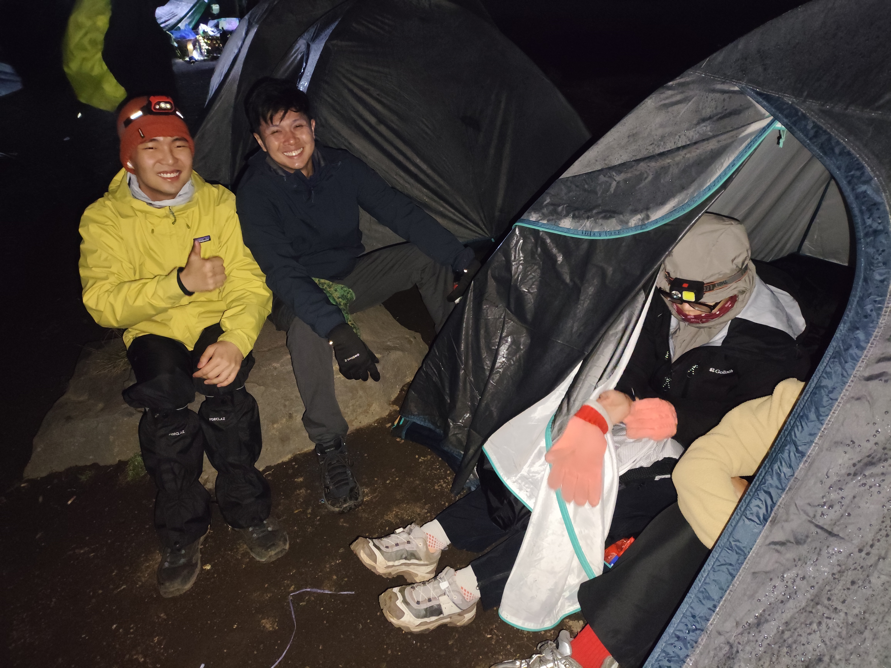

We woke up around 1am for the summit push. After a delayed breakfast, we set off for 
the summit, going past the rest of the tents and following along the crater rim
towards the summit. I believe this would be clockwise along the eastern end of the crater rim.

There was a line of people heading up. The ascent isn't easy, but I wouldn't say the 
bottlenecks were too bad. About a third of the way in, the terrain starts to get 
quite slippery, due to gravel and volcanic ash.

The path is also quite narrow, so there were few chances to overtake people.
At least it wasn't too crowded. Be very careful! The sides slop off very rapidly
so it's almost certain death if you fall off the sides. 

It was still before dawn, so I only got a good reckoning of the path on my descent.
It's a wholly different experience seeing only the city lights in the far distance
and barely anything on either side. We were lit by the full moon (couldn't stargaze because of this also).
It's only after the sun comes up that you get the sense of scale of the entire crater
and the layout of the land.

The summit is a small plateu that can still fit quite a number of people, who were 
all taking photographs, of course. that It's an amazing view into the crater.

Of our group, only about 5 of us summitted before sunrise, but the rest followed
soon enough. We started heading down around the time the sun came up and passed 
by them.

I got pretty hot due to the amount of physical activity. I ended up spending most 
of the summit ascent in just my thermals and a t-shirt.

<figure>

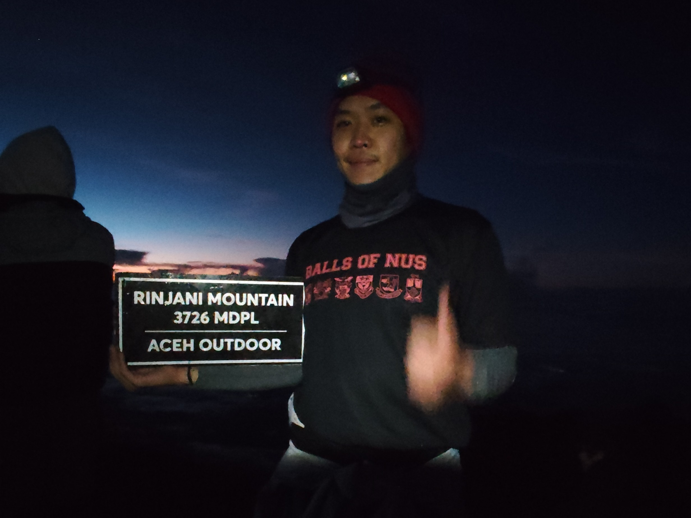
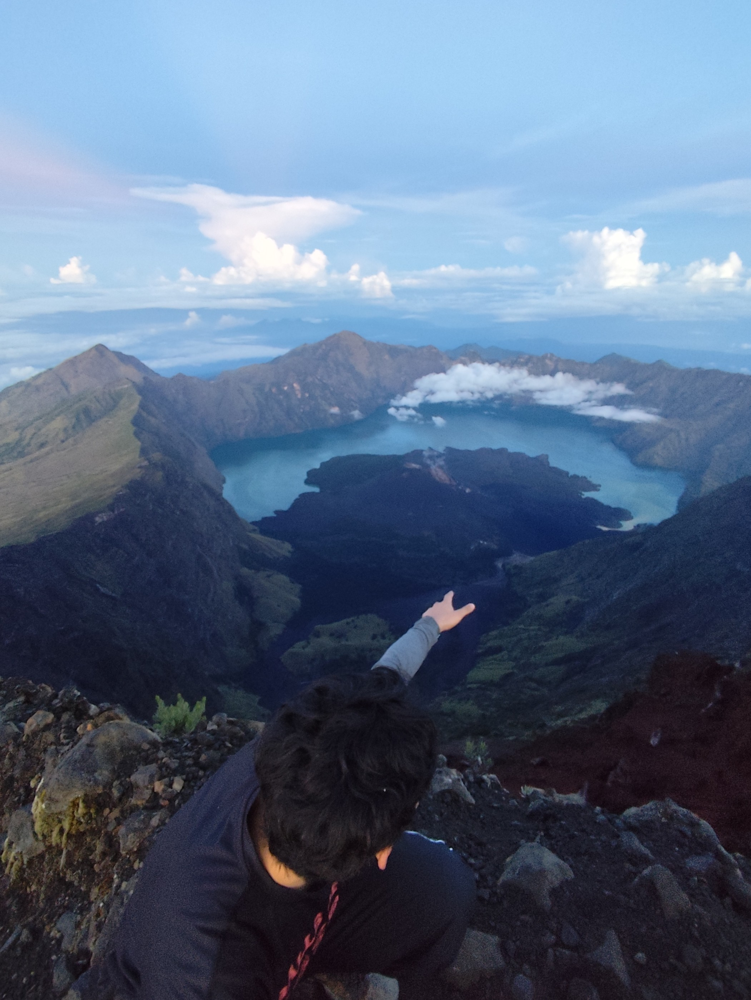

<figcaption>
Proof I summitted. Judging by the lighting in the photos you can tell I (and just
about everyone else there) took photos 'til the sun rose. We earned it!
</figcaption>
</figure>

I don't think I'm all that much of an adrenaline junkie, but I sat quite close to
the edge of the summit for my photos. I got a few warnings by concerned hikers before
they took from my example and started taking more photos my way.

### Back to Camp 

With the sun up, I got a good view of the entire crater in its full glory! It's
really remarkably huge. In fact, you should be able to see the north coast, right?
Enjoy the photos!

<figure>

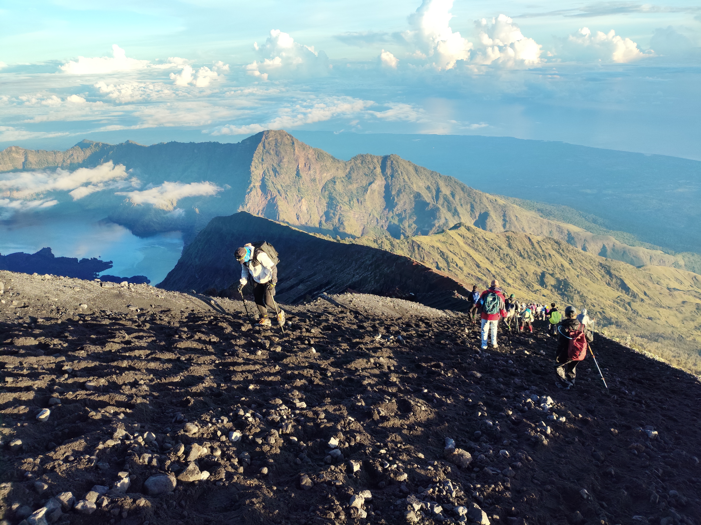
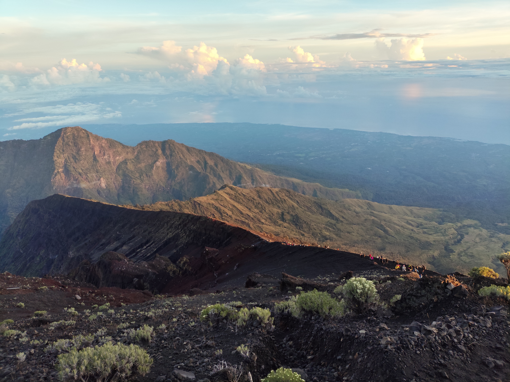

<figcaption>
I wish I could convey the sense of scale here. It's marvelous.
</figcaption>
</figure>

<figure>

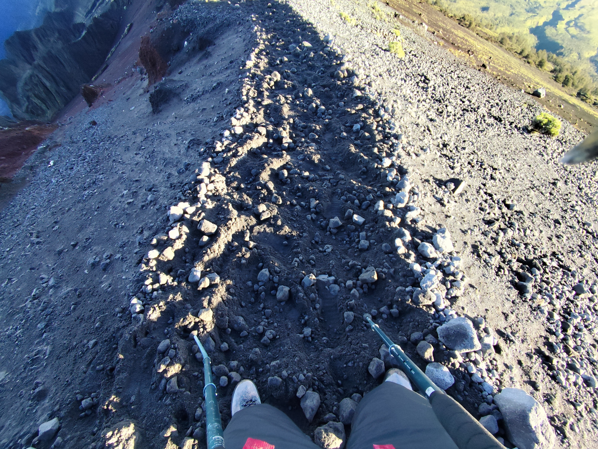

<figcaption>
Demonstrating just how narrow the path can be at times... and the slopes
on either side!
</figcaption>
</figure>

### Descent into Madness
We had breakfast upon returning to the camp, then a short nap, then lunch, all in 

the span of a few hours, which was not the best spacing-out for food.

The way down to the lake was rather steep, mostly composed of rocks.
It was made all the more dangerous due to the 
moisture and some drizzle, which made the rocks slippery.

At this point, we were quite tired, or to use a memorable quote by one of them,
"I am mi-se-ra-ble. Miserable." The way he said it still sticks in my mind.

Once we reached the lake, our campsite was across a river. The fact that we 
had to go across a river (not exactly shallow, so we had to take our shoes off)
was not well-received.

Some of us went to the hot spring by the waterfalls near the lake.

#### Mutiny

Okay, I'm being dramatic. But at this point, this was day 2 of a 4 day itinerary.
We were kind of sick of being on the mountain, and having cleared the important parts,
we wanted to wrap things up.

The last night was meant to be a camp some way along the descent trail, but we 
decided we could do the entire descent to the Senaru gate in a single day.

---

## Day 3: Back up to Crater Rim, Down to Senaru

For the first part of the descent, we had to actually climb back up to the crater rim
from the crater lake. The sky was clear and the views were spectacular going up,
which made the physical effort worth it, I suppose...

At this point, the Rinjani 100 ultramarathon had already begun, and the runners 
came from Senaru, so we'd run into runners going the other direction. The trail
was quite narrow at times, so this was slightly inconvenient for them. I'm surprised 
they didn't close the trail off for runners only.

It took about 3-4 hours to get to the rim. We reached at noon, which made it a good 
time for lunch at one of the campsites along the way down.

Our final lunch was a delicious pasta dish. It's incredible how the porters 
bring so much stuff up and still make such varied dishes. 

We tipped the shit out of them, definitely way above the standard rate. The porters and 
guides still made sure the . We all put our cash into one envelope 
and left them with one last task of divvying up the tips among all of them before we 
parted ways (the porters, having finished their duties, made their way down ahead of us).

*A little fun fact:* I heard from them that the porters work their way up to being guides, 
who earn more. That's because if a porter is out of commission, the guide should be 
ready to take on portering services. Looks like there's alpha in knowing English as well.

Now, because we decided to cut the hike short, we didn't have any accommodations for 
the night. With what sporadic reception we had, one of us managed to book a villa for all
of us, that night.

### Descent from Rim

Finally, once the elevation got lower and we crossed the tree line again,
the terrain became mostly mud and dirt. The guide at the front decided to 
lead the faster ones by running, which I believe is the right way to
descend terrain like that.

I slipped a few times on muddy roots, but eventually got the hang of it and 
stayed near the front of the pack as well. 

Descent didn't take long, perhaps about 3-4 hours of trail running down, all with 
minimal strain on the knees. We chilled at the base waiting for the others. I finally 
got reception at this point... Hip hip hurray!

Afterwards, we went back to the Senaru villa (day 0) to pick up our belongings that 
we had left for their safekeeping, courtesy of the villa. I was *onebagging*, so I
didn't have anything to get... Except an ice cold beer from the bar!

### To the Villa

The next ride was a rather long one to the villa we booked, [Villa Salama](https://maps.app.goo.gl/mtm28hKXZ5cAB4V87)
which was chosen for its vicinity to Bangsal Port (some of us had planned to visit the
Gili islands the next few days, me included. I eventually cancelled my stay in favour
of staying inland, though... More on this later).

I highly recommend, if you're going to Lombok, to book a villa especially after a hike,
as a reward. It's so beautiful and relaxing. I think this was the first time I'd ever
let myself let loose like that, and it was in good company that I did so.

This villa in particular was staffed on-site. I'm not sure if that's the usual arrangement,
but they were there to assist in things like laundry. They also cooked breakfast in the
morning.

---

## Day 4: The Villa and bailing on Gili Air

In the morning where we were supposed to check out of the villa to go our separate ways,
the staff cooked breakfast for us in the villa's kitchen. 

We also got to enjoy the morning sun, in full force, with no hurry to go anywhere whatsoever.
This was a cause for a dip in the pool and some beers.

If there are two things to go to Lombok for, it's Rinjani and the Villas. It's
only natural that we go to a villa after such a hike.

According to the original itinerary, we were supposed to descend on this day,
 and I had a stay on Gili Air booked. I decided
to forfeit the stay (about SGD 30) to just stay somewhere near the airport with the rest.
I wasn't the only one who cancelled his existing booking to spend more time with each other.
Did I mention the company was great?

In any case, the time it'd take to take the speedboat to/fro the Gili islands, and the 
cost of the transportation, as well as the distance from the airport, just didn't seem 
worth it to me at the end.

Lombok is huge, just like Bali. What it has going for itself is newly paved roads 
and FAR FAR less traffic. We took a 2 hour drive to the next hotel, Swiss-belcourt,
which was pretty nice.

I spent the night in my room, while the others went to the nearby Kuta beach. I wasn't 
about to endure another 1-2 hour drive. I ordered some delivery and went to town
on the food. I love Ayam Geprek!!!

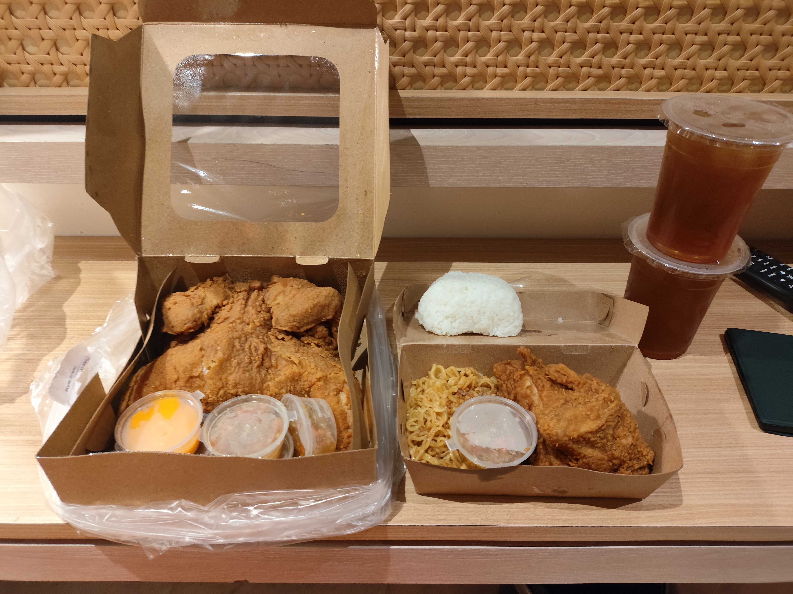

---

## Day 5: Going Home

The final day, we just headed to the airport after a quick breakfast. There's 
nothing much to report here. We saw some other familiar faces at the airport, who 
were also part of other groups on the trail the past few days.

I had a great time during this trip. I'm glad I chose to stay at the hotel near the 
airport too. If I had stuck with my original plans of staying at Gili Air, I'd have 
had to leave early (probably the first speedboat of the day), and then another maybe 
few hours of driving to get to the airport for my afternoon flight.

That's just way too many variables, I'm just glad I made the choice. Either way, Lombok's traffic 
is relatively smooth compared to Bali, and I hope it stays that way.

---

## Itinerary

There are some itineraries that the operators offer, and they're largely the same.

We got the 4D3N one which,
as you have found by now, we negotiated into a 3D2N one with no issue. 

There are some that only bring you to the crater rim, and others where you summit 
in 2D1N and get down the same way you came.

I'd say going down to the lake and coming out of a different exit (of which there
are 3) are well worth the extra days. 4 days seems a little excessive, in any case.

### Packing Notes

Boy! We came in at the tail end of the monsoon season, which meant the first few 
days were slightly wet with rain (each time didn't last too long).

As usual, waterproof your gear. Rinjani especially can get misty due to clouds and 
the presence of the lake.
It's high up so get some thermal layers as well.

Much of the hike is exposed to the HOT sun so PLEASE make sure to COVER UP and 
apply sunblock as a secondary measure.

Bring shoes that can negotiate muddy, rocky, and loose terrain. The gravel near 
the summit and the muddy trails are sure to make you slip and lose your footing.

Bromo is easier, but there's lots of ash/sand being blown around if you go to the 
Sea of Sand, so get something to cover the face.

### Costs

- Sotravel booking: $600
    - Includes hotel, transport, park entry, equipment rental, and guides.
	- Less $300 for my leadership duties
- Flights: $600 (Expensive)
- Food, purchases, tips: I spent roughly $70

**Total:** $650, give or take. Prices in SGD.

if you decide to pay for added services:
- Motorcycle rides up to Pos 2 from Sembalun: ~200K IDR

It may be cheaper if you settle the itinerary yourself, 
probably saving up to $100.
I also feel like I could've gotten a better deal with the flights.
Nonetheless, it was well worth it for all the people I got to meet.

(Notice how the above paragraph needed no modifications when I copied
this post's template over from last year's Bromo/Ijen post)

[^gojek]: There are people on motorbikes offering to take you up or down up until
the first lunch checkpoint. It makes short work of the trail but can cost a bit too.
