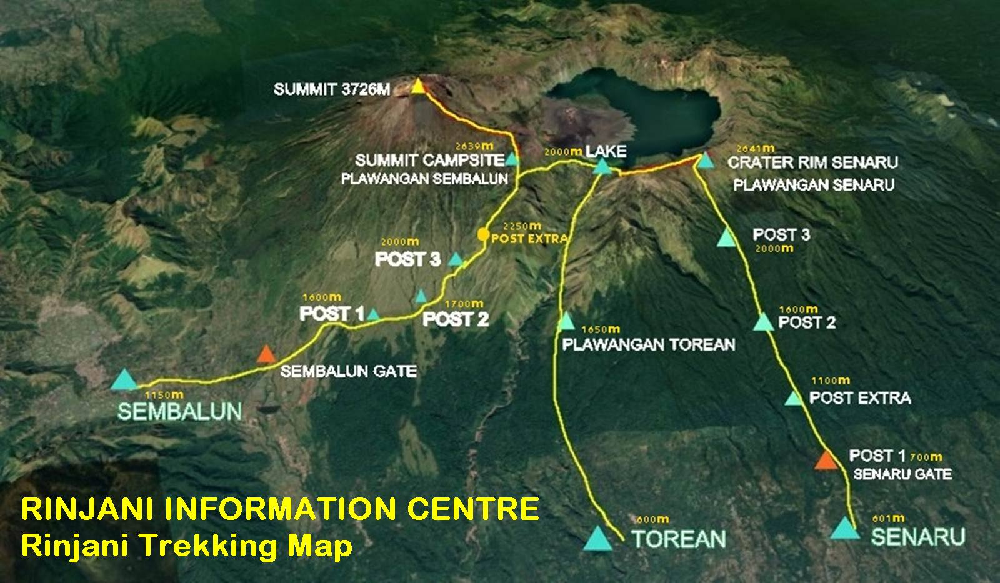

This trip which I had booked on impulse in order to make use of the labour day long 
weekend turned out to be one of the nicest trips I've had.

Rinjani has always had its place in my bucket list as one of the mountains I'd like to 
conquer. I'd also been recommended to visit Lombok for its nature, which rivals Bali,
its next-door neighbour, but without the same amount of publicity.

Without thinking much about the details, I decided to just go for it. What I got in 
return were beautiful sights, lots of ups and downs in the literal and metaphorical sense,
and a beautiful group of people with whom to experience all that.

---

## Day 0: Senaru Villa

test 

## Day 1: Up from Sembalun Entry to Crater Rim

## Day 2: Summit Push and Down to Lake

## Day 3: Lake to Senaru Crater Rim, then Exit

---

## Days 4-5: The Villa!

If there are two things to go to Lombok for, it's Rinjani and the Villas. It's
only natural that we go to a villa after such a hike.

<figure>

figure

<figcaption>Stars were out in full force. I saw Orion and Aquarius, and many others
I couldn't identify.
Check out that <a href="https://en.wikipedia.org/wiki/Bintang_Beer">red star</a>, too!</figcaption>
</figure>

<video muted controls>
  <source src="./bromo-jeep.webm" type="video/webm">
    Your browser does not support the video tag.
</video> 

---

## Itinerary

There are some itineraries that the operators offer, and they're largely the same.

We got the 4D3N one which,
as you have found by now, we negotiated into a 3D2N one with no issue. 

There are some that only bring you to the crater rim, and others where you summit 
in 2D1N and get down the same way you came.

I'd say going down to the lake and coming out of a different exit (of which there
are 3) are well worth the extra days. 4 days seems a little excessive, in any case.

### Packing Notes

Boy! We came in at the tail end of the monsoon season, which meant the first few 
days were slightly wet with rain (each time didn't last too long).

As usual, waterproof your gear. Rinjani especially can get misty due to clouds and 
the presence of the lake.
It's high up so get some thermal layers as well.

Much of the hike is exposed to the HOT sun so PLEASE make sure to COVER UP and 
apply sunblock as a secondary measure.

Bring shoes that can negotiate muddy, rocky, and loose terrain. The gravel near 
the summit and the muddy trails are sure to make you slip and lose your footing.

Bromo is easier, but there's lots of ash/sand being blown around if you go to the 
Sea of Sand, so get something to cover the face.

### Costs

- Sotravel booking: $600
    - Includes hotel, transport, park entry, equipment rental, and guides.
	- Less $300 for my leadership duties
- Flights: $600 (Expensive)
- Food, purchases, tips: I spent roughly $70

**Total:** $650, give or take. Prices in SGD.

if you decide to pay for added services:
- Motorcycle rides up to Pos 2 from Sembalun: ~200K IDR

It may be cheaper if you settle the itinerary yourself, 
probably saving up to $100.
I also feel like I could've gotten a better deal with the flights.
Nonetheless, it was well worth it for all the people I got to meet.

(Notice how the above paragraph needed no modifications when I copied
this post's template over from last year's Bromo/Ijen post)

