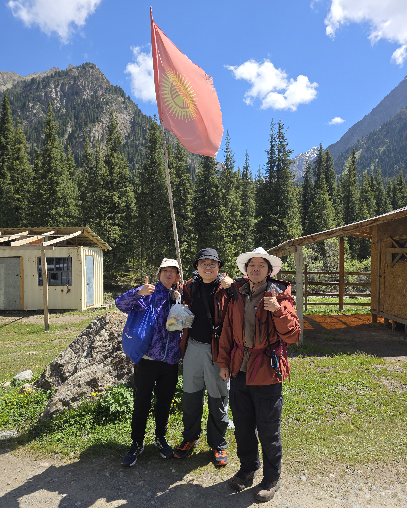
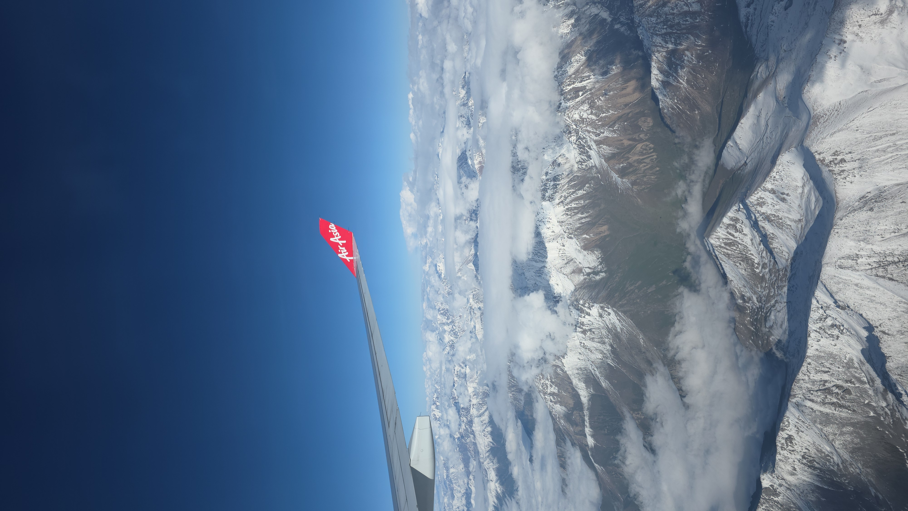
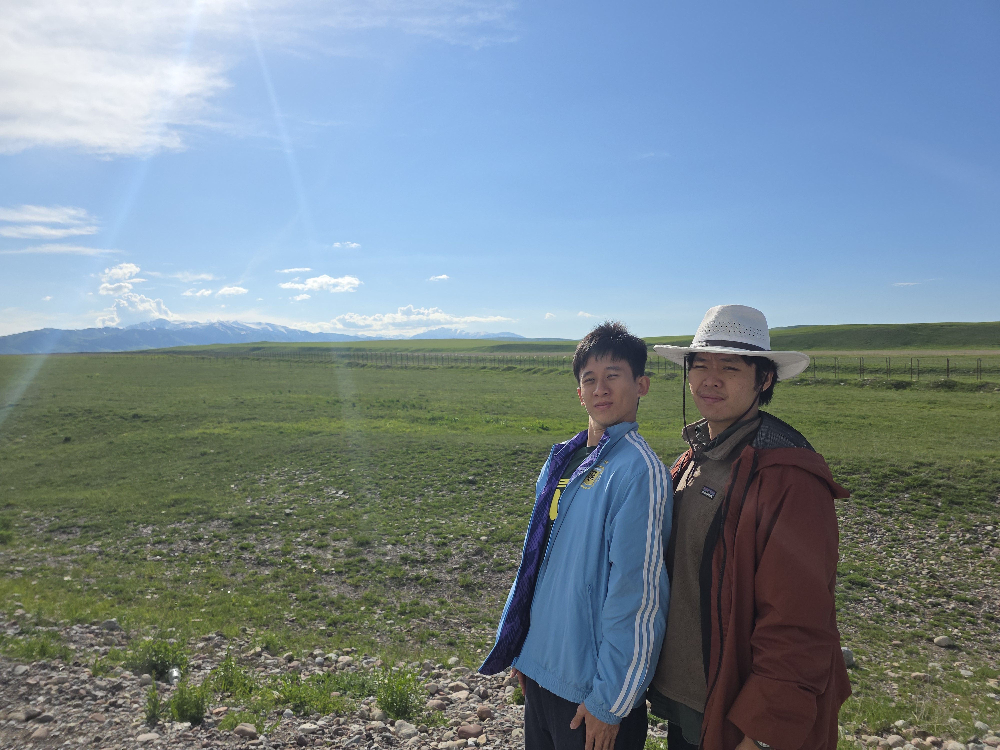

In May, combining my paid time off with two public holidays, 
I went to Kyrgyzstan (or "Xbox country" as I call it due to the flag[^flag]),
with two other friends.

In my opinion, Kyrgyzstan is one of the best travel spots you can go to now. The nature
is incredible, the people are warm and welcoming. The only thing they lack is the 
infrastructure to handle larger groups, so it's best to be early before it becomes 
over-touristed like Japan.

Among the central Asian countries,
you might have heard of Kazakhstan. Kyrgyzstan is very similar, though some may
say it has more to offer in terms of nature. In any case, I think it's a great idea 
to visit the big 3 stans: Uzbekistan, Kazakhstan, Kyrgyzstan, and if you're feeling 
adventurous, the others nearby. That's a goal for me another day.

This was a trip filled with many ups and downs. Apart from the elevation gain,
I also brought my friends to a hike we were sorely underprepared for.

I am fairly certain too that we were the first to hike the trail from Karakol Gorge
to Ala-Kol lake, and then to Ala-Kol pass, then to Altyn Arashan, for the hiking season of 2026.

The lake was still frozen, and we miraculously avoided any and all snowstorms and rain.

After the hikes, we also kicked back in the capital city of Bishkek. Many friends were 
made and good food eaten. There wasn't a day I didn't enjoy.

I'd love to share my experience and the beautiful photos I took. I blew the dust off
my old Digicam (Canon Powershot S95) and boy was I surprised at how the photos turned out.

Please read on and let me know if you have any questions! I'd love to revisit this place one day!

---

## A Night in Almaty

Our trip began in Almaty, Kazakhstan. It was slightly cheaper to fly in from Singapore
via Kuala Lumpur, Malaysia. The route is pretty, too. If you sit on the right side of the
plane on the trip from KUL to ALA, it passes by the Himalayan mountain range and it's
a sight to behold.

(Likewise, on the left on the way back)

<figure>

<figcaption>Brought to you by AirAsia.</figcaption>
</figure>

### Border Crossing at Karkara 

The majority of the 2nd day was spent on a bus ride to the eastern side of Kazakhstan,
to cross the border to Kyrgyzstan at [Karkara](https://maps.app.goo.gl/BcfLXHQwtbaSmuTg8).

Booking and boarding the bus was fuss-free. I followed this [useful guide](https://almaty-travel.com/almaty-karakol-bus/)
to book the bus. Upon reflection, a bus ride might be your best choice to get to Karakol.
While there is an airport at Karakol, I doubt it'd be worth the cost.

Anyway, the only improvement I can think of is if you can find a way to stop by along the 
way to the border. Going east from Almaty, you get to visit places like [Black Canyon](https://maps.app.goo.gl/s5fLsMLMrJjgCKMp6)
along the way.

---

## Karakol, Kyrgyzstan

The first stop 

### Impressions

It seems like all throughout Karakol, perhaps Kyrgyzstan, there is an issue with punctuality!
If a store or office says they'll be open at 8, give them another hour or so before
they actually open. I didn't test this with all the stores, but it was consistent.

The tour office, some coffee shops, all opened much later than listed on their doors.
The only ones that stuck to their hours were chain stores, like KFC (which tastes the
same, if you were curious), and the supermarkets.

---

## Itinerary

### Packing Notes

We went just a few days before Summer, so there was still snow at Ala-Kol, for better or for worse.
Most photos I saw online were of lush green fields and a blue lake. I was quite surprised 
to see the lake frozen, which was marvelous in its own right.

Of course, this means bring the necessary clothes for the season. It gets quite cold, sub-zero
at the lake especially when there's snow. The cold is tolerable in the city area.

Ala-Kol pass was also covered with snow. I borrowed crampons, but you may not necessarily 
need them. The other hikers I met didn't bring any.

The last few days of our trip, the summer sun came on strong. Each day was extremely sunny 
and hot. Regardless of season, bring proper UV protection.

#### Apps to Download

There are some recommendations for maps to use, such as Yandex or 2GIS. The recommendation
of the tour operator is [Maps.me](https://maps.me/), which I used, and I found the offline 
map functionality to be great[^maps].

Use Yandex Go for taxis. Also, very useful to have Google Translate prepared.

### Costs

- Accommodations:
	- Yurt package ([Kyrgyz Life](https://kyrgyzlife.com/)):
	Roughly SGD 700 ($233/pax) or KGS 44,800/USD 515 (KGS 5800 per pax, KGS 10,000 for UAZ transfer)
- Flights: SGD1143.50 (AirAsia)
- Food, purchases, tips: I spent roughly $70

Altogether, we spent about somewhere around or under SGD 2000; most of it being the flights and 
the accommodations. The yurt stays and UAZ rides were fairly expensive, I believe we might have been
able to get a cheaper quote, but it's all good.

[^flag]: The [flag](https://www.britannica.com/topic/flag-of-Kyrgyzstan)
 represents the tündük of a yurt (the opening at the roof), and
the 40 rays of the sun represent the forty historical Kyrgyz clans.

[^maps]: A brief look at the [Wikipedia article](https://en.wikipedia.org/wiki/Maps.me) 
shows that while Maps.me was originally Free and Open Source, it has since been acquired
and this may have changed. The developers seem to have created a fork, 
[Organic Maps](https://en.wikipedia.org/wiki/Organic_Maps), which should probably 
achieve the same purpose. Moving forward, I will use this app, or CoMaps, or one of 
the many FOSS and privacy-first apps.