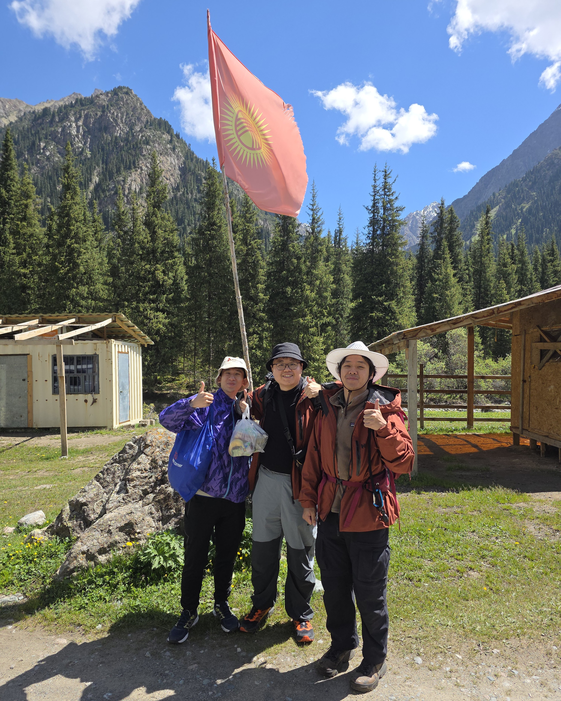
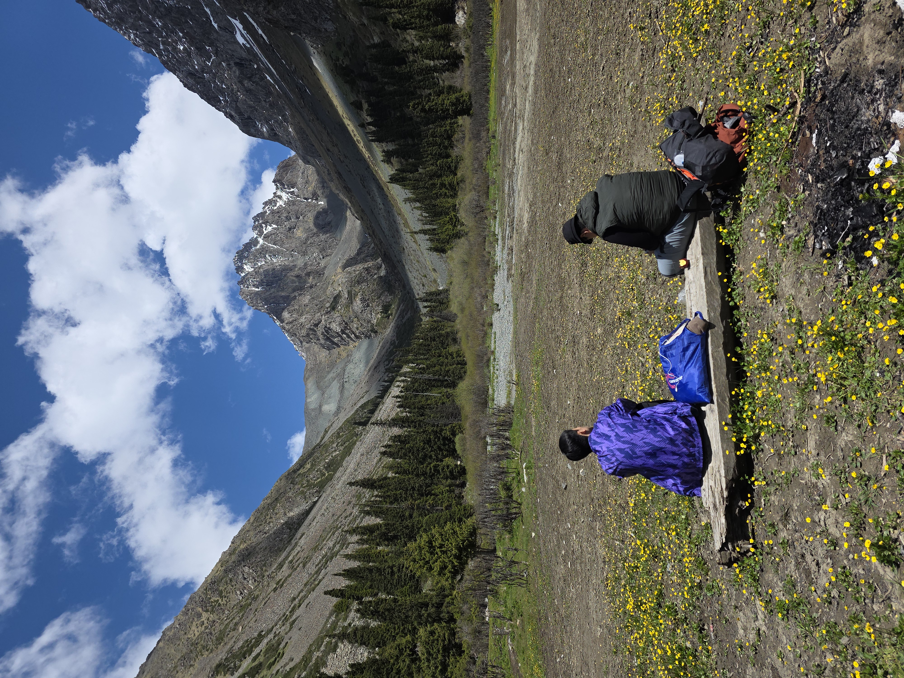
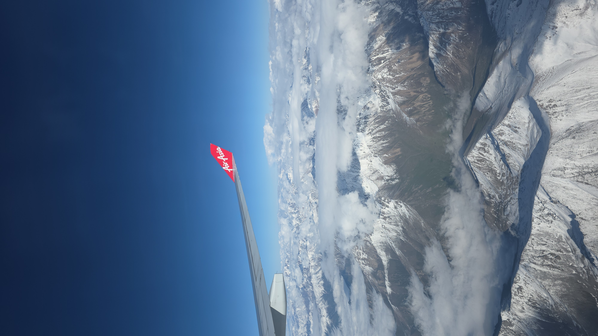
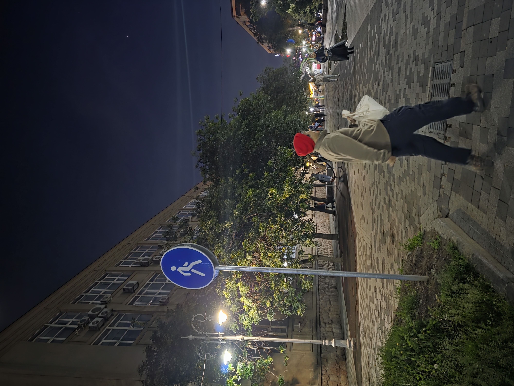
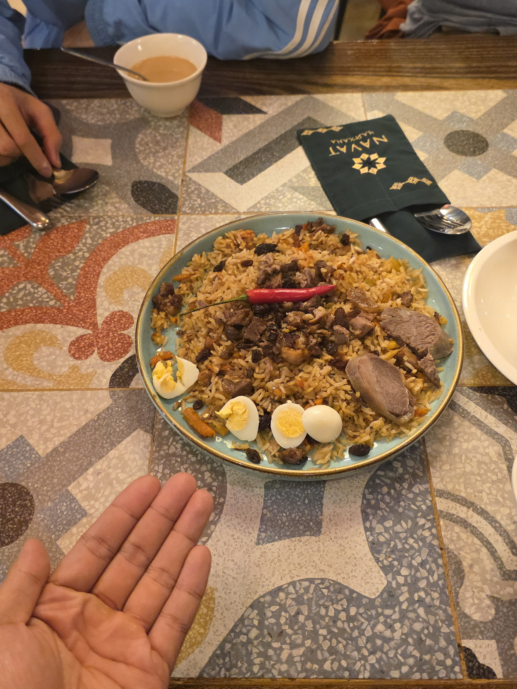
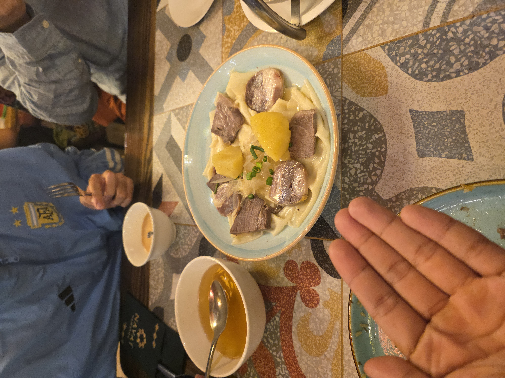
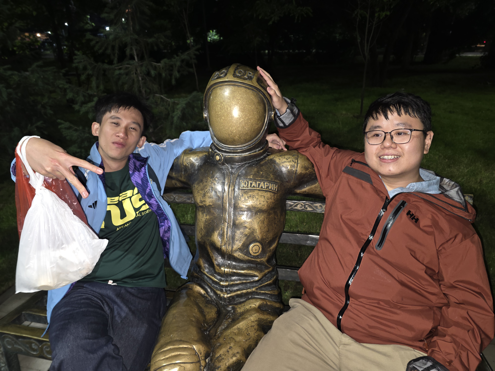
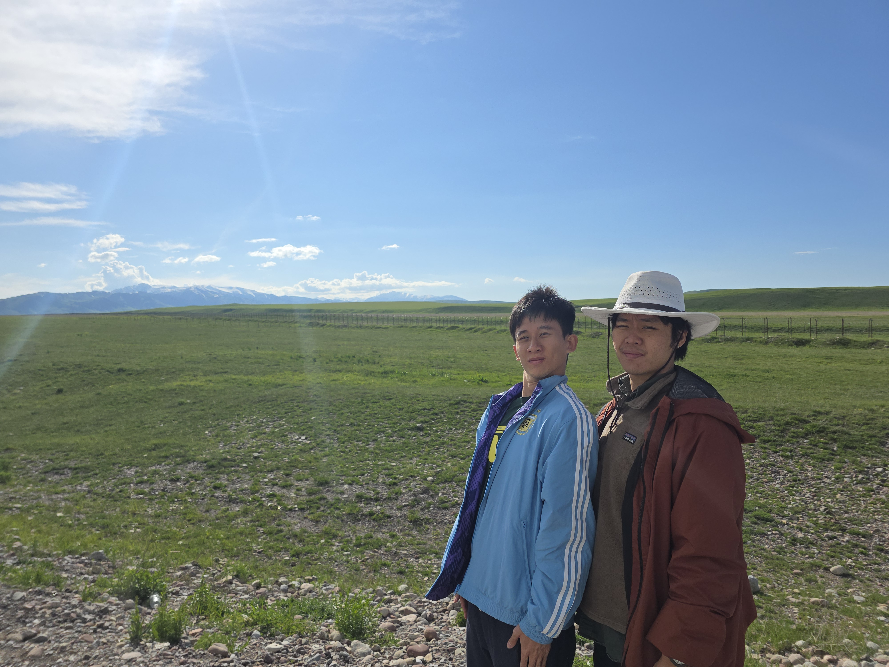

In May, combining my paid time off with two public holidays, 
I went to Kyrgyzstan (or "Xbox country" as I called it due to the flag[^flag]),
with two other friends, Ama and JQ.

We flew in and out of Almaty (Kazakhstan), nearly died hiking in Karakol,
and spent some time in Bishkek as well.

In my opinion, Kyrgyzstan is one of the best travel spots you can go to now. The nature
is incredible, the people are warm and welcoming. The only thing they lack is the 
infrastructure to handle larger groups, so it's best to be early before it becomes 
over-touristed like Japan.

Among the central Asian countries,
you might have heard of Kazakhstan. Kyrgyzstan is very similar, though some may
say it has more to offer in terms of nature. In any case, I think it's a great idea 
to visit the big 3 stans: Uzbekistan, Kazakhstan, Kyrgyzstan, and if you're feeling 
adventurous, the others nearby. That's a goal for me another day.

This was a trip filled with many ups and downs. Apart from the elevation gain,
I also brought my friends to a hike we were sorely underprepared for.

I am fairly certain too that we were the first to hike the trail from Karakol Gorge
to Ala-Kol lake, and then to Ala-Kol pass, then to Altyn Arashan, for the hiking season of 2026.
The lake was still frozen, and we miraculously avoided any and all rain and snow storms,
some of which occurred a day or two before and after our hiking days.

After the hikes, we also kicked back in the capital city of Bishkek. Many friends were 
made and good food eaten. There wasn't a day I didn't enjoy.

I'd love to share my experience and the beautiful photos I took. I blew the dust off
my old Digicam (Canon Powershot S95) and boy was I surprised at how the photos turned out.

Please read on and let me know if you have any questions! I'd love to revisit this place one day!

---

## A Night in Almaty

Our trip began in Almaty, Kazakhstan. It was slightly cheaper to fly in from Singapore
via Kuala Lumpur, Malaysia. The route is pretty, too. If you sit on the right side of the
plane on the trip from KUL to ALA, it passes by the Himalayan mountain range and it's
a sight to behold (likewise, on the left on the way back).

<figure>

<figcaption>Brought to you by AirAsia.</figcaption>
</figure>

### Night Walk 

I was the last of 3 to fly in. JQ had spent the past week in Uzbekistan (which, 
according to him, is the nicest of the 3), and Ama came from Astana. It was all 
our first night in Almaty.

We went walking around [Zhibek Zholy](https://maps.app.goo.gl/ALeuWsJxvKs35qAg7),
a walking street that's bustling at night,
which gave me the impression of Hongdae in Seoul, only much smaller. I should mention 
that the Korean population in central Asia is quite significant.

Our taxi driver recommended Navat, a chain restaurant that's favoured by locals. It 
easily became my favourite, and we kept going back in different locations.

<figure>

<row>

</row>

<figcaption>
On the left: Plov... MY LOVE!
and the right: Beshbarmak, both local specialties you must try.
</figcaption>
</figure>

At night, we decided to take the metro then take a long walk back to our apartment,
since the metro stations don't reach very far. The weather was perfectly cool.

## Border Crossing at Karkara 

The majority of the 2nd day was spent on a bus ride to the eastern side of Kazakhstan,
to cross the border to Kyrgyzstan at [Karkara](https://maps.app.goo.gl/BcfLXHQwtbaSmuTg8).

Booking and boarding the bus was fuss-free. I followed this [useful guide](https://almaty-travel.com/almaty-karakol-bus/)
to book the bus. Upon reflection, a bus ride might be your best choice to get to Karakol.
While there is an airport at Karakol, I doubt it'd be worth the cost.

Anyway, the only improvement I can think of is if you can rent a car and stop by along the 
way to the border. Going east from Almaty, you get to visit places like [Black Canyon](https://maps.app.goo.gl/s5fLsMLMrJjgCKMp6)
along the way.

---

## Karakol, Kyrgyzstan

The first major stop in our Kyrgyzstan trip was the quiet town of Karakol. 
Most people come here to visit the nearby Ak-Suu traverse, featuring Ala-Kol lake and 
Altyn Arashan. The town itself is rather small, but I might actually prefer it to Bishkek.

Upon arrival, we drew some Kyrgyz Som at an ATM in the building next to the bus station.
While walking towards the hostel, we stopped at [Dastorkon](https://maps.app.goo.gl/mbVV1kveYNJURRZD8)
for dinner, delicious as expected. I got the feeling that seeing tourists like us was 
still a novelty based on the interactions with the staff, very friendly and pleasant.
We weren't the only group of Singaporeans in the restaurant, though. 

After a long walk, we checked in to [Sayak Hostel](https://maps.app.goo.gl/2uymxrf2xhnDmzAm7),
which is smack in the middle of Karakol, a darn good location, though a little far from
the bus station we'd arrived in. We bought some supplies at a nearby supermarket, Globus.

I absolutely adore the walkability of Karakol, and Kyrgyzstan in general. The streets 
are wide and *extremely* clean. 

### Impressions

It seems like all throughout Karakol, perhaps Kyrgyzstan, there is an issue with punctuality!
If a store or office says they'll be open at 8, give them another hour or so before
they actually open. I didn't test this with all the stores, but it was consistent.

The tour office, some coffee shops, all opened much later than listed on their doors.
The only ones that stuck to their hours were chain stores, like KFC (which tastes the
same, if you were curious), and the supermarkets.

---

## Hike Day 1: Karakol Gorge 

Now, the hike! We began our 3-day hike on 25 May starting from Karakol Gorge. Some 
might call it the second bridge. If you choose to start there, a UAZ transfer to the 
gorge will cost you KGS 10,000 or somewhere above USD 100. 

We wanted a more condensed hike given the few days we had to spend, so we did just that.
The road leading up to the gorge is mostly off-road, some muddy, some rocky. Totally walkable.

The views were already incredible driving up to the trail. The first part of the trail 
was mostly hiking through forested paths, which was somewhat steep.

### To the Lake

Once the lake came into view, we could see it was completely frozen, and it was beautiful,
yet nothing like the pictures online where it's vibrant blue, and green grassy hills in the summer.

### Reaching the Camp

By the time we reached the campsite, it was nearly night-time. Thankfully, the summer 
days are generously long, and the last bits of illumination only faded away past 9pm.

There weren't many yurts set up, if at all, aside from ours. The guide told us that 
we were the first tourists to stay at Ala-Kol for the season. The few other hikers we saw
along the way up just did an out-and-back hike.

We could see the other guides transporting camp materials along Ala-Kol pass, mostly 
their torchlights in the darkness. They'll be building the yurts for summer.

## Hike Day 2: Ala-Kol Pass

On the morning of day 2, we made the difficult decision to split up. I wasn't too keen 
on abandoning the trail; I wanted to see it through, and I had heard that the terrain
in Altyn Arashan, beyond Ala-Kol pass, would be far easier to navigate.

Unfortunately, to even get to that point, we would have to cross the pass itself, which 
was around 3900m elevation, from our 3600m camp site. The climb up is steep and treacherous,
not to mention the fact that it's blanketed in snow on the other side.

### Snow at the Pass

It must have been a crazy sight seeing someone come DOWN from the pass.

### The rest of the walk

As I descended in altitude, the scenery gradually changed to more vibrant greens.
It was absolutely breathtaking. Every once in a while, someone on a horse would 
pass by.

I soon realised that having a horse made the trek around Altyn Arashan much easier.
While it's entirely doable on foot, the river crossings can be risky or unpredictable.

## Altyn Arashan

I was told there'd be hot springs here. Apparently, for my guesthouse at least, it
was in a private room that you had to book. I was fortunately able to book a slot for the 
next morning.

The hot spring itself is quite roomy and could probably fit a whole bunch of people.
The water temperature was not that hot, really. I had a nice shower.

I met some people from the UK who taught me a card game that's played with a standard 
deck plus jokers. I ended up being quite invested in it and shared it with my friends 
once we reunited as well. It's apparently called [Cabo](https://en.wikipedia.org/wiki/Cabo_(game)),
and there's probably variants on the rules. For ours, the joker was worth -1 and 
red kings worth -2. 7 to 10 were also power cards (e.g. "7 or 8, look at a mate").

---

## Bishkek

As we arrived in Bishkek, the weather had transitioned into summer heat, and we once 
again had to acclimate to it after having endured sub-zero temperatures.

---

## Itinerary

### Packing Notes

We went just a few days before Summer, so there was still snow at Ala-Kol, for better or for worse.
Most photos I saw online were of lush green fields and a blue lake. I was quite surprised 
to see the lake frozen, which was marvelous in its own right.

Of course, this means bring the necessary clothes for the season. It gets quite cold, sub-zero
at the lake especially when there's snow. The cold is tolerable in the city area.

Ala-Kol pass was also covered with snow. I borrowed crampons, but you may not necessarily 
need them. The other hikers I met didn't bring any.

The last few days of our trip, the summer sun came on strong. Each day was extremely sunny 
and hot. Regardless of season, bring proper UV protection.

#### Apps to Download

There are some recommendations for maps to use, such as Yandex or 2GIS. The recommendation
of the tour operator is [Maps.me](https://maps.me/), which I used, and I found the offline 
map functionality to be great[^maps].

Use Yandex Go for taxis. Also, very useful to have Google Translate prepared.

### Costs

- Accommodations:
	- Yurt package ([Kyrgyz Life](https://kyrgyzlife.com/)):
	Roughly SGD 700 ($233/pax) or KGS 44,800/USD 515 (KGS 5800 per pax, KGS 10,000 for UAZ transfer)
- Flights: SGD 1143.50 (AirAsia)
- Food, purchases, tips: I spent roughly SGD 70, or let's just round it up to 100.

Altogether, we spent about somewhere around or under SGD 2000; most of it being the flights and 
the accommodations. The yurt stays and UAZ rides were fairly expensive, I believe we might have been
able to get a cheaper quote, but it's all good.

[^flag]: The [flag](https://www.britannica.com/topic/flag-of-Kyrgyzstan)
 represents the tündük of a yurt (the opening at the roof), and
the 40 rays of the sun represent the forty historical Kyrgyz clans.

[^maps]: A brief look at the [Wikipedia article](https://en.wikipedia.org/wiki/Maps.me) 
shows that while Maps.me was originally Free and Open Source, it has since been acquired
and this may have changed. The developers seem to have created a fork, 
[Organic Maps](https://en.wikipedia.org/wiki/Organic_Maps), which should probably 
achieve the same purpose. Moving forward, I will use this app, or CoMaps, or one of 
the many FOSS and privacy-first apps.