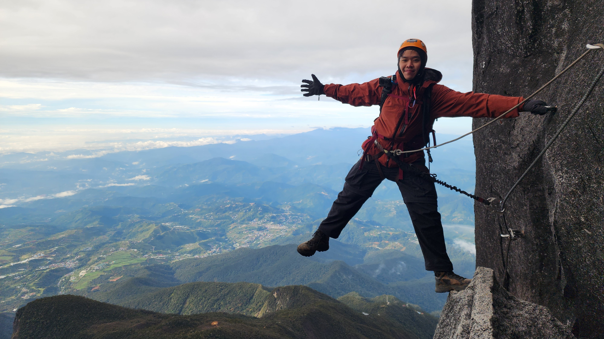
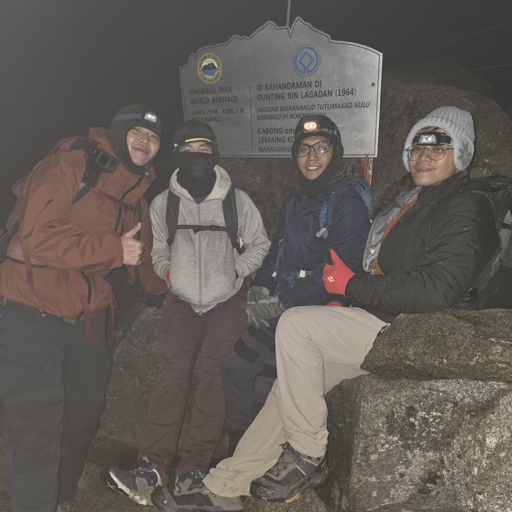
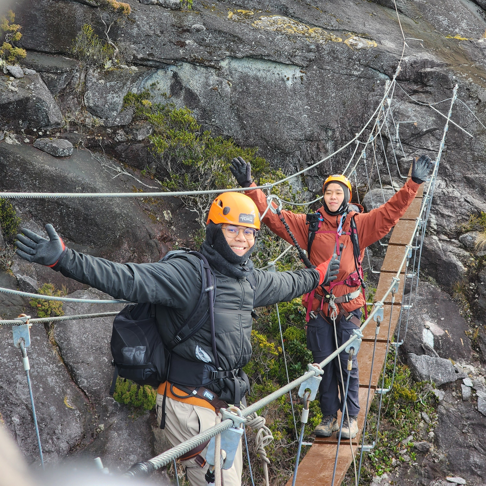
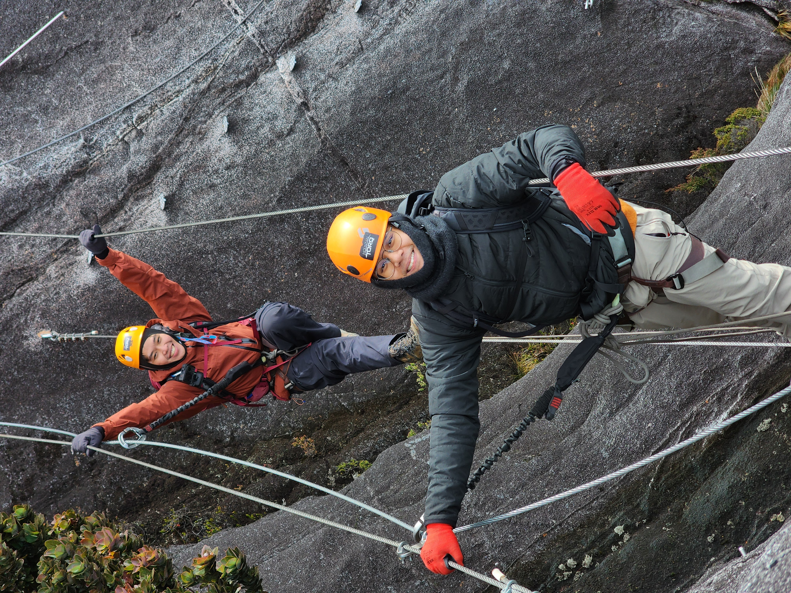

Kinabalu! The highest mountain of Malaysia, sitting at 4095m above sea level at the summit.
Located on the island of Borneo, in the state of Sabah, where my mom's hometown is.

I've been to Sabah so many times in the past, and was even raised there as a kid by 
my grandma while my parents worked back in Singapore. She tells this story often, 
about how she was stopped at immigration on the suspicion of being a child abductor.

Most indigenous groups of Sabah bring their children to climb Mount Kinabalu as a coming-of-age
ritual. Most Malaysians probably do the same eventually at some point in their lives.
As someone with Kadazan and Malaysian blood flowing in me, it's about time I took it on as well.

In terms of the hiking experience, I'd say Kinabalu is *perfect*. You get a fairly simple
ascent with stairs at the start and a huge slab of bare sloping rock at the end. The huts are well-provisioned
and there's even a buffet dinner. The trails are clean and well-maintained. All the money
going to the operators are used to provide an excellent experience to the limited 
number of hikers a day (180 people). Reception is great up there. What more could you ask for, really?

The via ferrata was also a great experience for a first-timer like me. I figured, I may 
as well get the complete experience of Kinabalu while I'm here, and make the most of 
my dollar. Not a lot of people go for Low's Peak, let alone any of the via ferrata
courses at all.

I'll be sharing my experience along with insights and advice for those who wish to 
climb the mountain and do the via ferrata as well.

---

## Hiking the Mountain

We eventually summited at 5:45am, which, according to my Strava, is just about 3 hours 
of hike in total, a fairly average ascent.

### The cut-off point

The main cut-off point for the summit push is at Sayat-Sayat checkpoint by 5:30am.
They check for your pass, and prepare your certificate there. That's the last proper checkpoint
before the summit, so feel free to visit the toilet. There's also beds there for those who
wish to rest.

For those doing Low's Peak via ferrata, you need to be at the 3776m starting point
by 6:30am. We were able to reach it comfortably at 6:15am by maintaining a steady pace with some 
intermittent rest, and plenty of room to take photos.

As for Walk the Torq, you need to be back at Sayat-Sayat checkpoint by 7:15am, after which
they'll bring you down to the starting point, which is much nearer to the starting point 
of the summit path.

We were the only group that day doing Low's Peak Circuit, and had the whole via ferrata
to ourselves. The other groups at Pendant Hut had planned to do Walk the Torq.

I heard from the others in Pendant hut that some of the other groups didn't make it
to the cut-off time, or just decided not to do the via ferrata. There was even one guy
that paid for an upgrade to do Low's Peak, and he *was* there before the cut-off time,
but for some reason didn't do either via ferrata. Probably was conserving energy for
the descent in the same day, since the other groups only booked a 2D1N stay.

## Via Ferrata

This was my first via ferrata experience, and it was great! Turns out I don't particularly
have a fear of heights if I'm safely secured to the wall.

Low's Peak Circuit is the "harder" of the two via ferrata courses, starting at a higher point 
and requiring more stamina to traverse the course. On average, it should take you about 4 hours
to get through the whole thing.

Walk the Torq is much easier, being a loop that starts and ends at the same point with
less technical portions. Low's Peak ends at the same location as well, and overlaps with 
half of Walk the Torq's course, albeit going in the opposite direction (You start Walk
the Torq by abseiling down, you end Low's Peak by climbing up with a rope).

Some of the photos were taken by the via ferrata instructor following us. 

### The Bridges

One of the first highlights of Low's Peak is the Suspension Bridge. As expected, it's shaky
and there's a big drop beneath it.

Next, there's the Nepalese bridge. It was fun to shake it. Neither of us were really 
shaken by the experience, though. Our grip kept us safe.

<figure>

<figcaption>When you have 3 points of contact, nothing can go wrong.</figcaption>
</figure>

---

## Itinerary

### Getting there

The most important thing you need to know is that Kinabalu park is about 2 hours away
from Kota Kinabalu city. As part of the tour package, the driver picked us up at KK city
at 6am, and we reached park headquarters at 8am. After some administrative work, we 
started around 9 or so, which was still plenty of time to reach the base camp.

**Via Ferrata:** You need to reach Pendant by 4pm on the first day's ascent to attend the safety
briefing, which is held in Pendant hut itself. The hut is only for Mountain Torq's 
guests, which is everyone doing the via ferrata.

### Packing Notes

You are expected to account for all your belongings during the trail,
counting all your items on your person and making sure they tally at the end of the hike,
which means not leaving anything behind. It's a RM5 fine per item lost, deducted from a RM200/group
deposit at the start.

The weather was absolutely fine, apart from a bit of tropical heat.
I packed a jacket but that wasn't needed at all. In hindsight,
I should have packed less. I should have had a better way to stow away my sticks, which got in the way
at the ladders/ropes. My gloves were a godsend because on the way down, I was grabbing a lot of branches,
mud, and rocks.

### Costs

- Full hike package: About SGD1600 (MYR4949 per pax)
- Flights: SGD 160.20 (one-way SIN to BKI)
	- I redeemed 2000 Krisflyer miles plus MYR59 fees for the return flight.
- Expenses outside of the hike:
	- Accommodations: SGD 39 (2 nights)
	- Food: About SGD 100 or so.

#### Total
The total price paid was about SGD2000, the bulk of it was the hike. In recent
times, the price for hiking Mount Kinabalu has really gone up. You can definitely get
it much cheaper if you plan it yourself, but the slots are highly competitive; You'd 
need to book them at the start of the year when they open.

We spoke to some other hikers. Those doing the 2D1N itinerary without Via Ferrata
paid upwards of SGD1000. Since we were doing the Low's Peak via ferrata and stayed an extra
day, the extra amount we paid was reasonable to us. In fact, I don't know if you can 
book a via ferrata itinerary independently instead of through the tour operator.

We had a driver who is a friend of my mother, and he made the whole trip outside of 
the hike much smoother. I can't say for sure how much the going rate is, but maybe 
MYR200 for a few days is an estimate.

 Considering how car-dependent Malaysia is, you could consider
getting a driver instead of getting taxis to and fro, as you can benefit from having
access to a larger van where all your gear can be stored and transported.
