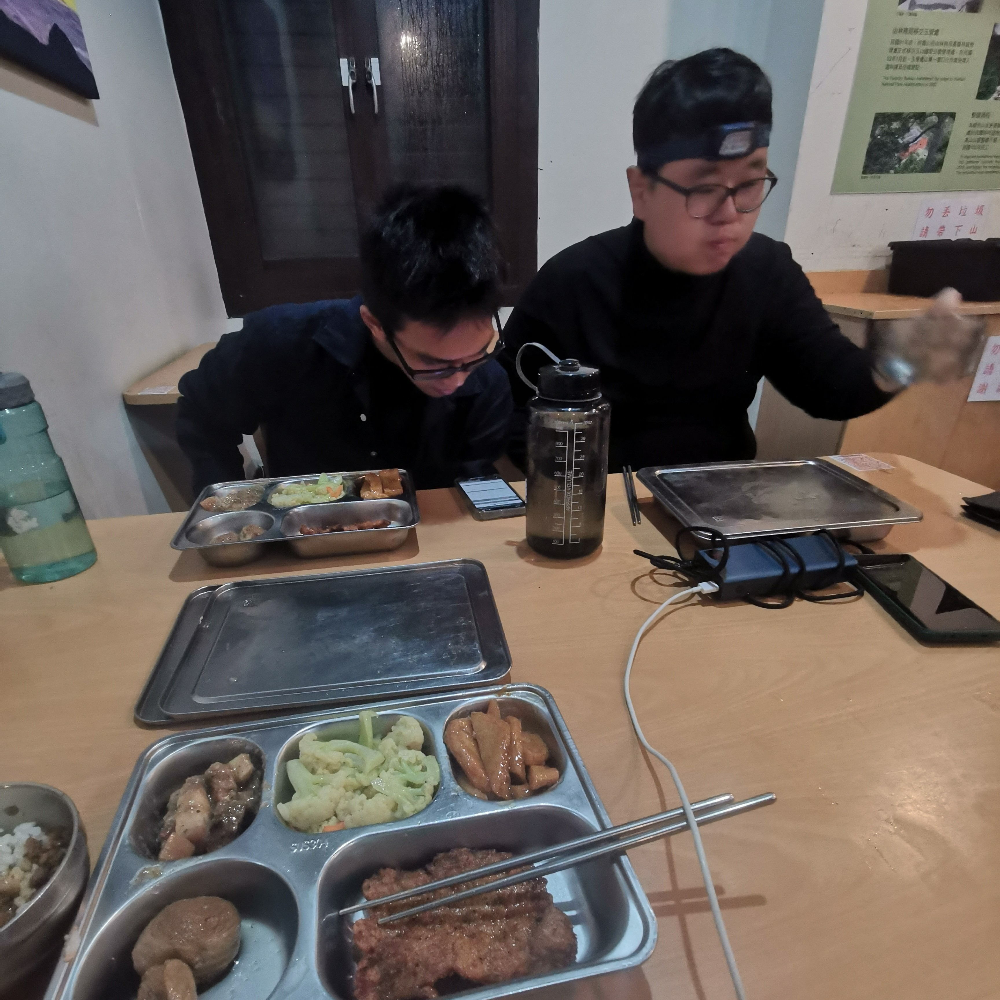
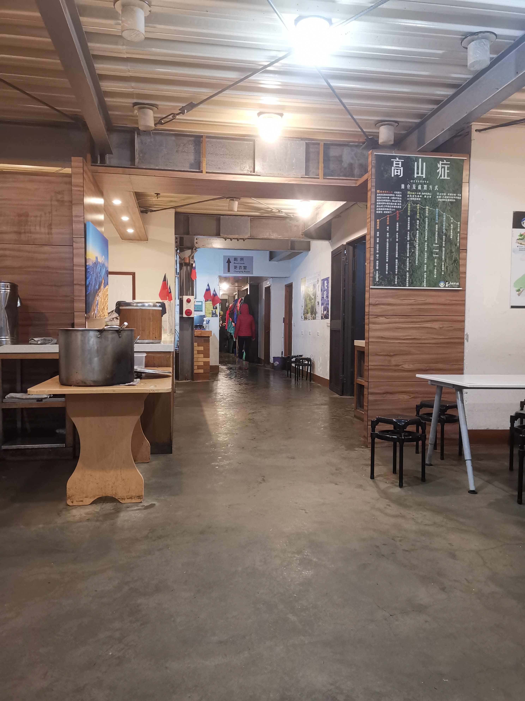
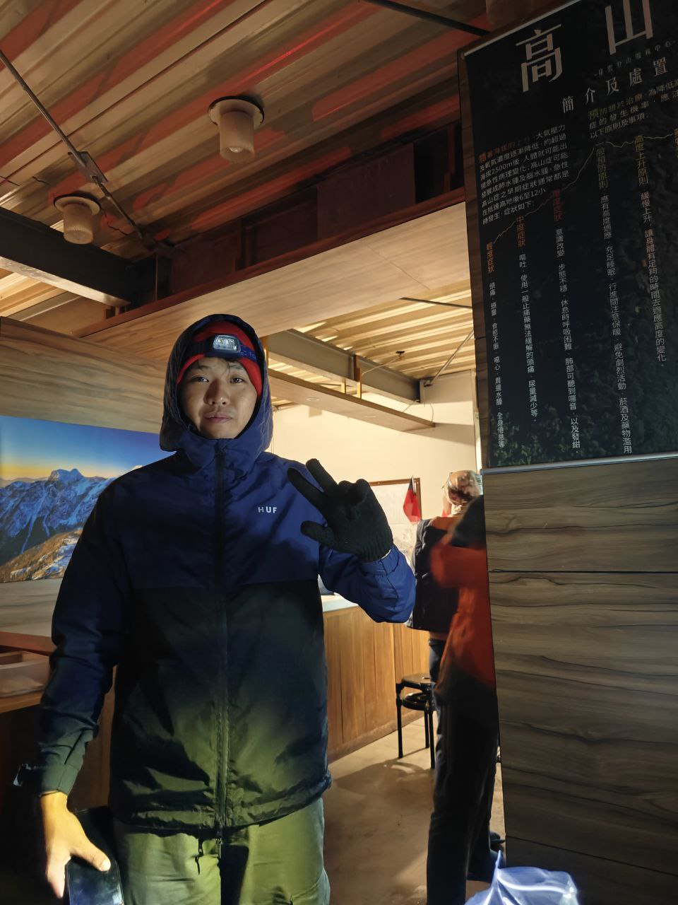

In June 2024, I went to Taiwan with two friends with the main objective of climbing Yushan,
or Jade Mountain, the highest peak in Taiwan at just a bit under 4000 meters of elevation.

The climb was not gentle on us. The wetness and cold made us
appreciate the ground-level temperature after the hike.

The rest of the trip was spent lollygagging around most of Taiwan,
and while I didn't fully circumnavigate the entire island (missed out the east coast),
I can say that I'd seen enough of what Taiwan had to offer.

## Summiting Jade Mountain

I learned one thing this trip

### At the cabin

The mountain shack is a place to rest before heading out
again for the summit.

By the time we got there, we were soaked.
There are places to hang our equipment to dry, though
the humidity and temperature made it difficult to
get fully dry. We still managed to an acceptable level, though!

You could help yourself to heaping portions of soup and 
braised meat rice, which warmed us up.

### The summit

<figure>
tba video
<figcaption>Near the peak. Views obscured by clouds, but still breathtaking.</figcaption>
</figure>

## Taipei

I'm not gonna lie, it was quite boring to me.
I did enjoy the food, gashapon machines, and the nightly Taiwan Beer inbibing,
but apart from that, there wasn't anything special to me.

I really enjoyed the architecture style of the country
parts of Taiwan. Very old school, and full of soul.
Taiwan Beer hits the spot for me, and the street food
were perfect accompaniments.

## Yilan

